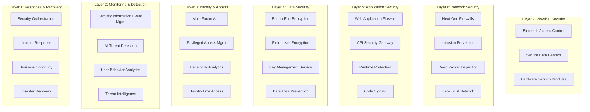
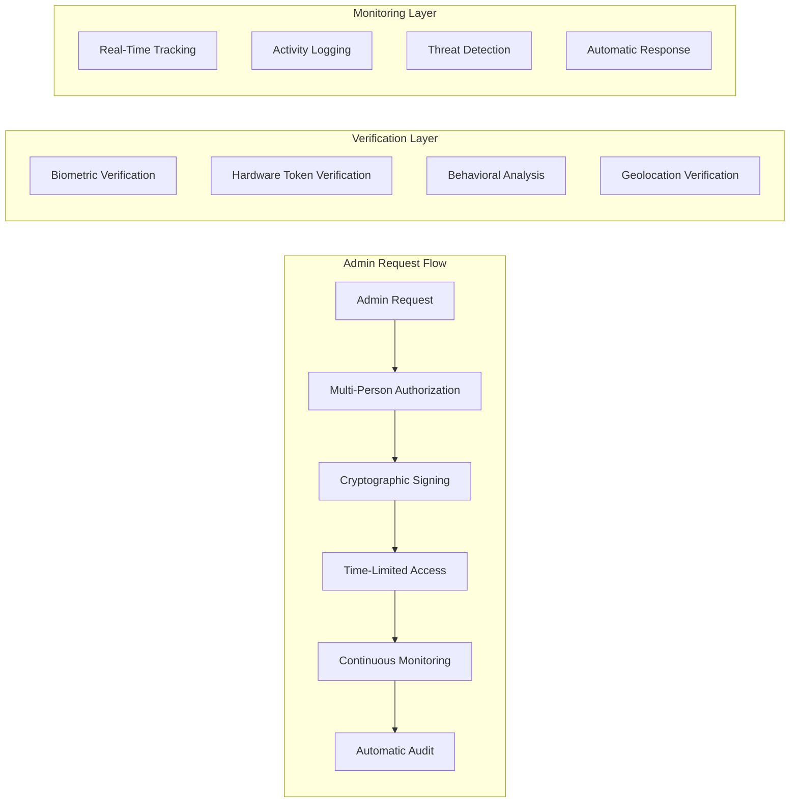

# Advanced Business Continuity & Super Admin Monitoring System - Design

## Overview

The Advanced Business Continuity & Super Admin Monitoring System provides **bank-level security** with healthcare-specific enhancements, ensuring WriteCareNotes is protected against all internal and external threats while maintaining 99.99% uptime for critical healthcare operations.

## Architecture

### Multi-Layer Security Architecture



### Zero-Trust Super Admin Architecture



## Components and Interfaces

### 1. Super Admin Monitoring Service

```typescript
interface SuperAdminMonitoringService {
  // Multi-person authorization
  requestPrivilegedAccess(request: PrivilegedAccessRequest): Promise<AuthorizationToken>;
  approveAccess(requestId: string, approverSignature: CryptographicSignature): Promise<void>;
  
  // Continuous monitoring
  monitorAdminSession(sessionId: string): Promise<SessionMonitoring>;
  detectAnomalousActivity(userId: string, activity: AdminActivity): Promise<ThreatAssessment>;
  
  // Emergency controls
  emergencyLockdown(reason: string, evidence: SecurityEvidence): Promise<void>;
  revokeAllAccess(userId: string, reason: string): Promise<void>;
}

interface PrivilegedAccessRequest {
  userId: string;
  requestedPermissions: Permission[];
  justification: string;
  duration: number; // in minutes
  emergencyOverride?: boolean;
  biometricVerification: BiometricData;
  hardwareTokenSignature: string;
}

interface SessionMonitoring {
  sessionId: string;
  userId: string;
  startTime: Date;
  activities: AdminActivity[];
  riskScore: number;
  anomalies: SecurityAnomaly[];
  continuousVerification: VerificationStatus;
}
```

### 2. Immutable Codebase Protection Service

```typescript
interface CodebaseProtectionService {
  // Code integrity
  verifyCodeIntegrity(repository: string, commit: string): Promise<IntegrityVerification>;
  createImmutableRecord(codeChange: CodeChange): Promise<BlockchainRecord>;
  
  // Multi-signature requirements
  requestCodeChange(change: CodeChangeRequest): Promise<string>;
  signCodeChange(changeId: string, signature: DeveloperSignature): Promise<void>;
  
  // Automatic protection
  detectTampering(repository: string): Promise<TamperingDetection>;
  rollbackToSecureState(repository: string, targetCommit: string): Promise<void>;
}

interface CodeChangeRequest {
  repository: string;
  branch: string;
  changes: FileChange[];
  description: string;
  requiredSignatures: number;
  securityImpact: SecurityImpactAssessment;
  complianceVerification: ComplianceCheck;
}

interface IntegrityVerification {
  isValid: boolean;
  blockchainHash: string;
  signatureVerification: SignatureStatus[];
  tamperingEvidence?: TamperingEvidence;
  lastVerifiedTimestamp: Date;
}
```

### 3. Advanced Threat Detection Engine

```typescript
interface ThreatDetectionEngine {
  // Real-time analysis
  analyzeNetworkTraffic(traffic: NetworkTraffic): Promise<ThreatAssessment>;
  detectBehavioralAnomalies(user: User, activities: Activity[]): Promise<AnomalyReport>;
  
  // Predictive intelligence
  predictThreats(historicalData: SecurityEvent[]): Promise<ThreatPrediction[]>;
  correlateEvents(events: SecurityEvent[]): Promise<ThreatCorrelation>;
  
  // Automated response
  executeCountermeasures(threat: IdentifiedThreat): Promise<ResponseAction[]>;
  isolateCompromisedComponents(components: SystemComponent[]): Promise<void>;
}

interface ThreatAssessment {
  threatLevel: 'LOW' | 'MEDIUM' | 'HIGH' | 'CRITICAL';
  confidence: number; // 0-1
  threatType: ThreatType;
  affectedSystems: string[];
  recommendedActions: ResponseAction[];
  evidenceChain: SecurityEvidence[];
  regulatoryImplications: RegulatoryImpact[];
}

interface ThreatPrediction {
  predictedThreat: ThreatType;
  probability: number;
  timeframe: string;
  preventiveActions: PreventiveAction[];
  riskMitigation: RiskMitigationStrategy;
}
```

### 4. Business Continuity Management Service

```typescript
interface BusinessContinuityService {
  // Disaster recovery
  executeDisasterRecovery(disaster: DisasterType): Promise<RecoveryExecution>;
  validateRecoveryReadiness(): Promise<ReadinessAssessment>;
  
  // High availability
  manageFailover(failedComponent: SystemComponent): Promise<FailoverResult>;
  maintainRedundancy(): Promise<RedundancyStatus>;
  
  // Zero-downtime operations
  performZeroDowntimeUpdate(update: SystemUpdate): Promise<UpdateResult>;
  rollbackDeployment(deploymentId: string): Promise<RollbackResult>;
}

interface RecoveryExecution {
  recoveryId: string;
  startTime: Date;
  estimatedCompletionTime: Date;
  recoverySteps: RecoveryStep[];
  currentStatus: RecoveryStatus;
  dataIntegrityVerification: IntegrityCheck;
  complianceValidation: ComplianceValidation;
}

interface FailoverResult {
  failoverTime: number; // milliseconds
  affectedServices: string[];
  dataConsistencyCheck: ConsistencyResult;
  userImpact: UserImpactAssessment;
  rollbackPlan: RollbackPlan;
}
```

### 5. Regulatory Compliance Automation Service

```typescript
interface ComplianceAutomationService {
  // Continuous compliance monitoring
  monitorCompliance(regulations: Regulation[]): Promise<ComplianceStatus>;
  validateRegulatoryRequirements(): Promise<ValidationResult>;
  
  // Automated reporting
  generateComplianceReport(regulatoryBody: RegulatoryBody): Promise<ComplianceReport>;
  submitRegulatoryFilings(filings: RegulatoryFiling[]): Promise<SubmissionResult>;
  
  // Violation detection and correction
  detectViolations(): Promise<ComplianceViolation[]>;
  autoCorrectViolations(violations: ComplianceViolation[]): Promise<CorrectionResult>;
}

interface ComplianceStatus {
  overallScore: number; // 0-100
  regulatoryBodies: {
    cqc: ComplianceScore;
    careInspectorate: ComplianceScore;
    ciw: ComplianceScore;
    rqia: ComplianceScore;
  };
  criticalIssues: ComplianceIssue[];
  recommendations: ComplianceRecommendation[];
  nextAuditDate: Date;
}
```

## Data Models

### Security Event Model

```typescript
interface SecurityEvent {
  eventId: string;
  timestamp: Date;
  eventType: SecurityEventType;
  severity: SecuritySeverity;
  source: EventSource;
  userId?: string;
  sessionId?: string;
  ipAddress: string;
  userAgent: string;
  geolocation: Geolocation;
  
  // Event details
  description: string;
  evidence: SecurityEvidence[];
  affectedResources: string[];
  
  // Response tracking
  responseActions: ResponseAction[];
  escalationLevel: EscalationLevel;
  resolutionStatus: ResolutionStatus;
  
  // Compliance tracking
  regulatoryImplications: RegulatoryImplication[];
  auditTrail: AuditEntry[];
  
  // Immutable verification
  cryptographicHash: string;
  blockchainRecord?: string;
  tamperProofSignature: string;
}
```

### Admin Activity Model

```typescript
interface AdminActivity {
  activityId: string;
  userId: string;
  sessionId: string;
  timestamp: Date;
  
  // Activity details
  action: AdminAction;
  targetResource: string;
  parameters: Record<string, any>;
  
  // Authorization
  authorizationLevel: AuthorizationLevel;
  approvers: Approver[];
  multiPersonVerification: boolean;
  
  // Monitoring
  riskScore: number;
  anomalyFlags: AnomalyFlag[];
  behavioralAnalysis: BehavioralAnalysis;
  
  // Audit trail
  beforeState?: SystemState;
  afterState?: SystemState;
  complianceValidation: ComplianceValidation;
  
  // Security verification
  biometricVerification: BiometricVerification;
  hardwareTokenVerification: TokenVerification;
  cryptographicSignature: string;
}
```

## Error Handling

### Security Exception Hierarchy

```typescript
abstract class SecurityException extends Error {
  abstract readonly securityLevel: SecurityLevel;
  abstract readonly responseRequired: boolean;
  abstract readonly regulatoryNotification: boolean;
}

class CriticalSecurityException extends SecurityException {
  readonly securityLevel = SecurityLevel.CRITICAL;
  readonly responseRequired = true;
  readonly regulatoryNotification = true;
  
  constructor(
    message: string,
    public readonly threatType: ThreatType,
    public readonly evidence: SecurityEvidence[],
    public readonly affectedSystems: string[]
  ) {
    super(message);
  }
}

class UnauthorizedAccessException extends SecurityException {
  readonly securityLevel = SecurityLevel.HIGH;
  readonly responseRequired = true;
  readonly regulatoryNotification = false;
  
  constructor(
    message: string,
    public readonly userId: string,
    public readonly attemptedResource: string,
    public readonly accessLevel: AccessLevel
  ) {
    super(message);
  }
}
```

### Automated Response Protocols

```typescript
interface SecurityResponseProtocol {
  // Immediate response (< 5 seconds)
  immediateResponse: {
    isolateUser: boolean;
    lockdownSystems: string[];
    notifySecurityTeam: boolean;
    escalateToEmergency: boolean;
  };
  
  // Short-term response (< 5 minutes)
  shortTermResponse: {
    forensicAnalysis: boolean;
    evidenceCollection: boolean;
    systemRecovery: boolean;
    stakeholderNotification: boolean;
  };
  
  // Long-term response (< 24 hours)
  longTermResponse: {
    rootCauseAnalysis: boolean;
    systemHardening: boolean;
    policyUpdates: boolean;
    regulatoryReporting: boolean;
  };
}
```

## Testing Strategy

### Security Testing Framework

```typescript
interface SecurityTestSuite {
  // Penetration testing
  runPenetrationTests(): Promise<PenetrationTestResult>;
  simulateAdvancedPersistentThreats(): Promise<APTSimulationResult>;
  
  // Vulnerability assessment
  scanForVulnerabilities(): Promise<VulnerabilityReport>;
  testSecurityControls(): Promise<ControlTestResult>;
  
  // Compliance testing
  validateRegulatoryCompliance(): Promise<ComplianceTestResult>;
  testAuditTrailIntegrity(): Promise<AuditIntegrityResult>;
  
  // Business continuity testing
  testDisasterRecovery(): Promise<DRTestResult>;
  validateFailoverProcedures(): Promise<FailoverTestResult>;
}
```

### Continuous Security Validation

```typescript
interface ContinuousSecurityValidation {
  // Real-time validation
  validateSecurityPosture(): Promise<SecurityPostureReport>;
  monitorThreatLandscape(): Promise<ThreatLandscapeReport>;
  
  // Automated testing
  runSecurityRegressionTests(): Promise<RegressionTestResult>;
  validateSecurityPolicies(): Promise<PolicyValidationResult>;
  
  // Performance impact assessment
  assessSecurityPerformanceImpact(): Promise<PerformanceImpactReport>;
  optimizeSecurityControls(): Promise<OptimizationResult>;
}
```

## Performance Considerations

### High-Performance Security Architecture

- **Sub-100ms threat detection** using distributed AI processing
- **Zero-latency failover** with hot-standby systems
- **Quantum-resistant encryption** with hardware acceleration
- **Real-time compliance monitoring** with minimal performance impact
- **Predictive scaling** based on threat intelligence and usage patterns

### Scalability Design

- **Horizontal scaling** of security services across multiple regions
- **Load balancing** with security-aware routing
- **Distributed threat intelligence** sharing across healthcare networks
- **Edge security processing** for reduced latency
- **Elastic resource allocation** based on threat levels

This design ensures WriteCareNotes has **bank-level security** with healthcare-specific enhancements, providing comprehensive protection against all threats while maintaining the highest levels of availability and compliance.