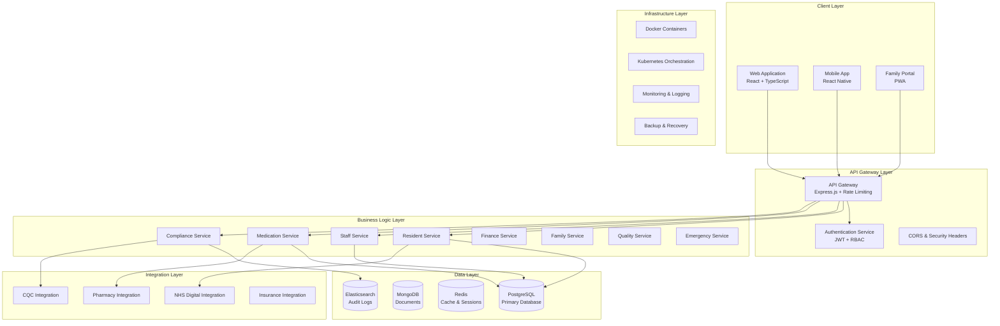
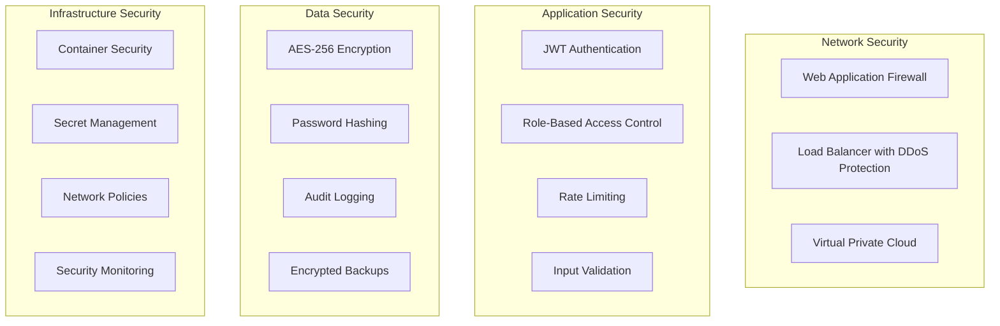
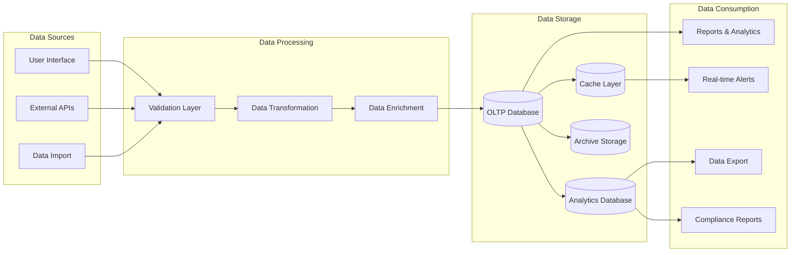
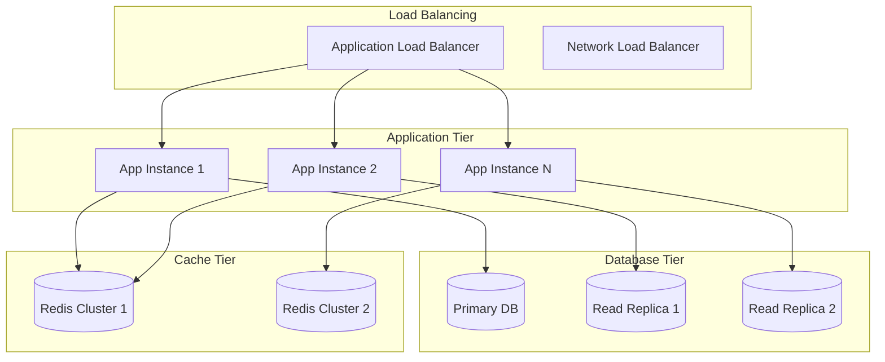

# WriteCareNotes Architecture Overview

## System Architecture Philosophy

WriteCareNotes follows a **microservices architecture** with **domain-driven design** principles, ensuring scalability, maintainability, and regulatory compliance across all British Isles jurisdictions.

## High-Level Architecture



## Technology Stack Decision Matrix

### Backend Technologies
| Component | Technology | Justification |
|-----------|------------|---------------|
| Runtime | Node.js 20 LTS | Healthcare industry standard, excellent TypeScript support |
| Framework | Express.js | Mature, extensive middleware ecosystem, healthcare integrations |
| Language | TypeScript | Type safety critical for healthcare data, better maintainability |
| Database | PostgreSQL 15 | ACID compliance, excellent JSON support, healthcare industry standard |
| Cache | Redis 7 | High performance, session management, real-time features |
| Search | Elasticsearch | Audit log analysis, complex healthcare data queries |
| Queue | Bull/BullMQ | Reliable job processing for reports and notifications |

### Frontend Technologies
| Component | Technology | Justification |
|-----------|------------|---------------|
| Framework | React 18 | Large ecosystem, accessibility support, healthcare UI libraries |
| Language | TypeScript | Type safety, better developer experience, API contract enforcement |
| State Management | Zustand | Lightweight, TypeScript-first, easier testing |
| UI Library | Material-UI v5 | Accessibility compliant, healthcare design patterns |
| Forms | React Hook Form | Performance, validation, accessibility |
| Testing | React Testing Library | Accessibility-focused testing, industry standard |

### Infrastructure Technologies
| Component | Technology | Justification |
|-----------|------------|---------------|
| Containerization | Docker | Consistent deployments, security isolation |
| Orchestration | Kubernetes | Scalability, health checks, rolling deployments |
| Cloud Provider | AWS (UK regions) | Data residency compliance, healthcare certifications |
| Monitoring | Prometheus + Grafana | Open source, extensive healthcare metrics |
| Logging | Winston + ELK Stack | Structured logging, audit trail requirements |

## Domain-Driven Design Structure

### Bounded Contexts
```typescript
// Core Domains
interface BoundedContexts {
  residentManagement: {
    entities: ['Resident', 'CarePlan', 'Assessment', 'MedicalHistory'];
    services: ['ResidentService', 'CarePlanService', 'AssessmentService'];
    repositories: ['ResidentRepository', 'CarePlanRepository'];
  };
  
  staffManagement: {
    entities: ['Staff', 'Shift', 'Qualification', 'Training'];
    services: ['StaffService', 'SchedulingService', 'TrainingService'];
    repositories: ['StaffRepository', 'ShiftRepository'];
  };
  
  medicationManagement: {
    entities: ['Medication', 'Prescription', 'Administration', 'Stock'];
    services: ['MedicationService', 'PrescriptionService', 'StockService'];
    repositories: ['MedicationRepository', 'PrescriptionRepository'];
  };
  
  complianceManagement: {
    entities: ['Incident', 'Audit', 'Report', 'Regulation'];
    services: ['ComplianceService', 'AuditService', 'ReportingService'];
    repositories: ['IncidentRepository', 'AuditRepository'];
  };
}
```

## Security Architecture

### Defense in Depth Strategy


### Security Controls Implementation
```typescript
interface SecurityControls {
  authentication: {
    method: 'JWT with refresh tokens';
    mfa: 'TOTP for admin users';
    sessionTimeout: '30 minutes idle, 8 hours absolute';
    passwordPolicy: 'NIST 800-63B compliant';
  };
  
  authorization: {
    model: 'RBAC with resource-level permissions';
    roles: ['SuperAdmin', 'CareHomeManager', 'Nurse', 'Carer', 'Family'];
    permissions: 'Granular per resource and action';
  };
  
  dataProtection: {
    encryption: 'AES-256-GCM for PII fields';
    hashing: 'Argon2id for passwords';
    tokenization: 'NHS numbers and sensitive identifiers';
    retention: 'Automated purging per GDPR requirements';
  };
}
```

## Data Architecture

### Database Design Principles
1. **Normalization**: 3NF for transactional data
2. **Denormalization**: Strategic for reporting and analytics
3. **Partitioning**: Time-based for audit logs and historical data
4. **Indexing**: Optimized for healthcare query patterns
5. **Constraints**: Enforce business rules at database level

### Data Flow Architecture


## Performance Architecture

### Performance Requirements
```typescript
interface PerformanceTargets {
  responseTime: {
    authentication: '< 100ms';
    dataRetrieval: '< 200ms';
    dataUpdate: '< 300ms';
    reportGeneration: '< 2000ms';
    fileUpload: '< 5000ms';
  };
  
  throughput: {
    concurrentUsers: 500;
    apiRequestsPerSecond: 1000;
    databaseConnections: 100;
  };
  
  availability: {
    uptime: '99.9%';
    plannedDowntime: '< 4 hours/month';
    recoveryTime: '< 15 minutes';
  };
}
```

### Caching Strategy
```typescript
interface CachingLayers {
  applicationCache: {
    technology: 'Redis';
    ttl: '5-60 minutes based on data type';
    strategy: 'Cache-aside with write-through';
  };
  
  databaseCache: {
    technology: 'PostgreSQL shared_buffers';
    size: '25% of available RAM';
    strategy: 'LRU eviction';
  };
  
  cdnCache: {
    technology: 'CloudFront';
    ttl: '1 hour for static assets';
    strategy: 'Edge caching with invalidation';
  };
}
```

## Scalability Architecture

### Horizontal Scaling Strategy


## Monitoring and Observability

### Observability Stack
```typescript
interface ObservabilityStack {
  metrics: {
    collection: 'Prometheus';
    visualization: 'Grafana';
    alerting: 'AlertManager';
    retention: '90 days detailed, 1 year aggregated';
  };
  
  logging: {
    collection: 'Fluentd';
    storage: 'Elasticsearch';
    visualization: 'Kibana';
    retention: '7 years for audit logs, 30 days for application logs';
  };
  
  tracing: {
    collection: 'Jaeger';
    sampling: '1% for production, 100% for development';
    retention: '7 days';
  };
  
  healthChecks: {
    application: '/health endpoint';
    database: 'Connection pool monitoring';
    external: 'Dependency health checks';
    frequency: '30 seconds';
  };
}
```