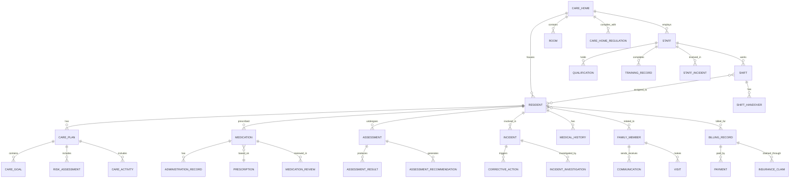

# WriteCareNotes Database Design Document

## Database Architecture Overview

WriteCareNotes uses a **PostgreSQL 15** primary database with supporting technologies for optimal performance and compliance:

- **Primary Database**: PostgreSQL 15 (ACID compliance, JSON support, healthcare industry standard)
- **Cache Layer**: Redis 7 (session management, real-time features)
- **Search Engine**: Elasticsearch 8 (audit logs, complex queries)
- **Document Storage**: PostgreSQL JSONB + File System (care plans, reports)

## Database Design Principles

### 1. Healthcare Data Standards
- **NHS Data Dictionary** compliance for all healthcare fields
- **SNOMED CT** coding for medical conditions and procedures
- **ICD-10** classification for diagnoses
- **dm+d** (Dictionary of medicines and devices) for medications

### 2. GDPR and Data Protection
- **Data minimization**: Only collect necessary data
- **Purpose limitation**: Clear purpose for each data field
- **Consent tracking**: Explicit consent for all data processing
- **Right to erasure**: Soft deletes with purging capabilities
- **Data portability**: Export capabilities for all personal data

### 3. Audit and Compliance
- **Complete audit trail** for all data changes
- **Immutable audit logs** stored separately
- **Correlation IDs** for request tracking
- **Compliance flags** for regulatory requirements

## Core Database Schema

### Entity Relationship Diagram



## Table Definitions

### 1. Core System Tables

#### care_homes
```sql
CREATE TABLE care_homes (
    id UUID PRIMARY KEY DEFAULT gen_random_uuid(),
    name VARCHAR(255) NOT NULL,
    registration_number VARCHAR(50) UNIQUE NOT NULL,
    care_home_type care_home_type_enum NOT NULL,
    address JSONB NOT NULL,
    contact_details JSONB NOT NULL,
    capacity INTEGER NOT NULL CHECK (capacity > 0),
    regulatory_body regulatory_body_enum NOT NULL,
    registration_date DATE NOT NULL,
    last_inspection_date DATE,
    next_inspection_due DATE,
    status care_home_status_enum DEFAULT 'active',
    
    -- GDPR and Audit Fields
    created_at TIMESTAMP WITH TIME ZONE DEFAULT NOW(),
    updated_at TIMESTAMP WITH TIME ZONE DEFAULT NOW(),
    created_by UUID NOT NULL,
    updated_by UUID NOT NULL,
    version INTEGER DEFAULT 1,
    
    -- Compliance Fields
    gdpr_consent_date TIMESTAMP WITH TIME ZONE,
    data_retention_period INTEGER DEFAULT 2555, -- 7 years in days
    
    CONSTRAINT fk_care_homes_created_by FOREIGN KEY (created_by) REFERENCES users(id),
    CONSTRAINT fk_care_homes_updated_by FOREIGN KEY (updated_by) REFERENCES users(id)
);

-- Indexes for performance
CREATE INDEX idx_care_homes_registration_number ON care_homes(registration_number);
CREATE INDEX idx_care_homes_regulatory_body ON care_homes(regulatory_body);
CREATE INDEX idx_care_homes_status ON care_homes(status);
```

#### users (Staff and System Users)
```sql
CREATE TABLE users (
    id UUID PRIMARY KEY DEFAULT gen_random_uuid(),
    care_home_id UUID NOT NULL,
    employee_id VARCHAR(50),
    email VARCHAR(255) UNIQUE NOT NULL,
    password_hash VARCHAR(255) NOT NULL,
    
    -- Personal Information (Encrypted)
    first_name VARCHAR(100) NOT NULL,
    last_name VARCHAR(100) NOT NULL,
    date_of_birth DATE,
    phone_number VARCHAR(20),
    address JSONB,
    
    -- Employment Details
    job_title VARCHAR(100),
    department VARCHAR(100),
    employment_start_date DATE,
    employment_end_date DATE,
    employment_status employment_status_enum DEFAULT 'active',
    
    -- System Access
    role user_role_enum NOT NULL,
    permissions JSONB DEFAULT '[]',
    last_login TIMESTAMP WITH TIME ZONE,
    failed_login_attempts INTEGER DEFAULT 0,
    account_locked_until TIMESTAMP WITH TIME ZONE,
    
    -- GDPR and Audit Fields
    created_at TIMESTAMP WITH TIME ZONE DEFAULT NOW(),
    updated_at TIMESTAMP WITH TIME ZONE DEFAULT NOW(),
    deleted_at TIMESTAMP WITH TIME ZONE,
    created_by UUID,
    updated_by UUID,
    version INTEGER DEFAULT 1,
    
    -- GDPR Compliance
    gdpr_consent BOOLEAN DEFAULT FALSE,
    gdpr_consent_date TIMESTAMP WITH TIME ZONE,
    gdpr_consent_withdrawn_date TIMESTAMP WITH TIME ZONE,
    data_processing_purposes JSONB DEFAULT '[]',
    
    CONSTRAINT fk_users_care_home FOREIGN KEY (care_home_id) REFERENCES care_homes(id),
    CONSTRAINT fk_users_created_by FOREIGN KEY (created_by) REFERENCES users(id),
    CONSTRAINT fk_users_updated_by FOREIGN KEY (updated_by) REFERENCES users(id)
);

-- Indexes
CREATE INDEX idx_users_care_home_id ON users(care_home_id);
CREATE INDEX idx_users_email ON users(email);
CREATE INDEX idx_users_role ON users(role);
CREATE INDEX idx_users_employment_status ON users(employment_status);
CREATE INDEX idx_users_deleted_at ON users(deleted_at);
```

### 2. Resident Management Tables

#### residents
```sql
CREATE TABLE residents (
    id UUID PRIMARY KEY DEFAULT gen_random_uuid(),
    care_home_id UUID NOT NULL,
    resident_number VARCHAR(50) UNIQUE NOT NULL,
    
    -- Personal Information (Encrypted PII)
    nhs_number VARCHAR(10) UNIQUE, -- Encrypted
    first_name VARCHAR(100) NOT NULL, -- Encrypted
    last_name VARCHAR(100) NOT NULL, -- Encrypted
    preferred_name VARCHAR(100), -- Encrypted
    date_of_birth DATE NOT NULL, -- Encrypted
    gender gender_enum,
    
    -- Contact Information (Encrypted)
    previous_address JSONB, -- Encrypted
    phone_number VARCHAR(20), -- Encrypted
    email VARCHAR(255), -- Encrypted
    
    -- Care Information
    care_level care_level_enum NOT NULL,
    admission_date DATE NOT NULL,
    discharge_date DATE,
    room_id UUID,
    
    -- Medical Information
    gp_details JSONB, -- Encrypted
    medical_conditions JSONB DEFAULT '[]',
    allergies JSONB DEFAULT '[]',
    dietary_requirements JSONB DEFAULT '[]',
    
    -- Legal and Financial
    next_of_kin JSONB, -- Encrypted
    power_of_attorney JSONB, -- Encrypted
    funding_source funding_source_enum,
    
    -- Status
    status resident_status_enum DEFAULT 'active',
    
    -- GDPR and Audit Fields
    created_at TIMESTAMP WITH TIME ZONE DEFAULT NOW(),
    updated_at TIMESTAMP WITH TIME ZONE DEFAULT NOW(),
    deleted_at TIMESTAMP WITH TIME ZONE,
    created_by UUID NOT NULL,
    updated_by UUID NOT NULL,
    version INTEGER DEFAULT 1,
    
    -- GDPR Compliance
    gdpr_consent BOOLEAN DEFAULT FALSE,
    gdpr_consent_date TIMESTAMP WITH TIME ZONE,
    gdpr_consent_withdrawn_date TIMESTAMP WITH TIME ZONE,
    lawful_basis_for_processing lawful_basis_enum NOT NULL,
    data_retention_period INTEGER DEFAULT 2555, -- 7 years
    right_to_be_forgotten_requested TIMESTAMP WITH TIME ZONE,
    data_portability_requested TIMESTAMP WITH TIME ZONE,
    
    CONSTRAINT fk_residents_care_home FOREIGN KEY (care_home_id) REFERENCES care_homes(id),
    CONSTRAINT fk_residents_room FOREIGN KEY (room_id) REFERENCES rooms(id),
    CONSTRAINT fk_residents_created_by FOREIGN KEY (created_by) REFERENCES users(id),
    CONSTRAINT fk_residents_updated_by FOREIGN KEY (updated_by) REFERENCES users(id),
    CONSTRAINT chk_residents_nhs_number CHECK (nhs_number ~ '^\d{10}$' OR nhs_number IS NULL)
);

-- Indexes
CREATE INDEX idx_residents_care_home_id ON residents(care_home_id);
CREATE INDEX idx_residents_nhs_number ON residents(nhs_number);
CREATE INDEX idx_residents_resident_number ON residents(resident_number);
CREATE INDEX idx_residents_care_level ON residents(care_level);
CREATE INDEX idx_residents_status ON residents(status);
CREATE INDEX idx_residents_admission_date ON residents(admission_date);
CREATE INDEX idx_residents_deleted_at ON residents(deleted_at);
```

#### care_plans
```sql
CREATE TABLE care_plans (
    id UUID PRIMARY KEY DEFAULT gen_random_uuid(),
    resident_id UUID NOT NULL,
    care_home_id UUID NOT NULL,
    
    -- Care Plan Details
    plan_name VARCHAR(255) NOT NULL,
    plan_type care_plan_type_enum NOT NULL,
    start_date DATE NOT NULL,
    end_date DATE,
    review_frequency INTEGER NOT NULL, -- Days between reviews
    next_review_date DATE NOT NULL,
    
    -- Care Plan Content (JSONB for flexibility)
    care_goals JSONB DEFAULT '[]',
    daily_activities JSONB DEFAULT '[]',
    risk_assessments JSONB DEFAULT '[]',
    care_interventions JSONB DEFAULT '[]',
    
    -- Approval and Status
    status care_plan_status_enum DEFAULT 'draft',
    approved_by UUID,
    approved_date TIMESTAMP WITH TIME ZONE,
    
    -- GDPR and Audit Fields
    created_at TIMESTAMP WITH TIME ZONE DEFAULT NOW(),
    updated_at TIMESTAMP WITH TIME ZONE DEFAULT NOW(),
    deleted_at TIMESTAMP WITH TIME ZONE,
    created_by UUID NOT NULL,
    updated_by UUID NOT NULL,
    version INTEGER DEFAULT 1,
    
    CONSTRAINT fk_care_plans_resident FOREIGN KEY (resident_id) REFERENCES residents(id),
    CONSTRAINT fk_care_plans_care_home FOREIGN KEY (care_home_id) REFERENCES care_homes(id),
    CONSTRAINT fk_care_plans_approved_by FOREIGN KEY (approved_by) REFERENCES users(id),
    CONSTRAINT fk_care_plans_created_by FOREIGN KEY (created_by) REFERENCES users(id),
    CONSTRAINT fk_care_plans_updated_by FOREIGN KEY (updated_by) REFERENCES users(id)
);

-- Indexes
CREATE INDEX idx_care_plans_resident_id ON care_plans(resident_id);
CREATE INDEX idx_care_plans_care_home_id ON care_plans(care_home_id);
CREATE INDEX idx_care_plans_status ON care_plans(status);
CREATE INDEX idx_care_plans_next_review_date ON care_plans(next_review_date);
CREATE INDEX idx_care_plans_deleted_at ON care_plans(deleted_at);
```

### 3. Medication Management Tables

#### medications
```sql
CREATE TABLE medications (
    id UUID PRIMARY KEY DEFAULT gen_random_uuid(),
    resident_id UUID NOT NULL,
    care_home_id UUID NOT NULL,
    
    -- Medication Details
    medication_name VARCHAR(255) NOT NULL,
    generic_name VARCHAR(255),
    dm_d_code VARCHAR(50), -- Dictionary of medicines and devices code
    strength VARCHAR(100),
    form medication_form_enum NOT NULL,
    
    -- Prescription Details
    prescriber_name VARCHAR(255) NOT NULL,
    prescriber_gmc_number VARCHAR(20),
    prescription_date DATE NOT NULL,
    prescription_number VARCHAR(100),
    
    -- Administration Details
    dosage VARCHAR(100) NOT NULL,
    frequency VARCHAR(100) NOT NULL,
    route_of_administration route_enum NOT NULL,
    administration_times JSONB DEFAULT '[]', -- Array of times
    
    -- Medication Periods
    start_date DATE NOT NULL,
    end_date DATE,
    
    -- Special Instructions
    special_instructions TEXT,
    contraindications JSONB DEFAULT '[]',
    side_effects JSONB DEFAULT '[]',
    
    -- Controlled Drug Information
    is_controlled_drug BOOLEAN DEFAULT FALSE,
    controlled_drug_schedule INTEGER,
    
    -- Status
    status medication_status_enum DEFAULT 'active',
    
    -- GDPR and Audit Fields
    created_at TIMESTAMP WITH TIME ZONE DEFAULT NOW(),
    updated_at TIMESTAMP WITH TIME ZONE DEFAULT NOW(),
    deleted_at TIMESTAMP WITH TIME ZONE,
    created_by UUID NOT NULL,
    updated_by UUID NOT NULL,
    version INTEGER DEFAULT 1,
    
    CONSTRAINT fk_medications_resident FOREIGN KEY (resident_id) REFERENCES residents(id),
    CONSTRAINT fk_medications_care_home FOREIGN KEY (care_home_id) REFERENCES care_homes(id),
    CONSTRAINT fk_medications_created_by FOREIGN KEY (created_by) REFERENCES users(id),
    CONSTRAINT fk_medications_updated_by FOREIGN KEY (updated_by) REFERENCES users(id)
);

-- Indexes
CREATE INDEX idx_medications_resident_id ON medications(resident_id);
CREATE INDEX idx_medications_care_home_id ON medications(care_home_id);
CREATE INDEX idx_medications_status ON medications(status);
CREATE INDEX idx_medications_is_controlled_drug ON medications(is_controlled_drug);
CREATE INDEX idx_medications_deleted_at ON medications(deleted_at);
```

#### medication_administration_records
```sql
CREATE TABLE medication_administration_records (
    id UUID PRIMARY KEY DEFAULT gen_random_uuid(),
    medication_id UUID NOT NULL,
    resident_id UUID NOT NULL,
    care_home_id UUID NOT NULL,
    
    -- Administration Details
    scheduled_time TIMESTAMP WITH TIME ZONE NOT NULL,
    actual_time TIMESTAMP WITH TIME ZONE,
    administered_by UUID NOT NULL,
    witnessed_by UUID,
    
    -- Administration Status
    status administration_status_enum NOT NULL,
    reason_not_given VARCHAR(255),
    
    -- Dosage Information
    prescribed_dosage VARCHAR(100) NOT NULL,
    actual_dosage VARCHAR(100),
    
    -- Notes and Observations
    administration_notes TEXT,
    resident_response TEXT,
    side_effects_observed JSONB DEFAULT '[]',
    
    -- Digital Signatures (for compliance)
    administrator_signature JSONB, -- Digital signature data
    witness_signature JSONB, -- Digital signature data
    
    -- GDPR and Audit Fields
    created_at TIMESTAMP WITH TIME ZONE DEFAULT NOW(),
    updated_at TIMESTAMP WITH TIME ZONE DEFAULT NOW(),
    created_by UUID NOT NULL,
    updated_by UUID NOT NULL,
    version INTEGER DEFAULT 1,
    
    CONSTRAINT fk_mar_medication FOREIGN KEY (medication_id) REFERENCES medications(id),
    CONSTRAINT fk_mar_resident FOREIGN KEY (resident_id) REFERENCES residents(id),
    CONSTRAINT fk_mar_care_home FOREIGN KEY (care_home_id) REFERENCES care_homes(id),
    CONSTRAINT fk_mar_administered_by FOREIGN KEY (administered_by) REFERENCES users(id),
    CONSTRAINT fk_mar_witnessed_by FOREIGN KEY (witnessed_by) REFERENCES users(id),
    CONSTRAINT fk_mar_created_by FOREIGN KEY (created_by) REFERENCES users(id),
    CONSTRAINT fk_mar_updated_by FOREIGN KEY (updated_by) REFERENCES users(id)
);

-- Indexes
CREATE INDEX idx_mar_medication_id ON medication_administration_records(medication_id);
CREATE INDEX idx_mar_resident_id ON medication_administration_records(resident_id);
CREATE INDEX idx_mar_scheduled_time ON medication_administration_records(scheduled_time);
CREATE INDEX idx_mar_administered_by ON medication_administration_records(administered_by);
CREATE INDEX idx_mar_status ON medication_administration_records(status);
```

### 4. Compliance and Audit Tables

#### incidents
```sql
CREATE TABLE incidents (
    id UUID PRIMARY KEY DEFAULT gen_random_uuid(),
    care_home_id UUID NOT NULL,
    incident_number VARCHAR(50) UNIQUE NOT NULL,
    
    -- Incident Classification
    incident_type incident_type_enum NOT NULL,
    severity severity_enum NOT NULL,
    category incident_category_enum NOT NULL,
    
    -- Incident Details
    title VARCHAR(255) NOT NULL,
    description TEXT NOT NULL,
    location VARCHAR(255),
    incident_date TIMESTAMP WITH TIME ZONE NOT NULL,
    reported_date TIMESTAMP WITH TIME ZONE DEFAULT NOW(),
    
    -- People Involved
    residents_involved JSONB DEFAULT '[]', -- Array of resident IDs
    staff_involved JSONB DEFAULT '[]', -- Array of staff IDs
    visitors_involved JSONB DEFAULT '[]', -- Array of visitor details
    
    -- Reporting
    reported_by UUID NOT NULL,
    manager_notified BOOLEAN DEFAULT FALSE,
    manager_notified_at TIMESTAMP WITH TIME ZONE,
    
    -- External Notifications
    family_notified BOOLEAN DEFAULT FALSE,
    family_notified_at TIMESTAMP WITH TIME ZONE,
    gp_notified BOOLEAN DEFAULT FALSE,
    gp_notified_at TIMESTAMP WITH TIME ZONE,
    regulatory_body_notified BOOLEAN DEFAULT FALSE,
    regulatory_body_notified_at TIMESTAMP WITH TIME ZONE,
    
    -- Investigation
    investigation_required BOOLEAN DEFAULT TRUE,
    investigation_status investigation_status_enum DEFAULT 'pending',
    investigation_assigned_to UUID,
    investigation_due_date DATE,
    investigation_completed_date DATE,
    
    -- Root Cause Analysis
    root_cause TEXT,
    contributing_factors JSONB DEFAULT '[]',
    
    -- Status and Resolution
    status incident_status_enum DEFAULT 'open',
    resolution TEXT,
    resolved_date TIMESTAMP WITH TIME ZONE,
    resolved_by UUID,
    
    -- GDPR and Audit Fields
    created_at TIMESTAMP WITH TIME ZONE DEFAULT NOW(),
    updated_at TIMESTAMP WITH TIME ZONE DEFAULT NOW(),
    deleted_at TIMESTAMP WITH TIME ZONE,
    created_by UUID NOT NULL,
    updated_by UUID NOT NULL,
    version INTEGER DEFAULT 1,
    
    CONSTRAINT fk_incidents_care_home FOREIGN KEY (care_home_id) REFERENCES care_homes(id),
    CONSTRAINT fk_incidents_reported_by FOREIGN KEY (reported_by) REFERENCES users(id),
    CONSTRAINT fk_incidents_investigation_assigned_to FOREIGN KEY (investigation_assigned_to) REFERENCES users(id),
    CONSTRAINT fk_incidents_resolved_by FOREIGN KEY (resolved_by) REFERENCES users(id),
    CONSTRAINT fk_incidents_created_by FOREIGN KEY (created_by) REFERENCES users(id),
    CONSTRAINT fk_incidents_updated_by FOREIGN KEY (updated_by) REFERENCES users(id)
);

-- Indexes
CREATE INDEX idx_incidents_care_home_id ON incidents(care_home_id);
CREATE INDEX idx_incidents_incident_number ON incidents(incident_number);
CREATE INDEX idx_incidents_incident_type ON incidents(incident_type);
CREATE INDEX idx_incidents_severity ON incidents(severity);
CREATE INDEX idx_incidents_status ON incidents(status);
CREATE INDEX idx_incidents_incident_date ON incidents(incident_date);
CREATE INDEX idx_incidents_deleted_at ON incidents(deleted_at);
```

#### audit_logs
```sql
CREATE TABLE audit_logs (
    id UUID PRIMARY KEY DEFAULT gen_random_uuid(),
    
    -- Request Tracking
    correlation_id UUID NOT NULL,
    session_id VARCHAR(255),
    
    -- User Information
    user_id UUID,
    user_role VARCHAR(50),
    care_home_id UUID,
    
    -- Action Details
    action VARCHAR(100) NOT NULL,
    resource_type VARCHAR(100) NOT NULL,
    resource_id UUID,
    
    -- Request Information
    http_method VARCHAR(10),
    endpoint VARCHAR(500),
    ip_address INET,
    user_agent TEXT,
    
    -- Data Changes
    old_values JSONB,
    new_values JSONB,
    
    -- Compliance and Security
    compliance_flags JSONB DEFAULT '[]',
    security_flags JSONB DEFAULT '[]',
    
    -- Timing
    timestamp TIMESTAMP WITH TIME ZONE DEFAULT NOW(),
    processing_time_ms INTEGER,
    
    -- Status
    success BOOLEAN NOT NULL,
    error_message TEXT,
    error_code VARCHAR(50),
    
    CONSTRAINT fk_audit_logs_user FOREIGN KEY (user_id) REFERENCES users(id),
    CONSTRAINT fk_audit_logs_care_home FOREIGN KEY (care_home_id) REFERENCES care_homes(id)
);

-- Indexes for audit log queries
CREATE INDEX idx_audit_logs_correlation_id ON audit_logs(correlation_id);
CREATE INDEX idx_audit_logs_user_id ON audit_logs(user_id);
CREATE INDEX idx_audit_logs_care_home_id ON audit_logs(care_home_id);
CREATE INDEX idx_audit_logs_action ON audit_logs(action);
CREATE INDEX idx_audit_logs_resource_type ON audit_logs(resource_type);
CREATE INDEX idx_audit_logs_resource_id ON audit_logs(resource_id);
CREATE INDEX idx_audit_logs_timestamp ON audit_logs(timestamp);

-- Partition audit_logs by month for performance
CREATE TABLE audit_logs_y2025m01 PARTITION OF audit_logs
    FOR VALUES FROM ('2025-01-01') TO ('2025-02-01');
```

## Enums and Custom Types

```sql
-- Care Home Types
CREATE TYPE care_home_type_enum AS ENUM (
    'residential',
    'nursing',
    'dementia_specialist',
    'mental_health',
    'learning_disability',
    'physical_disability',
    'mixed'
);

-- Regulatory Bodies
CREATE TYPE regulatory_body_enum AS ENUM (
    'cqc',              -- Care Quality Commission (England)
    'care_inspectorate', -- Care Inspectorate (Scotland)
    'ciw',              -- Care Inspectorate Wales
    'rqia'              -- Regulation and Quality Improvement Authority (Northern Ireland)
);

-- User Roles
CREATE TYPE user_role_enum AS ENUM (
    'super_admin',
    'care_home_manager',
    'deputy_manager',
    'registered_nurse',
    'senior_carer',
    'carer',
    'activities_coordinator',
    'maintenance_staff',
    'kitchen_staff',
    'admin_staff',
    'family_member',
    'visitor'
);

-- Care Levels
CREATE TYPE care_level_enum AS ENUM (
    'residential',
    'nursing',
    'dementia',
    'mental_health',
    'learning_disability',
    'physical_disability',
    'palliative',
    'respite'
);

-- Incident Types
CREATE TYPE incident_type_enum AS ENUM (
    'fall',
    'medication_error',
    'injury',
    'illness',
    'behavioral',
    'safeguarding',
    'complaint',
    'equipment_failure',
    'fire_safety',
    'infection_control',
    'security_breach',
    'data_breach',
    'other'
);

-- Severity Levels
CREATE TYPE severity_enum AS ENUM (
    'low',
    'medium',
    'high',
    'critical'
);

-- GDPR Lawful Basis
CREATE TYPE lawful_basis_enum AS ENUM (
    'consent',
    'contract',
    'legal_obligation',
    'vital_interests',
    'public_task',
    'legitimate_interests'
);
```

## Performance Optimization

### Indexing Strategy
```sql
-- Composite indexes for common queries
CREATE INDEX idx_residents_care_home_status ON residents(care_home_id, status) WHERE deleted_at IS NULL;
CREATE INDEX idx_medications_resident_active ON medications(resident_id, status) WHERE status = 'active';
CREATE INDEX idx_incidents_care_home_date ON incidents(care_home_id, incident_date DESC);
CREATE INDEX idx_audit_logs_user_timestamp ON audit_logs(user_id, timestamp DESC);

-- Partial indexes for soft deletes
CREATE INDEX idx_residents_active ON residents(id) WHERE deleted_at IS NULL;
CREATE INDEX idx_users_active ON users(id) WHERE deleted_at IS NULL;
CREATE INDEX idx_care_plans_active ON care_plans(id) WHERE deleted_at IS NULL;

-- GIN indexes for JSONB columns
CREATE INDEX idx_residents_medical_conditions ON residents USING GIN (medical_conditions);
CREATE INDEX idx_care_plans_care_goals ON care_plans USING GIN (care_goals);
CREATE INDEX idx_audit_logs_compliance_flags ON audit_logs USING GIN (compliance_flags);
```

### Partitioning Strategy
```sql
-- Partition audit_logs by month
ALTER TABLE audit_logs PARTITION BY RANGE (timestamp);

-- Create partitions for the next 12 months
CREATE TABLE audit_logs_y2025m01 PARTITION OF audit_logs
    FOR VALUES FROM ('2025-01-01') TO ('2025-02-01');
-- ... continue for each month
```

## Data Retention and Archival

### Retention Policies
```sql
-- Function to archive old audit logs
CREATE OR REPLACE FUNCTION archive_old_audit_logs()
RETURNS void AS $$
BEGIN
    -- Move audit logs older than 7 years to archive table
    INSERT INTO audit_logs_archive 
    SELECT * FROM audit_logs 
    WHERE timestamp < NOW() - INTERVAL '7 years';
    
    -- Delete archived records from main table
    DELETE FROM audit_logs 
    WHERE timestamp < NOW() - INTERVAL '7 years';
END;
$$ LANGUAGE plpgsql;

-- Schedule monthly archival
SELECT cron.schedule('archive-audit-logs', '0 2 1 * *', 'SELECT archive_old_audit_logs();');
```

This database design ensures WriteCareNotes meets all healthcare compliance requirements while providing optimal performance and data protection capabilities.