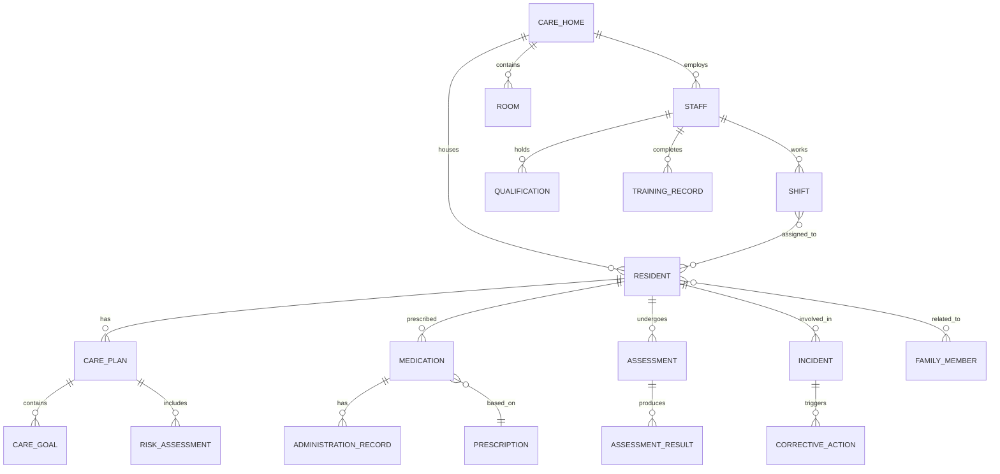

# Design Document

## Overview

The British Isles Adult Care Home Management System is designed as a comprehensive, cloud-based platform that provides end-to-end care home management capabilities. The system follows a microservices architecture with a modern web-based frontend, ensuring scalability, maintainability, and compliance with healthcare data protection regulations including GDPR, Data Protection Act 2018, and regional healthcare standards.

The platform integrates with existing healthcare systems (NHS Digital, HSC Northern Ireland, NHS Wales, NHS Scotland) and regulatory bodies while providing offline capabilities for critical operations during connectivity issues.

## Architecture

### System Architecture Overview

```mermaid
graph TB
    subgraph "Frontend Layer"
        PWA[Progressive Web Application]
        MOBILE[React Native Mobile App]
        FAMILY[Family Portal PWA]
        ADMIN[Admin Dashboard]
        FINANCE_UI[Financial Management UI]
        HR_UI[HR Management UI]
    end
    
    subgraph "API Gateway"
        GATEWAY[API Gateway & Load Balancer]
    end
    
    subgraph "Microservices Layer"
        RESIDENT[Resident Service]
        BED_MGMT[Bed Management Service]
        STAFF[Staff Service]
        HR_MGMT[HR Management Service]
        PAYROLL[Payroll Service]
        ROTA[ROTA Management Service]
        MEDICATION[Medication Service]
        FINANCE[Finance Service]
        ACCOUNTING[Accounting Service]
        FIN_ANALYTICS[Financial Analytics Service]
        TAX_OPT[Tax Optimization Service]
        COMPLIANCE[Compliance Service]
        FAMILY_SVC[Family Service]
        REPORTING[Reporting Service]
        MENTAL_HEALTH[Mental Health Service]
        QUALITY[Quality Service]
        BI_SERVICE[Business Intelligence Service]
        DOC_MGMT[Document Management Service]
        EMERGENCY[Emergency Service]
    end
    
    subgraph "Integration Layer"
        NHS_API[NHS Digital API]
        CQC_API[CQC Integration]
        HMRC_API[HMRC Integration]
        PENSION_API[Pension Providers]
        INSURANCE[Insurance APIs]
        PHARMACY[Pharmacy Systems]
        BANKING[Banking APIs]
        ACCOUNTING_INT[Accounting Software Integration]
    end
    
    subgraph "Data Layer"
        PRIMARY_DB[(Primary Database)]
        AUDIT_DB[(Audit Database)]
        DOCUMENT_STORE[(Document Store)]
        CACHE[(Redis Cache)]
    end
    
    subgraph "Infrastructure"
        MONITORING[Monitoring & Logging]
        BACKUP[Backup & Recovery]
        SECURITY[Security & Auth]
    end
    
    WEB --> GATEWAY
    MOBILE --> GATEWAY
    FAMILY --> GATEWAY
    
    GATEWAY --> RESIDENT
    GATEWAY --> STAFF
    GATEWAY --> MEDICATION
    GATEWAY --> COMPLIANCE
    GATEWAY --> FINANCE
    GATEWAY --> FAMILY_SVC
    GATEWAY --> REPORTING
    GATEWAY --> MENTAL_HEALTH
    GATEWAY --> QUALITY
    GATEWAY --> EMERGENCY
    
    RESIDENT --> NHS_API
    COMPLIANCE --> CQC_API
    FINANCE --> INSURANCE
    MEDICATION --> PHARMACY
    
    RESIDENT --> PRIMARY_DB
    STAFF --> PRIMARY_DB
    MEDICATION --> PRIMARY_DB
    COMPLIANCE --> AUDIT_DB
    FINANCE --> PRIMARY_DB
    FAMILY_SVC --> PRIMARY_DB
    REPORTING --> PRIMARY_DB
    MENTAL_HEALTH --> PRIMARY_DB
    QUALITY --> PRIMARY_DB
    EMERGENCY --> PRIMARY_DB
    
    PRIMARY_DB --> DOCUMENT_STORE
    PRIMARY_DB --> CACHE
```



### Technology Stack

**Frontend:**
- Progressive Web Application (PWA) with React.js and TypeScript
- React Native for complete mobile applications (iOS/Android)
- Material-UI with custom healthcare design system
- Offline-first architecture with service workers
- Real-time updates with WebSocket connections

**Backend:**
- Node.js with Express.js for microservices architecture
- TypeScript for type safety and enterprise development
- JWT authentication with comprehensive RBAC
- GraphQL and REST APIs for flexible data access
- Real-time capabilities with Socket.io

**Database & Analytics:**
- PostgreSQL for primary transactional data with advanced indexing
- MongoDB for document storage and flexible schemas
- Redis for caching, sessions, and real-time features
- Elasticsearch for audit logs, search, and analytics
- ClickHouse for financial analytics and business intelligence
- Apache Kafka for event streaming and data pipelines

**Enterprise Features:**
- Advanced financial modeling and forecasting engines
- Machine learning for predictive analytics
- Automated tax optimization algorithms
- Comprehensive audit and compliance frameworks
- Multi-tenant architecture for enterprise scaling

**Infrastructure:**
- Docker containers with Kubernetes orchestration
- AWS/Azure cloud with UK data residency compliance
- CDN for global performance optimization
- Auto-scaling and load balancing
- Comprehensive monitoring and alerting

## Components and Interfaces

### Enterprise Architecture Components

#### 1. Bed Management Service
**Responsibilities:**
- Real-time bed availability tracking
- Occupancy optimization and forecasting
- Waiting list management with prioritization
- Revenue optimization algorithms

**Key Interfaces:**
```typescript
interface BedManagement {
  bedAvailability: BedAvailabilityTracker;
  occupancyOptimizer: OccupancyOptimizer;
  waitingListManager: WaitingListManager;
  revenueOptimizer: RevenueOptimizer;
}

interface BedAvailability {
  bedId: string;
  roomType: RoomType;
  careLevel: CareLevel;
  availability: AvailabilityStatus;
  maintenanceSchedule: MaintenanceWindow[];
  ratePerNight: number;
  occupancyForecast: OccupancyForecast;
}
```

#### 2. HR Management Service
**Responsibilities:**
- Complete employee lifecycle management
- Performance management and appraisals
- Training and development tracking
- Compliance with employment law

**Key Interfaces:**
```typescript
interface HRManagement {
  employeeLifecycle: EmployeeLifecycleManager;
  performanceManagement: PerformanceManager;
  trainingManager: TrainingManager;
  complianceTracker: EmploymentComplianceTracker;
}

interface Employee {
  id: string;
  personalDetails: PersonalDetails;
  employmentDetails: EmploymentDetails;
  performanceHistory: PerformanceRecord[];
  trainingRecords: TrainingRecord[];
  complianceStatus: ComplianceStatus;
}
```

#### 3. Payroll Service
**Responsibilities:**
- Automated payroll processing
- Tax calculations and optimization
- Statutory payments management
- Integration with HMRC systems

**Key Interfaces:**
```typescript
interface PayrollService {
  payrollProcessor: PayrollProcessor;
  taxCalculator: TaxCalculator;
  statutoryPayments: StatutoryPaymentManager;
  hmrcIntegration: HMRCIntegration;
}

interface PayrollRecord {
  employeeId: string;
  payPeriod: PayPeriod;
  grossPay: number;
  deductions: Deduction[];
  netPay: number;
  taxOptimizations: TaxOptimization[];
  statutoryPayments: StatutoryPayment[];
}
```

#### 4. Financial Analytics Service (DataRails-type)
**Responsibilities:**
- Advanced financial modeling and forecasting
- Multi-scenario planning and analysis
- Real-time financial dashboards
- Predictive analytics and insights

**Key Interfaces:**
```typescript
interface FinancialAnalytics {
  financialModeling: FinancialModelingEngine;
  forecastingEngine: ForecastingEngine;
  scenarioPlanner: ScenarioPlanner;
  predictiveAnalytics: PredictiveAnalyticsEngine;
}

interface FinancialModel {
  modelId: string;
  scenarios: Scenario[];
  assumptions: Assumption[];
  forecasts: Forecast[];
  sensitivityAnalysis: SensitivityAnalysis;
  riskAssessment: RiskAssessment;
}
```

#### 5. Tax Optimization Service
**Responsibilities:**
- Automated tax optimization strategies
- Compliance with UK tax regulations
- Salary sacrifice scheme management
- Tax-efficient benefit administration

**Key Interfaces:**
```typescript
interface TaxOptimization {
  optimizationEngine: TaxOptimizationEngine;
  complianceChecker: TaxComplianceChecker;
  benefitOptimizer: BenefitOptimizer;
  reportingEngine: TaxReportingEngine;
}

interface TaxOptimizationStrategy {
  strategyId: string;
  applicableEmployees: string[];
  optimizationType: OptimizationType;
  potentialSavings: number;
  implementationSteps: ImplementationStep[];
  complianceRequirements: ComplianceRequirement[];
}
```

### Core Services

#### 1. Resident Management Service
**Responsibilities:**
- Resident profile management
- Care plan creation and updates
- Medical history tracking
- Assessment scheduling

**Key Interfaces:**
```typescript
interface ResidentProfile {
  id: string;
  personalDetails: PersonalDetails;
  medicalHistory: MedicalRecord[];
  carePlan: CarePlan;
  assessments: Assessment[];
  emergencyContacts: Contact[];
  admissionDate: Date;
  careLevel: CareLevel;
  roomAssignment: RoomAssignment;
}

interface CarePlan {
  id: string;
  residentId: string;
  careGoals: CareGoal[];
  dailyActivities: DailyActivity[];
  riskAssessments: RiskAssessment[];
  reviewSchedule: ReviewSchedule;
  lastUpdated: Date;
  approvedBy: string;
}
```

#### 2. Staff Management Service
**Responsibilities:**
- Staff profile and qualification management
- Shift scheduling and roster management
- Training record tracking
- Performance monitoring

**Key Interfaces:**
```typescript
interface StaffMember {
  id: string;
  personalDetails: PersonalDetails;
  qualifications: Qualification[];
  certifications: Certification[];
  employmentDetails: EmploymentDetails;
  availability: Availability[];
  performanceMetrics: PerformanceMetric[];
}

interface ShiftSchedule {
  id: string;
  staffId: string;
  shiftType: ShiftType;
  startTime: DateTime;
  endTime: DateTime;
  assignedResidents: string[];
  responsibilities: Responsibility[];
}
```

#### 3. Medication Management Service
**Responsibilities:**
- Prescription management
- Medication administration recording
- Drug interaction checking
- Controlled substance tracking

**Key Interfaces:**
```typescript
interface Medication {
  id: string;
  residentId: string;
  prescriptionDetails: PrescriptionDetails;
  administrationSchedule: AdministrationSchedule;
  administrationRecords: AdministrationRecord[];
  sideEffects: SideEffect[];
  interactions: DrugInteraction[];
}

interface AdministrationRecord {
  id: string;
  medicationId: string;
  administeredBy: string;
  administeredAt: DateTime;
  dosage: Dosage;
  notes: string;
  witnessed: boolean;
  witnessedBy?: string;
}
```

#### 4. Compliance and Regulatory Service
**Responsibilities:**
- Regulatory reporting generation
- Compliance monitoring
- Incident management
- Audit trail maintenance

**Key Interfaces:**
```typescript
interface ComplianceReport {
  id: string;
  reportType: ReportType;
  regulatoryBody: RegulatoryBody;
  reportingPeriod: DateRange;
  data: ReportData;
  submissionStatus: SubmissionStatus;
  generatedAt: DateTime;
}

interface Incident {
  id: string;
  type: IncidentType;
  severity: Severity;
  description: string;
  involvedPersons: Person[];
  reportedBy: string;
  reportedAt: DateTime;
  investigationStatus: InvestigationStatus;
  correctiveActions: CorrectiveAction[];
}
```

### Integration Interfaces

#### NHS Digital Integration
```typescript
interface NHSPatientRecord {
  nhsNumber: string;
  demographics: Demographics;
  medicalHistory: MedicalHistory;
  allergies: Allergy[];
  currentMedications: Medication[];
}
```

#### CQC Reporting Interface
```typescript
interface CQCSubmission {
  providerId: string;
  locationId: string;
  reportingPeriod: DateRange;
  keyMetrics: CQCMetrics;
  incidents: IncidentSummary[];
  staffingLevels: StaffingData;
  qualityIndicators: QualityIndicator[];
}
```

## Data Models

### Core Entity Relationships



### Data Security and Privacy

**Encryption:**
- AES-256 encryption for data at rest
- TLS 1.3 for data in transit
- Field-level encryption for sensitive data (NHS numbers, personal details)

**Access Control:**
- Role-based access control (RBAC) with principle of least privilege
- Multi-factor authentication for administrative access
- Audit logging for all data access and modifications

**Data Retention:**
- 7-year retention for care records (regulatory requirement)
- 3-year retention for operational data
- Automated data archival and purging processes

## Error Handling

### Error Classification

**System Errors:**
- Database connectivity issues
- External API failures
- Service unavailability

**Business Logic Errors:**
- Validation failures
- Regulatory compliance violations
- Workflow constraint violations

**Security Errors:**
- Authentication failures
- Authorization violations
- Data access violations

### Error Response Strategy

```typescript
interface ErrorResponse {
  errorCode: string;
  message: string;
  details?: ErrorDetails;
  timestamp: DateTime;
  correlationId: string;
  userMessage: string;
  supportContact?: string;
}

enum ErrorSeverity {
  LOW = "low",
  MEDIUM = "medium",
  HIGH = "high",
  CRITICAL = "critical"
}
```

### Offline Capability

**Critical Functions Available Offline:**
- Medication administration recording
- Incident reporting
- Basic resident care logging
- Emergency contact information

**Data Synchronization:**
- Automatic sync when connectivity restored
- Conflict resolution for concurrent edits
- Priority queuing for critical data

## Testing Strategy

### Testing Pyramid

**Unit Tests (70%):**
- Service layer business logic
- Data validation functions
- Utility functions
- API endpoint handlers

**Integration Tests (20%):**
- Database operations
- External API integrations
- Service-to-service communication
- Authentication and authorization flows

**End-to-End Tests (10%):**
- Critical user workflows
- Regulatory compliance scenarios
- Emergency procedures
- Cross-browser compatibility

### Compliance Testing

**Regulatory Compliance Tests:**
- CQC reporting accuracy validation
- Data protection compliance verification
- Audit trail completeness testing
- Regional regulation adherence testing

**Security Testing:**
- Penetration testing
- Vulnerability scanning
- Access control verification
- Data encryption validation

### Performance Testing

**Load Testing:**
- Concurrent user capacity (500+ users)
- Database performance under load
- API response time benchmarks
- Real-time notification delivery

**Disaster Recovery Testing:**
- Backup and restore procedures
- Failover mechanisms
- Data integrity verification
- Business continuity validation

### Monitoring and Observability

**Application Monitoring:**
- Real-time performance metrics
- Error rate tracking
- User activity monitoring
- System health dashboards

**Business Metrics:**
- Care quality indicators
- Compliance status tracking
- Staff productivity metrics
- Resident satisfaction scores

**Alerting:**
- Critical system failures
- Regulatory compliance violations
- Security incidents
- Performance degradation