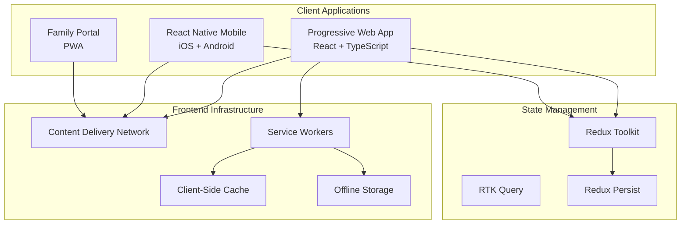
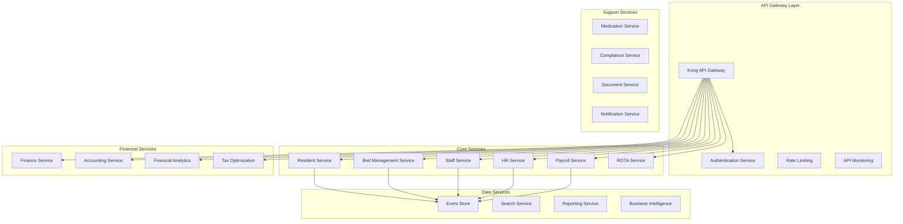
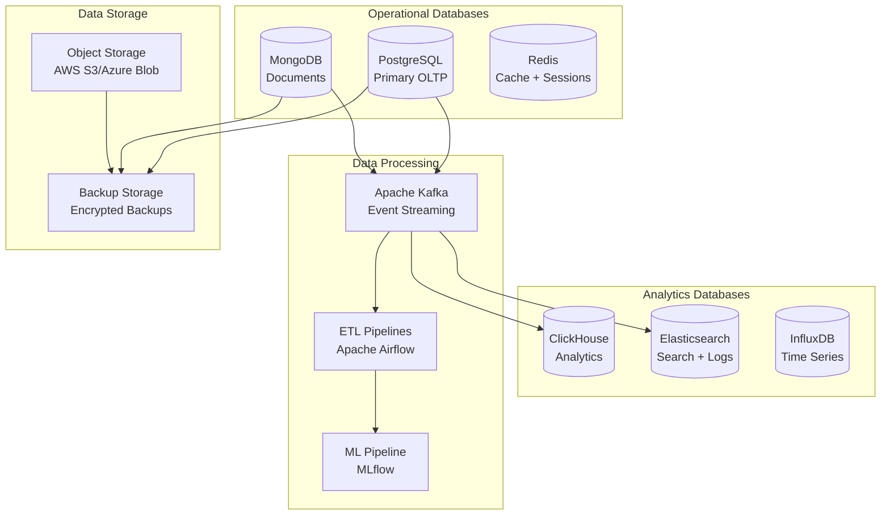
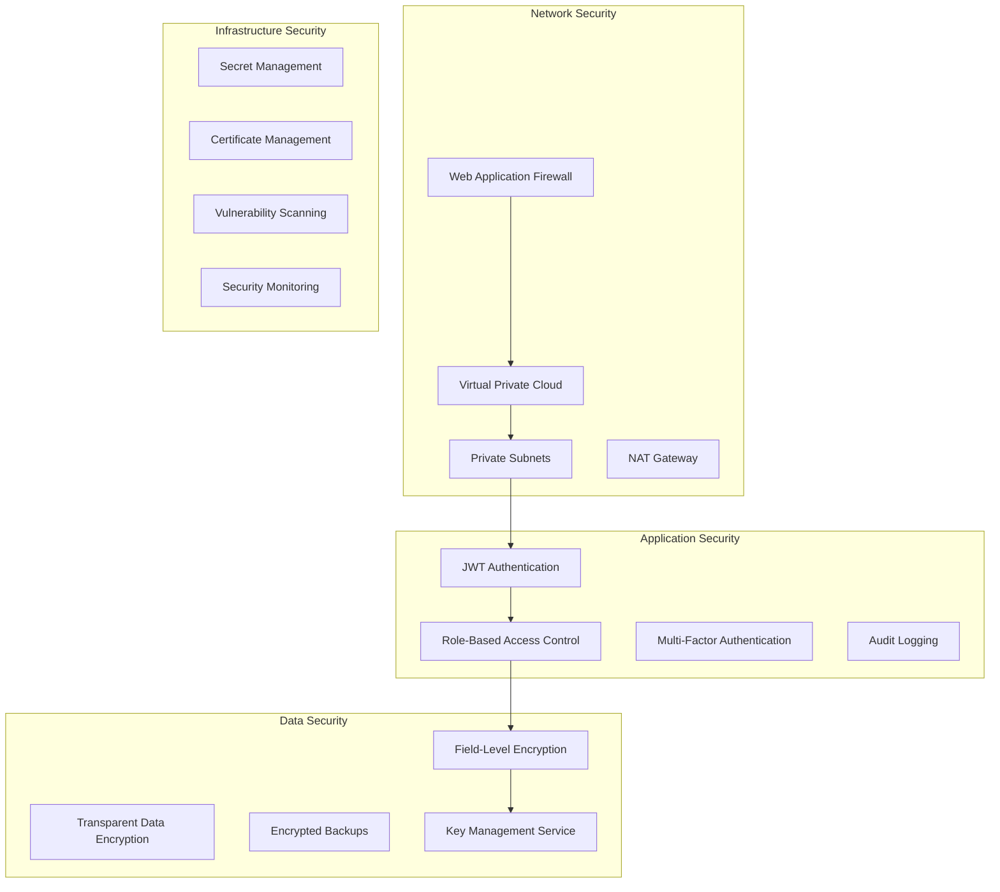
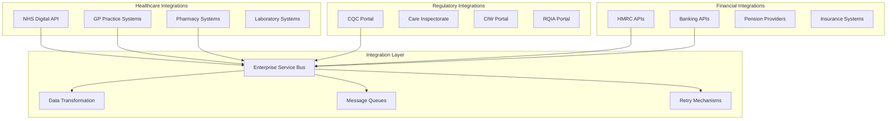
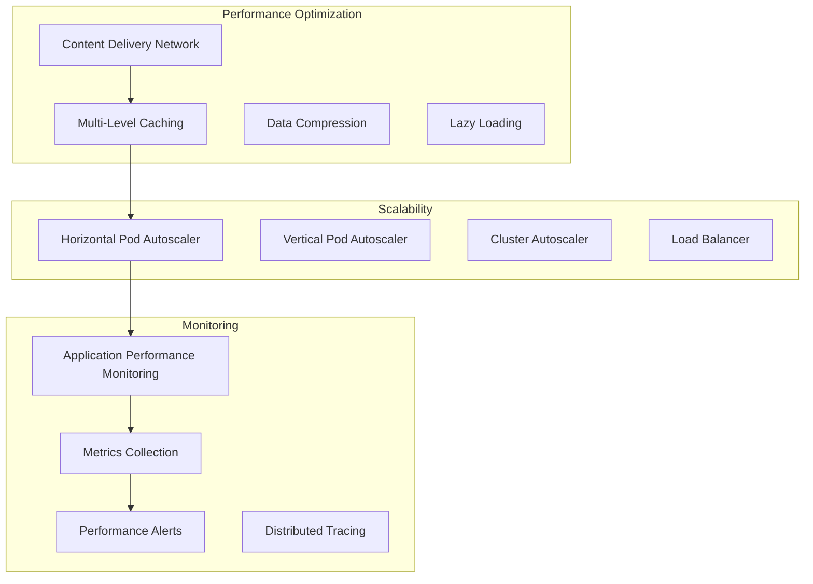
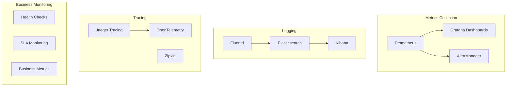
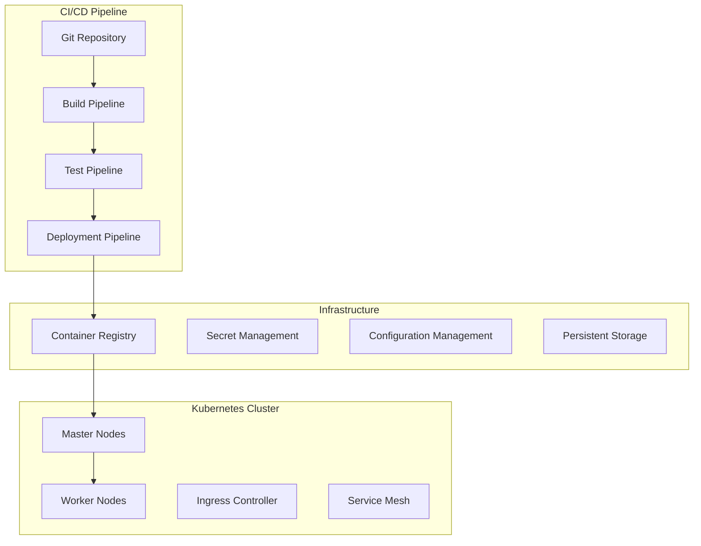

# WriteCareNotes System Design Document

## System Overview

WriteCareNotes is designed as a cloud-native, microservices-based enterprise platform that provides comprehensive care home management capabilities. The system architecture prioritizes scalability, security, compliance, and performance while maintaining the flexibility to adapt to changing healthcare regulations and business requirements.

## Architectural Principles

### 1. Domain-Driven Design (DDD)
The system is organized around business domains with clear bounded contexts:
- **Care Domain**: Resident management, care planning, assessments
- **Operations Domain**: Bed management, scheduling, staff management
- **Financial Domain**: Accounting, billing, financial analytics, tax optimization
- **HR Domain**: Employee management, payroll, performance management
- **Compliance Domain**: Regulatory reporting, audit management, quality assurance

### 2. Microservices Architecture
Each business capability is implemented as an independent microservice:
- Independent deployment and scaling
- Technology diversity where appropriate
- Fault isolation and resilience
- Team autonomy and ownership

### 3. Event-Driven Architecture
Services communicate through domain events:
- Loose coupling between services
- Eventual consistency where appropriate
- Audit trail through event sourcing
- Real-time notifications and updates

### 4. API-First Design
All functionality exposed through well-defined APIs:
- RESTful APIs for CRUD operations
- GraphQL for complex queries and real-time subscriptions
- OpenAPI 3.0 documentation for all endpoints
- Versioning strategy for backward compatibility

## Detailed System Architecture

### Frontend Architecture

**Progressive Web Application (PWA)**:
- **Framework**: React 18 with TypeScript for type safety
- **State Management**: Redux Toolkit with RTK Query for efficient data fetching
- **UI Framework**: Material-UI v5 with custom healthcare design system
- **Offline Support**: Service Workers with background sync and cache strategies
- **Performance**: Code splitting, lazy loading, and performance monitoring
- **Accessibility**: WCAG 2.1 AA compliance with screen reader support

**React Native Mobile Application**:
- **Architecture**: Modular architecture with feature-based organization
- **Navigation**: React Navigation v6 with deep linking support
- **State Management**: Shared Redux store with React Native specific middleware
- **Offline Capabilities**: SQLite local database with sync mechanisms
- **Native Features**: Camera, GPS, biometric authentication, push notifications
- **Performance**: Hermes JavaScript engine with native module optimization

### Backend Architecture

**API Gateway (Kong)**:
- **Authentication**: JWT token validation with refresh token rotation
- **Authorization**: Fine-grained RBAC with resource-level permissions
- **Rate Limiting**: Adaptive rate limiting based on user type and endpoint
- **Load Balancing**: Intelligent load balancing with health checks
- **Monitoring**: Real-time API metrics and performance monitoring

**Microservices Implementation**:
- **Framework**: Node.js with Express.js and TypeScript
- **Communication**: HTTP/REST for synchronous, Events for asynchronous
- **Data Access**: Repository pattern with TypeORM for database abstraction
- **Validation**: Joi schemas for input validation with healthcare-specific rules
- **Error Handling**: Structured error responses with correlation IDs

### Data Architecture

**Primary Database (PostgreSQL 15)**:
- **ACID Compliance**: Full ACID transactions for financial and care data
- **JSON Support**: JSONB for flexible schema requirements
- **Partitioning**: Time-based partitioning for audit logs and historical data
- **Indexing**: Comprehensive indexing strategy for healthcare query patterns
- **Encryption**: Transparent data encryption (TDE) for sensitive data

**Document Database (MongoDB)**:
- **Care Plans**: Flexible schema for complex care plan structures
- **Configuration**: System configuration and user preferences
- **Templates**: Document templates and form definitions
- **Audit Documents**: Complex audit trail documents

**Cache Layer (Redis)**:
- **Session Management**: Distributed session storage with TTL
- **Application Cache**: Frequently accessed data caching
- **Real-time Features**: Pub/Sub for real-time notifications
- **Rate Limiting**: Distributed rate limiting counters

**Analytics Database (ClickHouse)**:
- **Financial Analytics**: High-performance analytical queries
- **Business Intelligence**: OLAP operations for reporting
- **Time Series Data**: Performance metrics and monitoring data
- **Data Warehousing**: Historical data analysis and trends

### Security Architecture

**Authentication & Authorization**:
- **JWT Tokens**: Short-lived access tokens with refresh token rotation
- **Multi-Factor Authentication**: TOTP-based MFA for administrative users
- **Role-Based Access Control**: Hierarchical roles with resource-level permissions
- **Session Management**: Secure session handling with automatic timeout

**Data Protection**:
- **Field-Level Encryption**: AES-256-GCM encryption for PII and sensitive data
- **Key Management**: AWS KMS/Azure Key Vault for encryption key management
- **Data Masking**: Dynamic data masking for non-production environments
- **Backup Encryption**: Encrypted backups with separate key management

**Network Security**:
- **Web Application Firewall**: OWASP Top 10 protection with custom rules
- **VPC Configuration**: Private subnets with controlled internet access
- **Network Segmentation**: Micro-segmentation between service tiers
- **DDoS Protection**: Cloud-native DDoS protection and mitigation

### Integration Architecture

**Integration Patterns**:
- **API Gateway Pattern**: Centralized integration point for external systems
- **Event-Driven Integration**: Asynchronous integration with event sourcing
- **Circuit Breaker Pattern**: Fault tolerance for external system failures
- **Retry Mechanisms**: Exponential backoff with jitter for failed requests
- **Data Transformation**: ETL pipelines for data format conversion

**Healthcare Integrations**:
- **NHS Digital**: Patient demographics, medical history, and care records
- **GP Systems**: EMIS, SystmOne integration for medical information
- **Pharmacy Systems**: Electronic prescribing and medication management
- **Laboratory Systems**: Test results and diagnostic information

**Regulatory Integrations**:
- **CQC Portal**: Automated submission of regulatory reports and notifications
- **Care Inspectorate**: Scottish regulatory reporting and compliance
- **CIW Portal**: Welsh care standards reporting and submissions
- **RQIA Portal**: Northern Ireland regulatory compliance and reporting

### Performance Architecture

**Performance Targets**:
- **API Response Time**: < 200ms for 95th percentile
- **Database Query Time**: < 100ms for complex queries
- **Page Load Time**: < 2 seconds for initial load
- **Concurrent Users**: Support for 1000+ concurrent users
- **Throughput**: 10,000+ requests per minute

**Caching Strategy**:
- **CDN Caching**: Static assets cached at edge locations
- **Application Caching**: Redis-based caching for frequently accessed data
- **Database Caching**: Query result caching with intelligent invalidation
- **Browser Caching**: Optimized browser caching with cache busting

**Auto-Scaling**:
- **Horizontal Scaling**: Automatic pod scaling based on CPU/memory usage
- **Vertical Scaling**: Automatic resource adjustment for individual pods
- **Predictive Scaling**: ML-based scaling predictions for anticipated load
- **Cost Optimization**: Intelligent scaling to minimize infrastructure costs

### Monitoring and Observability

**Observability Stack**:
- **Metrics**: Prometheus for metrics collection with Grafana visualization
- **Logging**: Centralized logging with ELK stack (Elasticsearch, Logstash, Kibana)
- **Tracing**: Distributed tracing with Jaeger for request flow analysis
- **Health Checks**: Comprehensive health checks for all services and dependencies

**Business Monitoring**:
- **Care Quality Metrics**: Real-time monitoring of care quality indicators
- **Financial Performance**: Revenue, costs, and profitability tracking
- **Operational Efficiency**: Staff productivity and resource utilization
- **Compliance Status**: Regulatory compliance monitoring and alerts

**Alerting Strategy**:
- **Tiered Alerting**: Critical, warning, and informational alert levels
- **Escalation Procedures**: Automated escalation for unresolved critical alerts
- **On-Call Management**: Integration with PagerDuty for on-call rotations
- **Alert Correlation**: Intelligent alert correlation to reduce noise

## Deployment Architecture

### Container Orchestration

**Kubernetes Configuration**:
- **Multi-Zone Deployment**: High availability across multiple availability zones
- **Resource Management**: CPU and memory limits with quality of service classes
- **Network Policies**: Micro-segmentation with Kubernetes network policies
- **Storage Classes**: Dynamic provisioning with different storage tiers

**CI/CD Pipeline**:
- **Source Control**: Git-based workflow with feature branches and pull requests
- **Build Automation**: Docker image building with multi-stage builds
- **Testing**: Automated testing pipeline with unit, integration, and E2E tests
- **Deployment**: GitOps-based deployment with ArgoCD or Flux

### Environment Strategy

**Development Environment**:
- Local development with Docker Compose
- Feature branch deployments for testing
- Synthetic data for development and testing
- Performance profiling and debugging tools

**Staging Environment**:
- Production-like environment for final testing
- Automated deployment from main branch
- Load testing and performance validation
- Security scanning and vulnerability assessment

**Production Environment**:
- Multi-region deployment for disaster recovery
- Blue-green deployment strategy for zero-downtime updates
- Automated rollback mechanisms for failed deployments
- Comprehensive monitoring and alerting

This system design ensures that WriteCareNotes can scale to support thousands of care homes while maintaining the highest standards of security, compliance, and performance required for healthcare applications.