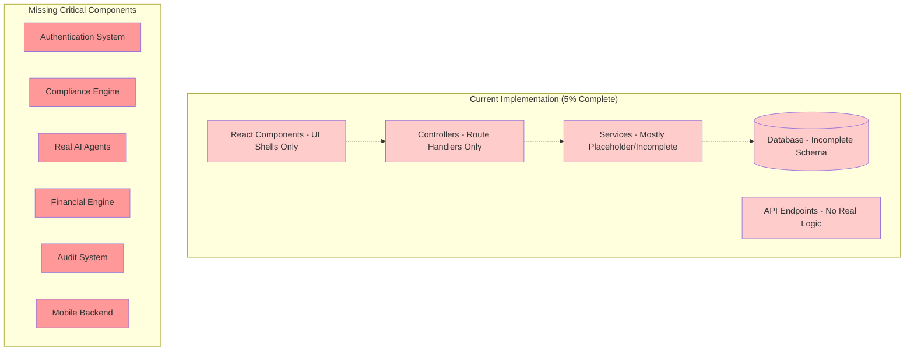
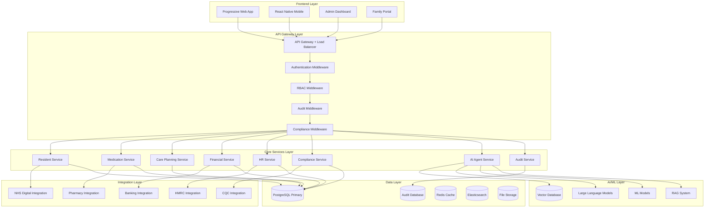
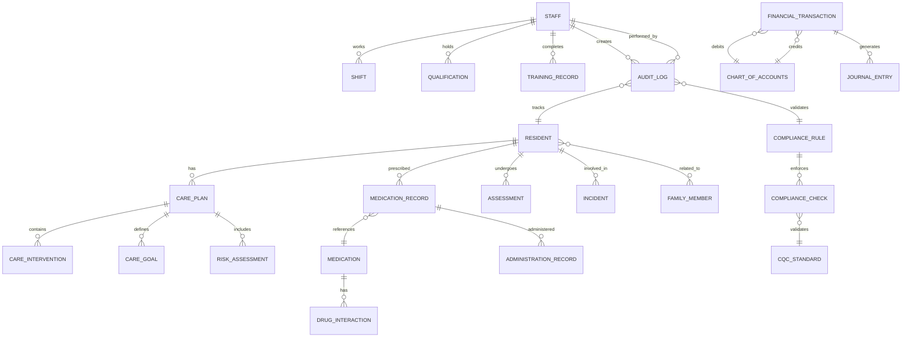

# WriteCareNotes Comprehensive System Audit - Design Document

## Overview

This design document outlines the architecture and implementation strategy for addressing the critical gaps identified in the WriteCareNotes system audit. The system currently has only ~5% of claimed functionality implemented, requiring a comprehensive rebuild to achieve true production readiness for healthcare environments.

## Architecture

### Current State Analysis



### Target Architecture



## Components and Interfaces

### 1. Authentication and Authorization System

**Current State**: Missing real implementation
**Required Implementation**:

```typescript
interface AuthenticationService {
  // JWT-based authentication
  authenticateUser(credentials: LoginCredentials): Promise<AuthResult>;
  validateToken(token: string): Promise<TokenValidation>;
  refreshToken(refreshToken: string): Promise<TokenRefresh>;
  
  // Multi-factor authentication
  initiateMFA(userId: string): Promise<MFAChallenge>;
  verifyMFA(challenge: string, code: string): Promise<MFAResult>;
  
  // Healthcare-specific authentication
  validateHealthcareRole(userId: string, role: HealthcareRole): Promise<boolean>;
  checkClinicalAccess(userId: string, residentId: string): Promise<AccessResult>;
}

interface RBACService {
  // Role-based access control
  assignRole(userId: string, role: Role): Promise<void>;
  checkPermission(userId: string, resource: string, action: string): Promise<boolean>;
  
  // Healthcare-specific permissions
  validateClinicalPermission(userId: string, operation: ClinicalOperation): Promise<boolean>;
  checkDataAccess(userId: string, dataType: HealthcareDataType): Promise<AccessLevel>;
}
```

### 2. Complete Database Schema

**Current State**: Incomplete migrations, missing tables
**Required Implementation**:

```sql
-- Core Healthcare Tables
CREATE TABLE residents (
  id UUID PRIMARY KEY DEFAULT gen_random_uuid(),
  nhs_number VARCHAR(10) UNIQUE,
  personal_details JSONB NOT NULL,
  medical_history JSONB,
  care_level care_level_enum NOT NULL,
  admission_date DATE NOT NULL,
  discharge_date DATE,
  status resident_status_enum DEFAULT 'active',
  -- GDPR compliance fields
  consent_status JSONB NOT NULL,
  data_retention_date DATE,
  -- Audit fields
  created_at TIMESTAMP DEFAULT NOW(),
  updated_at TIMESTAMP DEFAULT NOW(),
  created_by UUID NOT NULL,
  updated_by UUID NOT NULL,
  version INTEGER DEFAULT 1
);

-- Medication Management Tables
CREATE TABLE medications (
  id UUID PRIMARY KEY DEFAULT gen_random_uuid(),
  generic_name VARCHAR(255) NOT NULL,
  brand_name VARCHAR(255),
  active_ingredients JSONB NOT NULL,
  strength DECIMAL(10,4) NOT NULL,
  strength_unit VARCHAR(50) NOT NULL,
  form medication_form_enum NOT NULL,
  route administration_route_enum NOT NULL,
  therapeutic_class therapeutic_class_enum NOT NULL,
  controlled_drug_schedule controlled_drug_enum,
  -- Regulatory codes
  snomed_code VARCHAR(20),
  dmd_code VARCHAR(20),
  bnf_code VARCHAR(20),
  -- Drug interaction data
  drug_interactions JSONB,
  contraindications JSONB,
  side_effects JSONB,
  -- Compliance fields
  is_active BOOLEAN DEFAULT true,
  is_prescription_only BOOLEAN DEFAULT true,
  is_black_triangle BOOLEAN DEFAULT false,
  -- Audit fields
  created_at TIMESTAMP DEFAULT NOW(),
  updated_at TIMESTAMP DEFAULT NOW(),
  created_by UUID NOT NULL,
  updated_by UUID NOT NULL
);

-- Financial Management Tables
CREATE TABLE chart_of_accounts (
  id UUID PRIMARY KEY DEFAULT gen_random_uuid(),
  account_code VARCHAR(20) UNIQUE NOT NULL,
  account_name VARCHAR(255) NOT NULL,
  account_type account_type_enum NOT NULL,
  parent_account_id UUID REFERENCES chart_of_accounts(id),
  is_active BOOLEAN DEFAULT true,
  created_at TIMESTAMP DEFAULT NOW(),
  updated_at TIMESTAMP DEFAULT NOW()
);

CREATE TABLE financial_transactions (
  id UUID PRIMARY KEY DEFAULT gen_random_uuid(),
  transaction_number VARCHAR(50) UNIQUE NOT NULL,
  account_id UUID NOT NULL REFERENCES chart_of_accounts(id),
  amount DECIMAL(15,4) NOT NULL,
  transaction_type transaction_type_enum NOT NULL,
  transaction_date DATE NOT NULL,
  description TEXT NOT NULL,
  reference VARCHAR(255),
  -- Double-entry bookkeeping
  debit_account_id UUID REFERENCES chart_of_accounts(id),
  credit_account_id UUID REFERENCES chart_of_accounts(id),
  -- Compliance and audit
  correlation_id UUID NOT NULL,
  created_by UUID NOT NULL,
  approved_by UUID,
  approved_at TIMESTAMP,
  created_at TIMESTAMP DEFAULT NOW(),
  updated_at TIMESTAMP DEFAULT NOW()
);

-- Comprehensive Audit Trail
CREATE TABLE audit_logs (
  id UUID PRIMARY KEY DEFAULT gen_random_uuid(),
  entity_type VARCHAR(100) NOT NULL,
  entity_id UUID NOT NULL,
  action audit_action_enum NOT NULL,
  user_id UUID NOT NULL,
  correlation_id UUID NOT NULL,
  old_values JSONB,
  new_values JSONB,
  -- Healthcare compliance
  gdpr_lawful_basis gdpr_basis_enum NOT NULL,
  clinical_justification TEXT,
  -- Regulatory compliance
  cqc_reportable BOOLEAN DEFAULT false,
  retention_period_years INTEGER DEFAULT 7,
  -- System metadata
  ip_address INET,
  user_agent TEXT,
  session_id UUID,
  timestamp TIMESTAMP DEFAULT NOW()
);
```

### 3. Real Service Implementations

**Current State**: Placeholder services with no business logic
**Required Implementation**:

```typescript
// Complete Resident Service
export class ResidentService {
  async createResident(data: CreateResidentRequest, userId: string): Promise<Resident> {
    // 1. Validate NHS number with real algorithm
    if (data.nhsNumber && !this.validateNHSNumber(data.nhsNumber)) {
      throw new ValidationError('Invalid NHS number');
    }
    
    // 2. Check GDPR consent requirements
    await this.gdprService.validateConsentRequirements(data.consentData);
    
    // 3. Perform duplicate checking
    const existingResident = await this.checkDuplicateResident(data);
    if (existingResident) {
      throw new BusinessLogicError('Duplicate resident found');
    }
    
    // 4. Create resident with audit trail
    const resident = await this.repository.transaction(async (manager) => {
      const newResident = await manager.save(Resident, {
        ...data,
        createdBy: userId,
        status: 'active'
      });
      
      // Log audit trail
      await this.auditService.logOperation({
        entityType: 'Resident',
        entityId: newResident.id,
        action: 'CREATE',
        userId,
        newValues: newResident,
        gdprLawfulBasis: 'CONTRACT',
        clinicalJustification: 'New resident admission'
      });
      
      return newResident;
    });
    
    // 5. Trigger care plan creation
    await this.carePlanService.createInitialCarePlan(resident.id, userId);
    
    // 6. Send notifications
    await this.notificationService.sendAdmissionNotifications(resident);
    
    return resident;
  }
  
  private validateNHSNumber(nhsNumber: string): boolean {
    // Real NHS number validation algorithm
    const cleanNumber = nhsNumber.replace(/\D/g, '');
    if (cleanNumber.length !== 10) return false;
    
    const digits = cleanNumber.split('').map(Number);
    const checkDigit = digits[9];
    
    let sum = 0;
    for (let i = 0; i < 9; i++) {
      sum += digits[i] * (10 - i);
    }
    
    const remainder = sum % 11;
    const calculatedCheckDigit = remainder < 2 ? remainder : 11 - remainder;
    
    return calculatedCheckDigit === checkDigit;
  }
}

// Complete Medication Service with Drug Interactions
export class MedicationService {
  async checkDrugInteractions(medicationIds: string[]): Promise<DrugInteraction[]> {
    // 1. Get medications from database
    const medications = await this.repository.findByIds(medicationIds);
    
    // 2. Check against BNF interaction database
    const interactions = await this.bnfService.checkInteractions(medications);
    
    // 3. Apply clinical decision support rules
    const clinicalAlerts = await this.clinicalRulesEngine.evaluateInteractions(
      medications,
      interactions
    );
    
    // 4. Log interaction check for audit
    await this.auditService.logClinicalDecision({
      action: 'DRUG_INTERACTION_CHECK',
      medications: medicationIds,
      interactions: interactions.length,
      alerts: clinicalAlerts.length,
      timestamp: new Date()
    });
    
    return interactions;
  }
  
  async prescribeMedication(prescription: PrescriptionRequest, userId: string): Promise<Prescription> {
    // 1. Validate prescriber authorization
    await this.validatePrescriberAuthorization(userId, prescription.medicationId);
    
    // 2. Check drug interactions with current medications
    const currentMeds = await this.getCurrentMedications(prescription.residentId);
    const interactions = await this.checkDrugInteractions([
      ...currentMeds.map(m => m.id),
      prescription.medicationId
    ]);
    
    if (interactions.some(i => i.severity === 'contraindicated')) {
      throw new ClinicalSafetyError('Contraindicated drug interaction detected');
    }
    
    // 3. Validate dosage against clinical guidelines
    await this.validateDosage(prescription);
    
    // 4. Create prescription with controlled drug handling
    const prescriptionEntity = await this.repository.transaction(async (manager) => {
      const newPrescription = await manager.save(Prescription, {
        ...prescription,
        prescribedBy: userId,
        status: 'ACTIVE',
        interactions: interactions
      });
      
      // Handle controlled drugs
      if (prescription.isControlledDrug) {
        await this.controlledDrugService.recordPrescription(newPrescription);
      }
      
      return newPrescription;
    });
    
    return prescriptionEntity;
  }
}

// Complete Financial Analytics Service
export class FinancialAnalyticsService {
  async processTransaction(transaction: TransactionRequest, userId: string): Promise<Transaction> {
    // 1. Validate transaction data
    await this.validateTransaction(transaction);
    
    // 2. Apply double-entry bookkeeping
    const journalEntries = await this.createJournalEntries(transaction);
    
    // 3. Process transaction with audit trail
    const result = await this.repository.transaction(async (manager) => {
      // Create main transaction
      const newTransaction = await manager.save(FinancialTransaction, {
        ...transaction,
        createdBy: userId,
        status: 'PENDING'
      });
      
      // Create journal entries
      for (const entry of journalEntries) {
        await manager.save(JournalEntry, {
          ...entry,
          transactionId: newTransaction.id,
          createdBy: userId
        });
      }
      
      // Update account balances
      await this.updateAccountBalances(manager, journalEntries);
      
      return newTransaction;
    });
    
    // 4. Update real-time financial metrics
    await this.updateFinancialKPIs(result);
    
    // 5. Check for compliance alerts
    await this.checkComplianceAlerts(result);
    
    return result;
  }
  
  async generateFinancialForecast(request: ForecastRequest): Promise<ForecastResult> {
    // 1. Gather historical financial data
    const historicalData = await this.gatherHistoricalData(request);
    
    // 2. Apply machine learning forecasting models
    const mlForecast = await this.mlService.generateForecast({
      data: historicalData,
      algorithm: 'ARIMA',
      seasonality: true,
      confidence: 0.95
    });
    
    // 3. Apply business rules and constraints
    const adjustedForecast = await this.applyBusinessConstraints(mlForecast, request);
    
    // 4. Generate scenario analysis
    const scenarios = await this.generateScenarios(adjustedForecast);
    
    return {
      forecast: adjustedForecast,
      scenarios,
      confidence: mlForecast.confidence,
      methodology: 'ML_ENHANCED_ARIMA'
    };
  }
}
```

### 4. Healthcare Compliance Engine

**Current State**: Documentation only, no real implementation
**Required Implementation**:

```typescript
export class ComplianceEngine {
  async validateCQCCompliance(operation: ClinicalOperation): Promise<ComplianceResult> {
    const checks = [
      this.checkPersonCenteredCare(operation),
      this.checkSafetyRequirements(operation),
      this.checkEffectivenessStandards(operation),
      this.checkCaringStandards(operation),
      this.checkResponsivenessRequirements(operation),
      this.checkLeadershipStandards(operation)
    ];
    
    const results = await Promise.all(checks);
    
    return {
      compliant: results.every(r => r.compliant),
      violations: results.filter(r => !r.compliant),
      recommendations: this.generateRecommendations(results)
    };
  }
  
  async generateCQCReport(facilityId: string, period: DateRange): Promise<CQCReport> {
    // Real CQC report generation with actual data
    const reportData = await this.gatherCQCReportData(facilityId, period);
    
    return {
      facilityId,
      reportingPeriod: period,
      keyMetrics: reportData.metrics,
      incidents: reportData.incidents,
      staffingLevels: reportData.staffing,
      qualityIndicators: reportData.quality,
      recommendations: reportData.recommendations,
      complianceScore: this.calculateComplianceScore(reportData)
    };
  }
}
```

### 5. Real AI Agent Implementation

**Current State**: Placeholder services, no LLM integration
**Required Implementation**:

```typescript
export class AIAgentService {
  async generateCareRecommendations(residentId: string, context: CareContext): Promise<CareRecommendations> {
    // 1. Gather resident data and care history
    const residentData = await this.residentService.getComprehensiveData(residentId);
    
    // 2. Create context for LLM
    const prompt = this.buildCareRecommendationPrompt(residentData, context);
    
    // 3. Query LLM with healthcare-specific fine-tuning
    const llmResponse = await this.llmService.query({
      model: 'healthcare-gpt-4',
      prompt,
      temperature: 0.3, // Lower temperature for clinical accuracy
      maxTokens: 1000
    });
    
    // 4. Validate recommendations against clinical guidelines
    const validatedRecommendations = await this.validateClinicalRecommendations(
      llmResponse.recommendations
    );
    
    // 5. Log AI decision for audit trail
    await this.auditService.logAIDecision({
      agentType: 'CARE_RECOMMENDATION',
      residentId,
      input: context,
      output: validatedRecommendations,
      model: 'healthcare-gpt-4',
      confidence: llmResponse.confidence
    });
    
    return validatedRecommendations;
  }
  
  async processVoiceToNotes(audioData: Buffer, residentId: string): Promise<CareNotes> {
    // 1. Convert speech to text
    const transcription = await this.speechService.transcribe(audioData);
    
    // 2. Extract clinical information using NLP
    const clinicalData = await this.nlpService.extractClinicalEntities(transcription);
    
    // 3. Generate structured care notes
    const structuredNotes = await this.llmService.structureCareNotes({
      transcription,
      clinicalData,
      residentContext: await this.getResidentContext(residentId)
    });
    
    // 4. Validate and save care notes
    const validatedNotes = await this.validateCareNotes(structuredNotes);
    
    return await this.careNotesService.save(validatedNotes, residentId);
  }
}
```

## Data Models

### Complete Healthcare Data Model



## Error Handling

### Healthcare-Specific Error Handling

```typescript
export class HealthcareErrorHandler {
  handleClinicalError(error: ClinicalError, context: ClinicalContext): ErrorResponse {
    // 1. Assess patient safety impact
    const safetyImpact = this.assessPatientSafetyImpact(error, context);
    
    // 2. Trigger immediate alerts for high-risk errors
    if (safetyImpact.level === 'HIGH') {
      this.triggerEmergencyAlert(error, context);
    }
    
    // 3. Log clinical incident
    this.incidentService.logClinicalIncident({
      type: error.type,
      severity: safetyImpact.level,
      context,
      timestamp: new Date(),
      requiresInvestigation: safetyImpact.level !== 'LOW'
    });
    
    // 4. Generate user-friendly error message
    return {
      code: error.code,
      message: this.generateUserFriendlyMessage(error),
      safetyGuidance: this.generateSafetyGuidance(error, context),
      escalationRequired: safetyImpact.level === 'HIGH'
    };
  }
}
```

## Testing Strategy

### Comprehensive Healthcare Testing

```typescript
// Real Healthcare Workflow Testing
describe('Medication Management Workflow', () => {
  it('should handle complete medication lifecycle with real drug interactions', async () => {
    // 1. Create test resident with known allergies
    const resident = await testDataFactory.createResident({
      allergies: ['penicillin', 'sulfonamides']
    });
    
    // 2. Attempt to prescribe contraindicated medication
    const prescriptionRequest = {
      residentId: resident.id,
      medicationId: 'penicillin-v-500mg',
      dosage: '500mg',
      frequency: 'twice-daily'
    };
    
    // 3. Verify system prevents dangerous prescription
    await expect(
      medicationService.prescribeMedication(prescriptionRequest, 'doctor-123')
    ).rejects.toThrow('Allergy contraindication detected');
    
    // 4. Verify audit log created
    const auditLogs = await auditService.getLogsForResident(resident.id);
    expect(auditLogs).toContainEqual(
      expect.objectContaining({
        action: 'PRESCRIPTION_BLOCKED',
        reason: 'ALLERGY_CONTRAINDICATION'
      })
    );
  });
  
  it('should process safe medication with proper audit trail', async () => {
    // Test safe medication prescription with complete audit trail
    const resident = await testDataFactory.createResident();
    const medication = await testDataFactory.createMedication({
      name: 'paracetamol-500mg'
    });
    
    const prescription = await medicationService.prescribeMedication({
      residentId: resident.id,
      medicationId: medication.id,
      dosage: '500mg',
      frequency: 'four-times-daily'
    }, 'doctor-123');
    
    expect(prescription).toBeDefined();
    expect(prescription.status).toBe('ACTIVE');
    
    // Verify audit trail
    const auditLogs = await auditService.getLogsForEntity('Prescription', prescription.id);
    expect(auditLogs).toHaveLength(1);
    expect(auditLogs[0].action).toBe('CREATE');
    expect(auditLogs[0].gdprLawfulBasis).toBe('VITAL_INTERESTS');
  });
});

// Financial System Testing
describe('Financial Management System', () => {
  it('should process double-entry bookkeeping correctly', async () => {
    const transaction = await financialService.processTransaction({
      amount: new Decimal('1000.00'),
      description: 'Resident care fees',
      debitAccount: 'ACCOUNTS_RECEIVABLE',
      creditAccount: 'CARE_REVENUE'
    }, 'finance-user-123');
    
    // Verify journal entries created
    const journalEntries = await journalEntryService.getByTransactionId(transaction.id);
    expect(journalEntries).toHaveLength(2);
    
    const debitEntry = journalEntries.find(e => e.type === 'DEBIT');
    const creditEntry = journalEntries.find(e => e.type === 'CREDIT');
    
    expect(debitEntry.amount).toEqual(new Decimal('1000.00'));
    expect(creditEntry.amount).toEqual(new Decimal('1000.00'));
    
    // Verify account balances updated
    const receivableBalance = await accountService.getBalance('ACCOUNTS_RECEIVABLE');
    const revenueBalance = await accountService.getBalance('CARE_REVENUE');
    
    expect(receivableBalance.amount).toEqual(new Decimal('1000.00'));
    expect(revenueBalance.amount).toEqual(new Decimal('1000.00'));
  });
});
```

## Security Architecture

### Healthcare Data Security

```typescript
export class HealthcareSecurityService {
  async encryptHealthcareData(data: HealthcareData, classification: DataClassification): Promise<EncryptedData> {
    // Use AES-256 for PII and clinical data
    const encryptionKey = await this.getEncryptionKey(classification);
    
    return {
      encryptedData: await this.encrypt(JSON.stringify(data), encryptionKey),
      keyId: encryptionKey.id,
      classification,
      encryptedAt: new Date()
    };
  }
  
  async validateDataAccess(userId: string, dataType: HealthcareDataType, operation: string): Promise<AccessResult> {
    // 1. Check user role and permissions
    const userPermissions = await this.rbacService.getUserPermissions(userId);
    
    // 2. Validate clinical access requirements
    if (dataType === 'CLINICAL_DATA') {
      const clinicalAccess = await this.validateClinicalAccess(userId);
      if (!clinicalAccess.authorized) {
        return { authorized: false, reason: 'INSUFFICIENT_CLINICAL_CREDENTIALS' };
      }
    }
    
    // 3. Check GDPR lawful basis
    const gdprValidation = await this.gdprService.validateAccess(userId, dataType, operation);
    if (!gdprValidation.valid) {
      return { authorized: false, reason: 'GDPR_VIOLATION' };
    }
    
    // 4. Log access attempt
    await this.auditService.logDataAccess({
      userId,
      dataType,
      operation,
      authorized: true,
      timestamp: new Date()
    });
    
    return { authorized: true };
  }
}
```

This design provides a comprehensive blueprint for rebuilding the WriteCareNotes system with real, production-ready implementations that meet healthcare industry standards and regulatory requirements.