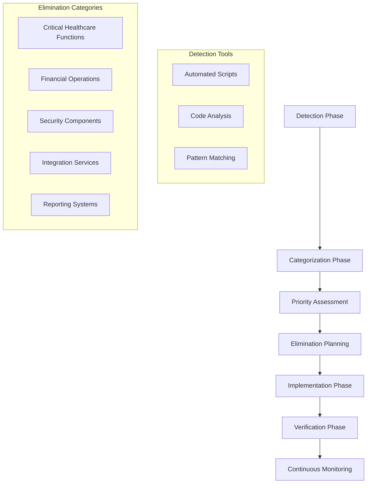

# Fake Implementation Elimination Design

## Overview

This design document outlines the systematic approach to eliminate all fake implementations, mocks, placeholders, and stubs from the WriteCareNotes healthcare management system. The elimination process will be conducted in phases to ensure system stability while achieving zero tolerance for non-production code.

## Architecture

### Elimination Strategy



### Implementation Phases

#### Phase 1: Critical Healthcare Functions (Priority 1)
- Medication management services
- Resident care planning
- Health records management
- Emergency response systems
- Clinical assessment tools

#### Phase 2: Financial and Compliance (Priority 2)
- Financial service implementations
- HR and payroll systems
- Audit and compliance reporting
- Regulatory integration services

#### Phase 3: Integration and Infrastructure (Priority 3)
- External API integrations
- Database operations
- Caching and performance systems
- Monitoring and logging

#### Phase 4: User Interface and Experience (Priority 4)
- Frontend components
- User interaction services
- Notification systems
- Reporting interfaces

## Components and Interfaces

### Detection Engine

```typescript
interface FakeImplementationDetector {
  scanDirectory(path: string): Promise<ViolationReport>;
  categorizeViolations(violations: Violation[]): CategorizedViolations;
  generateEliminationPlan(violations: CategorizedViolations): EliminationPlan;
  validateElimination(filePath: string): Promise<ValidationResult>;
}

interface Violation {
  filePath: string;
  lineNumber: number;
  violationType: ViolationType;
  severity: 'critical' | 'high' | 'medium' | 'low';
  description: string;
  suggestedFix: string;
  healthcareImpact: boolean;
}

enum ViolationType {
  MOCK_COMMENT = 'mock_comment',
  PLACEHOLDER_COMMENT = 'placeholder_comment',
  FAKE_RETURN = 'fake_return',
  SIMULATION_PATTERN = 'simulation_pattern',
  HARDCODED_SUCCESS = 'hardcoded_success',
  CONSOLE_LOG = 'console_log',
  EMPTY_FUNCTION = 'empty_function',
  TODO_FIXME = 'todo_fixme'
}
```

### Elimination Service

```typescript
interface EliminationService {
  eliminateViolation(violation: Violation): Promise<EliminationResult>;
  replaceWithRealImplementation(filePath: string, violation: Violation): Promise<void>;
  validateRealImplementation(filePath: string): Promise<ValidationResult>;
  generateRealBusinessLogic(context: BusinessContext): Promise<string>;
}

interface BusinessContext {
  domain: 'healthcare' | 'financial' | 'hr' | 'compliance' | 'integration';
  functionality: string;
  inputTypes: string[];
  outputTypes: string[];
  complianceRequirements: string[];
  securityRequirements: string[];
}
```

### Real Implementation Generator

```typescript
interface RealImplementationGenerator {
  generateHealthcareService(specification: HealthcareServiceSpec): Promise<string>;
  generateFinancialService(specification: FinancialServiceSpec): Promise<string>;
  generateComplianceService(specification: ComplianceServiceSpec): Promise<string>;
  generateDatabaseOperations(specification: DatabaseSpec): Promise<string>;
  generateValidationLogic(specification: ValidationSpec): Promise<string>;
}

interface HealthcareServiceSpec {
  serviceName: string;
  clinicalRequirements: ClinicalRequirement[];
  safetyProtocols: SafetyProtocol[];
  regulatoryCompliance: RegulatoryRequirement[];
  dataValidation: ValidationRule[];
  auditRequirements: AuditRequirement[];
}
```

## Data Models

### Violation Tracking

```typescript
interface ViolationReport {
  scanDate: Date;
  totalViolations: number;
  criticalViolations: number;
  violationsByType: Record<ViolationType, number>;
  violationsByFile: Record<string, Violation[]>;
  healthcareImpactViolations: Violation[];
  eliminationPriority: PriorityLevel[];
}

interface EliminationPlan {
  phases: EliminationPhase[];
  estimatedDuration: number;
  riskAssessment: RiskAssessment;
  resourceRequirements: ResourceRequirement[];
  successCriteria: SuccessCriteria[];
}

interface EliminationPhase {
  phaseNumber: number;
  phaseName: string;
  targetViolations: Violation[];
  estimatedEffort: number;
  dependencies: string[];
  riskLevel: 'low' | 'medium' | 'high' | 'critical';
  healthcareImpact: boolean;
}
```

### Real Implementation Templates

```typescript
interface ImplementationTemplate {
  templateName: string;
  domain: BusinessDomain;
  codeTemplate: string;
  requiredImports: string[];
  testTemplate: string;
  documentationTemplate: string;
  complianceChecks: ComplianceCheck[];
}

interface HealthcareImplementationTemplate extends ImplementationTemplate {
  clinicalSafetyChecks: SafetyCheck[];
  regulatoryCompliance: RegulatoryCheck[];
  dataProtectionMeasures: DataProtectionMeasure[];
  auditTrailRequirements: AuditRequirement[];
}
```

## Error Handling

### Elimination Error Management

```typescript
class EliminationError extends Error {
  constructor(
    message: string,
    public violationType: ViolationType,
    public filePath: string,
    public healthcareImpact: boolean,
    public suggestedAction: string
  ) {
    super(message);
  }
}

class HealthcareSafetyError extends EliminationError {
  constructor(
    message: string,
    public clinicalRisk: 'low' | 'medium' | 'high' | 'critical',
    public affectedSystems: string[],
    public mitigationSteps: string[]
  ) {
    super(message, ViolationType.MOCK_COMMENT, '', true, 'Immediate healthcare safety review required');
  }
}
```

### Rollback Mechanisms

```typescript
interface RollbackManager {
  createBackup(filePath: string): Promise<BackupInfo>;
  rollbackChanges(backupId: string): Promise<void>;
  validateRollback(filePath: string): Promise<boolean>;
  cleanupBackups(olderThan: Date): Promise<void>;
}

interface BackupInfo {
  backupId: string;
  originalFilePath: string;
  backupFilePath: string;
  timestamp: Date;
  violationsFixed: Violation[];
  checksumBefore: string;
  checksumAfter: string;
}
```

## Testing Strategy

### Elimination Verification Tests

```typescript
interface EliminationTestSuite {
  testRealImplementation(filePath: string): Promise<TestResult>;
  testHealthcareSafety(implementation: string): Promise<SafetyTestResult>;
  testComplianceAdherence(implementation: string): Promise<ComplianceTestResult>;
  testPerformanceImpact(implementation: string): Promise<PerformanceTestResult>;
  testSecurityMeasures(implementation: string): Promise<SecurityTestResult>;
}

interface SafetyTestResult {
  passed: boolean;
  clinicalRisks: ClinicalRisk[];
  safetyViolations: SafetyViolation[];
  recommendedActions: string[];
  approvalRequired: boolean;
}
```

### Real Data Testing

```typescript
interface RealDataTestFramework {
  generateRealisticTestData(domain: BusinessDomain): Promise<TestDataSet>;
  validateWithRealScenarios(implementation: string, testData: TestDataSet): Promise<ValidationResult>;
  testWithProductionLikeLoad(implementation: string): Promise<LoadTestResult>;
  verifyComplianceWithRealData(implementation: string): Promise<ComplianceResult>;
}
```

## Security Considerations

### Secure Elimination Process

1. **Code Review Requirements**
   - All elimination changes require peer review
   - Healthcare-critical changes require clinical review
   - Security-sensitive changes require security team approval

2. **Audit Trail Maintenance**
   - Complete audit trail of all elimination activities
   - Before/after code comparisons
   - Risk assessments and approvals
   - Testing results and validations

3. **Access Control**
   - Restricted access to elimination tools
   - Role-based permissions for different violation types
   - Multi-factor authentication for critical changes

### Data Protection During Elimination

```typescript
interface SecureEliminationProcess {
  encryptSensitiveCode(code: string): Promise<string>;
  validateDataProtectionCompliance(implementation: string): Promise<boolean>;
  ensureGDPRCompliance(dataProcessing: DataProcessingOperation): Promise<ComplianceResult>;
  auditSecurityMeasures(implementation: string): Promise<SecurityAuditResult>;
}
```

## Performance Optimization

### Efficient Elimination Process

1. **Parallel Processing**
   - Process non-dependent violations in parallel
   - Batch similar violation types
   - Optimize file I/O operations

2. **Incremental Validation**
   - Validate changes incrementally
   - Cache validation results
   - Skip unchanged files

3. **Resource Management**
   - Monitor memory usage during large-scale elimination
   - Implement progress tracking and resumption
   - Optimize for minimal system downtime

## Monitoring and Alerting

### Continuous Violation Detection

```typescript
interface ContinuousMonitoring {
  scheduleRegularScans(frequency: ScanFrequency): Promise<void>;
  alertOnNewViolations(violations: Violation[]): Promise<void>;
  trackEliminationProgress(plan: EliminationPlan): Promise<ProgressReport>;
  generateComplianceReports(): Promise<ComplianceReport>;
}

interface ViolationAlert {
  alertId: string;
  severity: AlertSeverity;
  violationType: ViolationType;
  affectedFiles: string[];
  healthcareImpact: boolean;
  recommendedAction: string;
  escalationRequired: boolean;
}
```

## Integration Points

### CI/CD Integration

1. **Pre-commit Hooks**
   - Automatic violation detection before commits
   - Block commits containing fake implementations
   - Provide immediate feedback to developers

2. **Build Pipeline Integration**
   - Mandatory violation scans in build process
   - Fail builds on detection of fake implementations
   - Generate violation reports for review

3. **Deployment Gates**
   - Zero-violation requirement for production deployment
   - Automated verification of real implementations
   - Compliance certification before release

## Success Metrics

### Elimination Success Criteria

1. **Zero Tolerance Achievement**
   - 0 violations detected in production code
   - 100% real implementation coverage
   - All healthcare functions using actual business logic

2. **Quality Metrics**
   - 90%+ test coverage with real scenarios
   - All external integrations using real endpoints
   - Complete audit trail for all operations

3. **Compliance Verification**
   - All healthcare regulations properly implemented
   - GDPR compliance with real data protection
   - Financial regulations with actual accounting logic

4. **Performance Standards**
   - API response times < 200ms with real implementations
   - Database operations optimized for production load
   - System stability under realistic usage patterns

This design ensures systematic, safe, and complete elimination of all fake implementations while maintaining system integrity and healthcare safety standards.