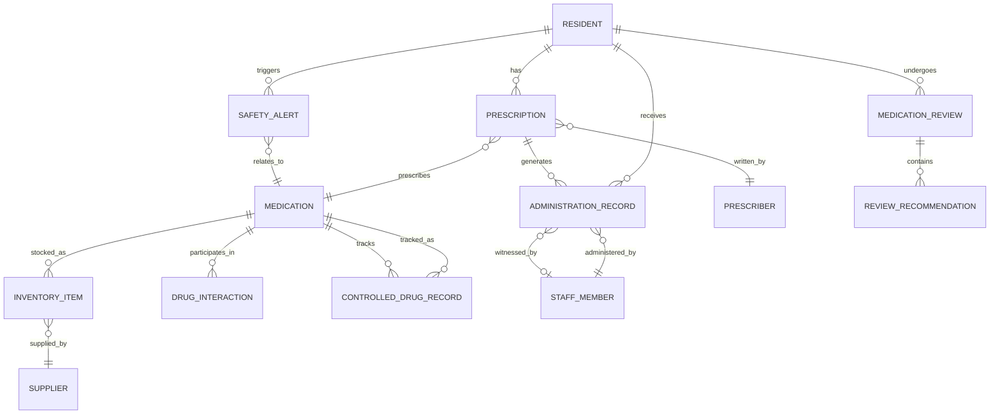

# Medication Management System Design Document

## Overview

The Medication Management System is a comprehensive healthcare module that provides safe, compliant, and efficient medication management for adult care homes across the British Isles. Built on the existing WriteCareNotes foundation, it integrates seamlessly with the Resident Management System while providing specialized functionality for prescription management, medication administration, safety monitoring, and regulatory compliance.

The system follows enterprise-grade healthcare standards with real-time clinical decision support, comprehensive audit trails, and integration with external healthcare systems including NHS Digital, pharmacy systems, and regulatory bodies (MHRA, CQC, Care Inspectorate, CIW, RQIA).

## Architecture

### System Architecture Overview

```mermaid
graph TB
    subgraph "Frontend Layer"
        MEDICATION_UI[Medication Management UI]
        ADMIN_UI[Medication Administration UI]
        PHARMACY_UI[Pharmacy Management UI]
        CLINICAL_UI[Clinical Review UI]
        MOBILE_APP[Mobile Medication App]
    end
    
    subgraph "API Gateway"
        GATEWAY[API Gateway & Load Balancer]
        AUTH[Authentication Service]
        RBAC[Role-Based Access Control]
    end
    
    subgraph "Medication Services"
        PRESCRIPTION_SVC[Prescription Service]
        ADMINISTRATION_SVC[Administration Service]
        SAFETY_SVC[Clinical Safety Service]
        INVENTORY_SVC[Inventory Service]
        CONTROLLED_SVC[Controlled Substances Service]
        REVIEW_SVC[Medication Review Service]
        INCIDENT_SVC[Medication Incident Service]
        SCHEDULING_SVC[Scheduling Service]
        COMPLIANCE_SVC[Regulatory Compliance Service]
        INTEGRATION_SVC[Healthcare Integration Service]
    end
    
    subgraph "Core Services (Existing)"
        RESIDENT_SVC[Resident Service]
        AUDIT_SVC[Audit Trail Service]
        GDPR_SVC[GDPR Compliance Service]
        NOTIFICATION_SVC[Notification Service]
        SECURITY_SVC[Data Security Service]
    end
    
    subgraph "External Integrations"
        NHS_DIGITAL[NHS Digital API]
        PHARMACY_API[Pharmacy Systems]
        MHRA_API[MHRA Integration]
        DM_D[dm+d Drug Database]
        BNF_API[British National Formulary]
        INTERACTION_DB[Drug Interaction Database]
    end
    
    subgraph "Data Layer"
        MEDICATION_DB[(Medication Database)]
        AUDIT_DB[(Audit Database)]
        CACHE[(Redis Cache)]
        DOCUMENT_STORE[(Document Store)]
    end
    
    MEDICATION_UI --> GATEWAY
    ADMIN_UI --> GATEWAY
    PHARMACY_UI --> GATEWAY
    CLINICAL_UI --> GATEWAY
    MOBILE_APP --> GATEWAY
    
    GATEWAY --> AUTH
    GATEWAY --> RBAC
    
    GATEWAY --> PRESCRIPTION_SVC
    GATEWAY --> ADMINISTRATION_SVC
    GATEWAY --> SAFETY_SVC
    GATEWAY --> INVENTORY_SVC
    GATEWAY --> CONTROLLED_SVC
    
    PRESCRIPTION_SVC --> RESIDENT_SVC
    ADMINISTRATION_SVC --> AUDIT_SVC
    SAFETY_SVC --> NOTIFICATION_SVC
    INVENTORY_SVC --> SECURITY_SVC
    
    PRESCRIPTION_SVC --> NHS_DIGITAL
    SAFETY_SVC --> DM_D
    SAFETY_SVC --> BNF_API
    SAFETY_SVC --> INTERACTION_DB
    INVENTORY_SVC --> PHARMACY_API
    COMPLIANCE_SVC --> MHRA_API
    
    PRESCRIPTION_SVC --> MEDICATION_DB
    ADMINISTRATION_SVC --> MEDICATION_DB
    SAFETY_SVC --> MEDICATION_DB
    INVENTORY_SVC --> MEDICATION_DB
    
    MEDICATION_DB --> CACHE
    MEDICATION_DB --> AUDIT_DB
    MEDICATION_DB --> DOCUMENT_STORE
```



### Technology Stack Integration

**Backend Services:**
- Node.js with Express.js and TypeScript (consistent with existing architecture)
- NestJS framework for dependency injection and modular structure
- PostgreSQL for medication data with specialized healthcare indexes
- Redis for real-time medication alerts and caching
- Integration with existing audit, GDPR, and security services

**Clinical Decision Support:**
- Real-time drug interaction checking using SNOMED CT codes
- Integration with British National Formulary (BNF) API
- MHRA Yellow Card scheme integration for adverse event reporting
- NHS dm+d (Dictionary of medicines and devices) integration

**Security & Compliance:**
- Field-level encryption for sensitive medication data
- Role-based access control with healthcare-specific permissions
- Comprehensive audit trails for all medication operations
- GDPR compliance with data subject rights for medication records

## Components and Interfaces

### Core Medication Services

#### 1. Prescription Management Service
**Responsibilities:**
- Electronic prescription creation and management
- Prescriber credential validation
- Prescription lifecycle tracking
- Integration with GP systems and NHS Digital

**Key Interfaces:**
```typescript
interface PrescriptionService {
  createPrescription(request: CreatePrescriptionRequest, userId: string): Promise<Prescription>;
  updatePrescription(id: string, updates: UpdatePrescriptionRequest, userId: string): Promise<Prescription>;
  getPrescriptionById(id: string, userId: string): Promise<Prescription>;
  getPrescriptionsByResident(residentId: string, userId: string): Promise<Prescription[]>;
  validatePrescription(prescription: Prescription): Promise<ValidationResult>;
  expirePrescription(id: string, userId: string): Promise<void>;
}

interface Prescription {
  id: string;
  residentId: string;
  prescriberId: string;
  prescriberName: string;
  prescriberGMCNumber?: string;
  medicationId: string;
  medicationName: string;
  dosage: Dosage;
  frequency: Frequency;
  route: AdministrationRoute;
  startDate: Date;
  endDate?: Date;
  duration?: number;
  instructions: string;
  indication: string;
  status: PrescriptionStatus;
  reviewDate?: Date;
  organizationId: string;
  tenantId: string;
  createdAt: Date;
  updatedAt: Date;
  createdBy: string;
  updatedBy?: string;
}

interface CreatePrescriptionRequest {
  residentId: string;
  prescriberId: string;
  medicationId: string;
  dosage: Dosage;
  frequency: Frequency;
  route: AdministrationRoute;
  startDate: string;
  endDate?: string;
  duration?: number;
  instructions: string;
  indication: string;
  organizationId: string;
  tenantId: string;
}
```

#### 2. Medication Administration Service
**Responsibilities:**
- Real-time medication administration recording
- Electronic signature verification
- Witness management for controlled substances
- Administration schedule management

**Key Interfaces:**
```typescript
interface AdministrationService {
  recordAdministration(request: AdministrationRequest, userId: string): Promise<AdministrationRecord>;
  recordRefusal(request: RefusalRequest, userId: string): Promise<AdministrationRecord>;
  getAdministrationHistory(residentId: string, userId: string): Promise<AdministrationRecord[]>;
  getDueAdministrations(organizationId: string, userId: string): Promise<DueAdministration[]>;
  validateAdministration(request: AdministrationRequest): Promise<ValidationResult>;
}

interface AdministrationRecord {
  id: string;
  prescriptionId: string;
  residentId: string;
  medicationId: string;
  scheduledTime: Date;
  actualTime: Date;
  dosageGiven: Dosage;
  route: AdministrationRoute;
  administeredBy: string;
  witnessedBy?: string;
  status: AdministrationStatus;
  notes?: string;
  sideEffects?: string[];
  refusalReason?: string;
  organizationId: string;
  tenantId: string;
  createdAt: Date;
}

interface AdministrationRequest {
  prescriptionId: string;
  scheduledTime: string;
  actualTime: string;
  dosageGiven: Dosage;
  route: AdministrationRoute;
  witnessId?: string;
  notes?: string;
  sideEffects?: string[];
  organizationId: string;
  tenantId: string;
}
```

#### 3. Clinical Safety Service
**Responsibilities:**
- Drug interaction checking
- Allergy screening
- Contraindication detection
- Clinical decision support

**Key Interfaces:**
```typescript
interface ClinicalSafetyService {
  checkDrugInteractions(medications: string[], residentId: string): Promise<InteractionResult>;
  checkAllergies(medicationId: string, residentId: string): Promise<AllergyResult>;
  checkContraindications(medicationId: string, residentId: string): Promise<ContraindicationResult>;
  performSafetyCheck(prescription: Prescription): Promise<SafetyCheckResult>;
  generateSafetyAlerts(residentId: string): Promise<SafetyAlert[]>;
}

interface SafetyCheckResult {
  safe: boolean;
  warnings: SafetyWarning[];
  contraindications: Contraindication[];
  interactions: DrugInteraction[];
  allergies: AllergyWarning[];
  recommendations: ClinicalRecommendation[];
}

interface DrugInteraction {
  id: string;
  medication1: string;
  medication2: string;
  severity: InteractionSeverity;
  description: string;
  clinicalSignificance: string;
  management: string;
  references: string[];
}

interface SafetyWarning {
  type: WarningType;
  severity: WarningSeverity;
  message: string;
  recommendation: string;
  requiresAction: boolean;
}
```

#### 4. Controlled Substances Service
**Responsibilities:**
- Controlled drug register management
- Custody chain tracking
- Witness verification
- Regulatory reporting

**Key Interfaces:**
```typescript
interface ControlledSubstancesService {
  recordReceipt(request: ControlledDrugReceiptRequest, userId: string): Promise<ControlledDrugRecord>;
  recordAdministration(request: ControlledDrugAdministrationRequest, userId: string): Promise<ControlledDrugRecord>;
  recordDestruction(request: ControlledDrugDestructionRequest, userId: string): Promise<ControlledDrugRecord>;
  performStockCheck(organizationId: string, userId: string): Promise<StockCheckResult>;
  generateRegisterReport(organizationId: string, dateRange: DateRange, userId: string): Promise<ControlledDrugRegister>;
}

interface ControlledDrugRecord {
  id: string;
  medicationId: string;
  medicationName: string;
  schedule: ControlledDrugSchedule;
  transactionType: TransactionType;
  quantity: number;
  unit: string;
  runningBalance: number;
  transactionDate: Date;
  performedBy: string;
  witnessedBy: string;
  supplierDetails?: SupplierDetails;
  destructionDetails?: DestructionDetails;
  organizationId: string;
  tenantId: string;
  createdAt: Date;
}

interface StockCheckResult {
  medicationId: string;
  expectedBalance: number;
  actualBalance: number;
  discrepancy: number;
  lastChecked: Date;
  status: StockStatus;
  requiresInvestigation: boolean;
}
```

#### 5. Medication Inventory Service
**Responsibilities:**
- Stock level monitoring
- Automated reordering
- Expiry date tracking
- Supplier management

**Key Interfaces:**
```typescript
interface InventoryService {
  updateStock(request: StockUpdateRequest, userId: string): Promise<InventoryItem>;
  checkStockLevels(organizationId: string, userId: string): Promise<StockLevel[]>;
  generateReorderAlerts(organizationId: string, userId: string): Promise<ReorderAlert[]>;
  processDelivery(request: DeliveryRequest, userId: string): Promise<DeliveryRecord>;
  trackExpiry(organizationId: string, userId: string): Promise<ExpiryAlert[]>;
}

interface InventoryItem {
  id: string;
  medicationId: string;
  medicationName: string;
  currentStock: number;
  unit: string;
  minimumStock: number;
  maximumStock: number;
  reorderLevel: number;
  reorderQuantity: number;
  averageUsage: number;
  lastOrderDate?: Date;
  nextOrderDate?: Date;
  supplierId?: string;
  storageLocation: string;
  organizationId: string;
  tenantId: string;
  updatedAt: Date;
}

interface ExpiryAlert {
  medicationId: string;
  medicationName: string;
  batchNumber: string;
  expiryDate: Date;
  daysUntilExpiry: number;
  currentStock: number;
  recommendedAction: ExpiryAction;
  priority: AlertPriority;
}
```

### Integration Interfaces

#### NHS Digital Integration
```typescript
interface NHSDigitalIntegration {
  syncPrescriptions(residentNHSNumber: string): Promise<PrescriptionSyncResult>;
  submitMedicationChanges(changes: MedicationChange[]): Promise<SubmissionResult>;
  validatePrescriberCredentials(gmcNumber: string): Promise<PrescriberValidation>;
}
```

#### Pharmacy System Integration
```typescript
interface PharmacyIntegration {
  submitElectronicPrescription(prescription: Prescription): Promise<EPSSubmission>;
  requestMedicationDelivery(order: MedicationOrder): Promise<DeliverySchedule>;
  checkMedicationAvailability(medicationId: string): Promise<AvailabilityStatus>;
}
```

## Data Models

### Core Entity Relationships



### Database Schema Design

#### Medications Table
```sql
CREATE TABLE medications (
    id UUID PRIMARY KEY DEFAULT gen_random_uuid(),
    name VARCHAR(255) NOT NULL,
    generic_name VARCHAR(255),
    brand_names TEXT[],
    active_ingredients TEXT[],
    strength VARCHAR(100),
    form VARCHAR(100), -- tablet, capsule, liquid, injection, etc.
    route VARCHAR(100), -- oral, topical, injection, etc.
    therapeutic_class VARCHAR(255),
    controlled_drug_schedule VARCHAR(10), -- Schedule 1-5 or NULL
    snomed_code VARCHAR(20),
    dmd_code VARCHAR(20), -- dm+d code
    bnf_code VARCHAR(20),
    manufacturer VARCHAR(255),
    license_number VARCHAR(100),
    storage_requirements TEXT,
    special_precautions TEXT,
    contraindications TEXT[],
    side_effects TEXT[],
    monitoring_requirements TEXT[],
    is_active BOOLEAN DEFAULT true,
    created_at TIMESTAMP DEFAULT CURRENT_TIMESTAMP,
    updated_at TIMESTAMP DEFAULT CURRENT_TIMESTAMP
);
```

#### Prescriptions Table
```sql
CREATE TABLE prescriptions (
    id UUID PRIMARY KEY DEFAULT gen_random_uuid(),
    resident_id UUID NOT NULL REFERENCES residents(id),
    prescriber_id UUID NOT NULL,
    prescriber_name VARCHAR(255) NOT NULL,
    prescriber_gmc_number VARCHAR(20),
    medication_id UUID NOT NULL REFERENCES medications(id),
    dosage_amount DECIMAL(10,3) NOT NULL,
    dosage_unit VARCHAR(50) NOT NULL,
    frequency VARCHAR(100) NOT NULL, -- "twice daily", "as required", etc.
    route VARCHAR(100) NOT NULL,
    start_date DATE NOT NULL,
    end_date DATE,
    duration_days INTEGER,
    instructions TEXT NOT NULL,
    indication VARCHAR(500),
    status VARCHAR(50) DEFAULT 'active', -- active, expired, discontinued, completed
    review_date DATE,
    max_dose_per_day DECIMAL(10,3),
    min_interval_hours INTEGER,
    organization_id UUID NOT NULL,
    tenant_id UUID NOT NULL,
    created_at TIMESTAMP DEFAULT CURRENT_TIMESTAMP,
    updated_at TIMESTAMP DEFAULT CURRENT_TIMESTAMP,
    created_by UUID NOT NULL,
    updated_by UUID,
    
    CONSTRAINT valid_dates CHECK (end_date IS NULL OR end_date >= start_date),
    CONSTRAINT valid_dosage CHECK (dosage_amount > 0)
);
```

#### Administration Records Table
```sql
CREATE TABLE administration_records (
    id UUID PRIMARY KEY DEFAULT gen_random_uuid(),
    prescription_id UUID NOT NULL REFERENCES prescriptions(id),
    resident_id UUID NOT NULL REFERENCES residents(id),
    medication_id UUID NOT NULL REFERENCES medications(id),
    scheduled_time TIMESTAMP NOT NULL,
    actual_time TIMESTAMP NOT NULL,
    dosage_amount DECIMAL(10,3) NOT NULL,
    dosage_unit VARCHAR(50) NOT NULL,
    route VARCHAR(100) NOT NULL,
    administered_by UUID NOT NULL,
    witnessed_by UUID,
    status VARCHAR(50) NOT NULL, -- given, refused, omitted, delayed
    notes TEXT,
    side_effects TEXT[],
    refusal_reason VARCHAR(500),
    late_administration_reason VARCHAR(500),
    organization_id UUID NOT NULL,
    tenant_id UUID NOT NULL,
    created_at TIMESTAMP DEFAULT CURRENT_TIMESTAMP,
    
    CONSTRAINT valid_administration_time CHECK (actual_time >= scheduled_time - INTERVAL '2 hours')
);
```

#### Controlled Drug Records Table
```sql
CREATE TABLE controlled_drug_records (
    id UUID PRIMARY KEY DEFAULT gen_random_uuid(),
    medication_id UUID NOT NULL REFERENCES medications(id),
    schedule VARCHAR(10) NOT NULL, -- Schedule 2, 3, 4, 5
    transaction_type VARCHAR(50) NOT NULL, -- receipt, administration, destruction, adjustment
    quantity DECIMAL(10,3) NOT NULL,
    unit VARCHAR(50) NOT NULL,
    running_balance DECIMAL(10,3) NOT NULL,
    transaction_date TIMESTAMP NOT NULL,
    performed_by UUID NOT NULL,
    witnessed_by UUID NOT NULL,
    supplier_name VARCHAR(255),
    supplier_license VARCHAR(100),
    batch_number VARCHAR(100),
    expiry_date DATE,
    destruction_method VARCHAR(255),
    destruction_witness_2 UUID,
    destruction_certificate VARCHAR(255),
    resident_id UUID REFERENCES residents(id), -- for administration records
    prescription_id UUID REFERENCES prescriptions(id), -- for administration records
    organization_id UUID NOT NULL,
    tenant_id UUID NOT NULL,
    created_at TIMESTAMP DEFAULT CURRENT_TIMESTAMP,
    
    CONSTRAINT valid_quantity CHECK (quantity != 0),
    CONSTRAINT valid_balance CHECK (running_balance >= 0)
);
```

### Data Security and Encryption

**Field-Level Encryption:**
- Prescription details and dosages
- Administration records and notes
- Controlled substance quantities and balances
- Prescriber information and credentials

**Access Control:**
- Role-based permissions for different medication operations
- Audit trails for all medication data access
- Time-based access restrictions for controlled substances

**Data Retention:**
- 7-year retention for prescription records (regulatory requirement)
- 25-year retention for controlled substance records
- Automated archival and secure deletion processes

## Error Handling

### Medication-Specific Error Types

**Clinical Safety Errors:**
- Drug interaction warnings
- Allergy alerts
- Contraindication violations
- Dosage range violations

**Administration Errors:**
- Late administration alerts
- Missed dose notifications
- Wrong route administration
- Unauthorized administration attempts

**Controlled Substance Errors:**
- Stock discrepancy alerts
- Missing witness signatures
- Unauthorized access attempts
- Regulatory compliance violations

### Error Response Strategy

```typescript
interface MedicationErrorResponse {
  errorCode: MedicationErrorCode;
  severity: ErrorSeverity;
  message: string;
  clinicalGuidance?: string;
  requiredActions: string[];
  escalationRequired: boolean;
  regulatoryImplications?: string[];
  correlationId: string;
  timestamp: Date;
}

enum MedicationErrorCode {
  DRUG_INTERACTION = 'DRUG_INTERACTION',
  ALLERGY_ALERT = 'ALLERGY_ALERT',
  CONTRAINDICATION = 'CONTRAINDICATION',
  DOSAGE_EXCEEDED = 'DOSAGE_EXCEEDED',
  UNAUTHORIZED_ADMINISTRATION = 'UNAUTHORIZED_ADMINISTRATION',
  CONTROLLED_SUBSTANCE_DISCREPANCY = 'CONTROLLED_SUBSTANCE_DISCREPANCY',
  PRESCRIPTION_EXPIRED = 'PRESCRIPTION_EXPIRED',
  STOCK_SHORTAGE = 'STOCK_SHORTAGE'
}
```

## Testing Strategy

### Medication-Specific Testing Requirements

**Clinical Safety Testing:**
- Drug interaction database validation
- Allergy checking accuracy
- Contraindication detection
- Dosage calculation verification

**Controlled Substance Testing:**
- Stock balance calculations
- Witness verification workflows
- Regulatory reporting accuracy
- Audit trail completeness

**Integration Testing:**
- NHS Digital API integration
- Pharmacy system connectivity
- MHRA reporting submission
- BNF and dm+d data synchronization

### Compliance Testing

**Regulatory Compliance Tests:**
- MHRA Yellow Card reporting
- CQC medication management standards
- Controlled substance regulations (Misuse of Drugs Act)
- Data protection compliance (GDPR)

**Clinical Governance Tests:**
- Medication review workflows
- Incident reporting procedures
- Clinical decision support accuracy
- Professional accountability trails

### Performance Testing

**Real-Time Requirements:**
- Drug interaction checking < 500ms
- Administration recording < 200ms
- Safety alert generation < 1000ms
- Stock level updates < 100ms

**Scalability Testing:**
- 1000+ concurrent medication administrations
- 10,000+ active prescriptions per organization
- Real-time safety monitoring for 500+ residents
- Controlled substance tracking for multiple sites

## Monitoring and Observability

### Clinical Metrics

**Safety Indicators:**
- Drug interaction alerts generated
- Allergy warnings triggered
- Contraindication violations
- Medication error rates

**Operational Metrics:**
- On-time administration rates
- Prescription completion rates
- Stock shortage incidents
- Controlled substance discrepancies

**Compliance Metrics:**
- Regulatory reporting timeliness
- Audit trail completeness
- Professional signature compliance
- Documentation quality scores

### Real-Time Monitoring

**Clinical Alerts:**
- Critical drug interactions
- Severe allergic reactions
- Controlled substance discrepancies
- Prescription expiry warnings

**System Health:**
- External API availability (NHS Digital, BNF, dm+d)
- Database performance for medication queries
- Real-time notification delivery
- Backup and recovery status

This comprehensive design ensures the Medication Management System provides enterprise-grade healthcare functionality while maintaining seamless integration with the existing WriteCareNotes architecture and meeting all regulatory requirements across the British Isles.