# Microservices Architecture Transition Design

## Overview

This design document outlines the transition from WriteCareNotes' current monolithic architecture to a comprehensive microservices architecture. The design focuses on healthcare-specific requirements, regulatory compliance, and enterprise-scale operations across the British Isles.

## Architecture

### High-Level Architecture Diagram

```mermaid
graph TB
    subgraph "API Gateway Layer"
        AG[API Gateway]
        LB[Load Balancer]
    end
    
    subgraph "Authentication & Authorization"
        IAM[Identity & Access Management]
        JWT[JWT Token Service]
    end
    
    subgraph "Core Healthcare Services"
        RS[Resident Service]
        CS[Care Planning Service]
        MS[Medication Service]
        AS[Assessment Service]
        HS[Health Records Service]
    end
    
    subgraph "Operational Services"
        FS[Financial Service]
        HRS[HR & Payroll Service]
        IS[Inventory Service]
        TS[Transport Service]
        LS[Laundry Service]
    end
    
    subgraph "Compliance & Regulatory"
        COS[Compliance Service]
        AUS[Audit Service]
        GS[GDPR Service]
        RS2[Regulatory Reporting Service]
    end
    
    subgraph "Integration Services"
        NHS[NHS Integration Service]
        CQC[CQC Integration Service]
        EIS[External Integration Service]
        FIS[FHIR Integration Service]
    end
    
    subgraph "AI & Analytics"
        AIS[AI Analytics Service]
        PES[Predictive Engagement Service]
        MLS[Machine Learning Service]
        BIS[Business Intelligence Service]
    end
    
    subgraph "Communication & Notifications"
        NS[Notification Service]
        ES[Email Service]
        SMS[SMS Service]
        FPS[Family Portal Service]
    end
    
    subgraph "Infrastructure Services"
        MS2[Monitoring Service]
        LS2[Logging Service]
        CS2[Configuration Service]
        SS[Security Service]
    end
    
    subgraph "Data Layer"
        PG[(PostgreSQL Cluster)]
        RD[(Redis Cluster)]
        ES2[(Elasticsearch)]
        S3[(Object Storage)]
    end
    
    subgraph "Message Queue"
        RMQ[RabbitMQ Cluster]
        KF[Kafka Cluster]
    end
    
    LB --> AG
    AG --> IAM
    AG --> RS
    AG --> CS
    AG --> MS
    AG --> AS
    AG --> HS
    AG --> FS
    AG --> HRS
    AG --> IS
    AG --> TS
    AG --> LS
    AG --> COS
    AG --> AUS
    AG --> GS
    AG --> RS2
    AG --> NHS
    AG --> CQC
    AG --> EIS
    AG --> FIS
    AG --> AIS
    AG --> PES
    AG --> MLS
    AG --> BIS
    AG --> NS
    AG --> ES
    AG --> SMS
    AG --> FPS
    
    RS --> PG
    CS --> PG
    MS --> PG
    AS --> PG
    HS --> PG
    FS --> PG
    HRS --> PG
    IS --> PG
    TS --> PG
    LS --> PG
    COS --> PG
    AUS --> ES2
    GS --> PG
    RS2 --> PG
    
    RS --> RD
    CS --> RD
    MS --> RD
    AS --> RD
    HS --> RD
    
    RS --> RMQ
    CS --> RMQ
    MS --> RMQ
    AS --> RMQ
    HS --> RMQ
    FS --> RMQ
    HRS --> RMQ
    
    AIS --> KF
    PES --> KF
    MLS --> KF
    BIS --> KF
    
    NS --> RMQ
    ES --> RMQ
    SMS --> RMQ
    FPS --> RMQ
```



### Service Decomposition Strategy

#### 1. Core Healthcare Services

**Resident Service**
- Manages resident demographics, admission, discharge
- Handles emergency contacts and family relationships
- Maintains resident preferences and care requirements
- Database: `residents`, `emergency_contacts`, `resident_preferences`

**Care Planning Service**
- Creates and manages individualized care plans
- Tracks care goals and outcomes
- Manages care plan reviews and updates
- Database: `care_plans`, `care_goals`, `care_plan_reviews`

**Medication Service**
- Manages medication administration records (MAR)
- Handles prescription management and drug interactions
- Tracks controlled substances and compliance
- Database: `medications`, `prescriptions`, `medication_administration`

**Assessment Service**
- Conducts and tracks various healthcare assessments
- Manages risk assessments and care evaluations
- Handles assessment scheduling and reminders
- Database: `assessments`, `assessment_results`, `risk_assessments`

**Health Records Service**
- Maintains comprehensive health records
- Manages vital signs and health monitoring data
- Handles clinical observations and notes
- Database: `health_records`, `vital_signs`, `clinical_observations`

#### 2. Operational Services

**Financial Service**
- Manages resident billing and payments
- Handles insurance claims and reimbursements
- Tracks financial reporting and reconciliation
- Database: `invoices`, `payments`, `insurance_claims`

**HR & Payroll Service**
- Manages staff records and employment data
- Handles payroll processing and tax compliance
- Tracks training records and certifications
- Database: `employees`, `payroll`, `training_records`

**Inventory Service**
- Manages medical supplies and equipment
- Tracks inventory levels and reordering
- Handles asset management and maintenance
- Database: `inventory_items`, `stock_levels`, `purchase_orders`

#### 3. Compliance & Regulatory Services

**Compliance Service**
- Monitors regulatory compliance across jurisdictions
- Manages compliance reporting and documentation
- Tracks compliance violations and remediation
- Database: `compliance_checks`, `compliance_reports`, `violations`

**Audit Service**
- Maintains comprehensive audit trails
- Handles audit log aggregation and analysis
- Manages compliance audit preparation
- Database: `audit_logs`, `audit_reports`, `audit_findings`

**GDPR Service**
- Manages data subject rights and consent
- Handles data retention and deletion policies
- Tracks data processing activities
- Database: `consent_records`, `data_processing_activities`, `deletion_requests`

#### 4. Integration Services

**NHS Integration Service**
- Integrates with NHS Digital APIs
- Manages GP Connect and NHS App integration
- Handles NHS number validation and patient matching
- Database: `nhs_integrations`, `patient_links`, `gp_connections`

**FHIR Integration Service**
- Provides FHIR R4 compliant APIs
- Manages healthcare data interoperability
- Handles clinical terminology mapping (SNOMED CT)
- Database: `fhir_resources`, `terminology_mappings`

#### 5. AI & Analytics Services

**AI Analytics Service**
- Provides predictive analytics for care outcomes
- Manages machine learning model deployment
- Handles real-time analytics and insights
- Database: `analytics_models`, `predictions`, `insights`

**Business Intelligence Service**
- Generates comprehensive reporting and dashboards
- Manages KPI tracking and performance metrics
- Handles regulatory reporting automation
- Database: `reports`, `kpis`, `dashboard_configs`

## Components and Interfaces

### Service Communication Patterns

#### 1. Synchronous Communication (REST APIs)

```typescript
// Standard API Response Format
interface APIResponse<T> {
  success: boolean;
  data?: T;
  error?: {
    code: string;
    message: string;
    details?: Record<string, any>;
    correlationId: string;
  };
  meta?: {
    pagination?: PaginationMeta;
    timestamp: string;
    version: string;
  };
}

// Service-to-Service Authentication
interface ServiceAuthHeader {
  'Authorization': 'Bearer <service-jwt>';
  'X-Service-Name': string;
  'X-Correlation-ID': string;
  'X-Tenant-ID': string;
}
```

#### 2. Asynchronous Communication (Event-Driven)

```typescript
// Event Schema
interface DomainEvent {
  eventId: string;
  eventType: string;
  aggregateId: string;
  aggregateType: string;
  eventVersion: number;
  timestamp: Date;
  tenantId: string;
  userId?: string;
  correlationId: string;
  payload: Record<string, any>;
  metadata: {
    source: string;
    causationId?: string;
    complianceFlags: string[];
  };
}

// Healthcare-Specific Events
interface ResidentAdmittedEvent extends DomainEvent {
  eventType: 'ResidentAdmitted';
  payload: {
    residentId: string;
    admissionDate: Date;
    careLevel: 'residential' | 'nursing' | 'dementia' | 'mental-health';
    roomId: string;
    emergencyContacts: EmergencyContact[];
  };
}

interface MedicationAdministeredEvent extends DomainEvent {
  eventType: 'MedicationAdministered';
  payload: {
    residentId: string;
    medicationId: string;
    dosage: number;
    administeredBy: string;
    administeredAt: Date;
    notes?: string;
  };
}
```

### API Gateway Configuration

```yaml
# Kong API Gateway Configuration
services:
  - name: resident-service
    url: http://resident-service:3001
    routes:
      - name: resident-routes
        paths: ["/api/v1/residents"]
        methods: ["GET", "POST", "PUT", "DELETE"]
    plugins:
      - name: jwt
      - name: rate-limiting
        config:
          minute: 1000
          hour: 10000
      - name: correlation-id
      - name: request-transformer
        config:
          add:
            headers: ["X-Service-Name:api-gateway"]

  - name: medication-service
    url: http://medication-service:3002
    routes:
      - name: medication-routes
        paths: ["/api/v1/medications"]
        methods: ["GET", "POST", "PUT", "DELETE"]
    plugins:
      - name: jwt
      - name: rate-limiting
        config:
          minute: 500
          hour: 5000
      - name: correlation-id
```

### Service Discovery and Load Balancing

```yaml
# Kubernetes Service Discovery
apiVersion: v1
kind: Service
metadata:
  name: resident-service
  labels:
    app: resident-service
    tier: core-healthcare
spec:
  selector:
    app: resident-service
  ports:
    - port: 3001
      targetPort: 3001
  type: ClusterIP

---
apiVersion: apps/v1
kind: Deployment
metadata:
  name: resident-service
spec:
  replicas: 3
  selector:
    matchLabels:
      app: resident-service
  template:
    metadata:
      labels:
        app: resident-service
    spec:
      containers:
      - name: resident-service
        image: writecarenotes/resident-service:latest
        ports:
        - containerPort: 3001
        env:
        - name: DATABASE_URL
          valueFrom:
            secretKeyRef:
              name: database-secrets
              key: resident-db-url
        - name: REDIS_URL
          valueFrom:
            secretKeyRef:
              name: cache-secrets
              key: redis-url
        resources:
          requests:
            memory: "256Mi"
            cpu: "250m"
          limits:
            memory: "512Mi"
            cpu: "500m"
        livenessProbe:
          httpGet:
            path: /health
            port: 3001
          initialDelaySeconds: 30
          periodSeconds: 10
        readinessProbe:
          httpGet:
            path: /ready
            port: 3001
          initialDelaySeconds: 5
          periodSeconds: 5
```

## Data Models

### Database Per Service Pattern

#### Resident Service Database Schema

```sql
-- Resident Service Database
CREATE DATABASE resident_service;

CREATE TABLE residents (
    id UUID PRIMARY KEY DEFAULT gen_random_uuid(),
    tenant_id UUID NOT NULL,
    nhs_number VARCHAR(10) UNIQUE,
    first_name VARCHAR(100) NOT NULL,
    last_name VARCHAR(100) NOT NULL,
    date_of_birth DATE NOT NULL,
    gender VARCHAR(20),
    admission_date DATE NOT NULL,
    discharge_date DATE,
    care_level VARCHAR(50) NOT NULL,
    room_id UUID,
    status VARCHAR(20) DEFAULT 'active',
    created_at TIMESTAMP DEFAULT CURRENT_TIMESTAMP,
    updated_at TIMESTAMP DEFAULT CURRENT_TIMESTAMP,
    created_by UUID NOT NULL,
    updated_by UUID NOT NULL,
    version INTEGER DEFAULT 1
);

CREATE TABLE emergency_contacts (
    id UUID PRIMARY KEY DEFAULT gen_random_uuid(),
    resident_id UUID NOT NULL REFERENCES residents(id),
    name VARCHAR(200) NOT NULL,
    relationship VARCHAR(100) NOT NULL,
    phone_primary VARCHAR(20) NOT NULL,
    phone_secondary VARCHAR(20),
    email VARCHAR(255),
    address TEXT,
    is_primary BOOLEAN DEFAULT false,
    is_next_of_kin BOOLEAN DEFAULT false,
    created_at TIMESTAMP DEFAULT CURRENT_TIMESTAMP,
    updated_at TIMESTAMP DEFAULT CURRENT_TIMESTAMP
);

-- Indexes for performance
CREATE INDEX idx_residents_tenant_id ON residents(tenant_id);
CREATE INDEX idx_residents_nhs_number ON residents(nhs_number);
CREATE INDEX idx_residents_status ON residents(status);
CREATE INDEX idx_emergency_contacts_resident_id ON emergency_contacts(resident_id);
```

#### Medication Service Database Schema

```sql
-- Medication Service Database
CREATE DATABASE medication_service;

CREATE TABLE medications (
    id UUID PRIMARY KEY DEFAULT gen_random_uuid(),
    tenant_id UUID NOT NULL,
    name VARCHAR(255) NOT NULL,
    generic_name VARCHAR(255),
    strength VARCHAR(100),
    form VARCHAR(100),
    route VARCHAR(100),
    frequency VARCHAR(100),
    is_controlled_substance BOOLEAN DEFAULT false,
    controlled_substance_schedule VARCHAR(10),
    active_ingredient VARCHAR(255),
    manufacturer VARCHAR(255),
    ndc_code VARCHAR(20),
    created_at TIMESTAMP DEFAULT CURRENT_TIMESTAMP,
    updated_at TIMESTAMP DEFAULT CURRENT_TIMESTAMP
);

CREATE TABLE prescriptions (
    id UUID PRIMARY KEY DEFAULT gen_random_uuid(),
    tenant_id UUID NOT NULL,
    resident_id UUID NOT NULL,
    medication_id UUID NOT NULL REFERENCES medications(id),
    prescriber_name VARCHAR(255) NOT NULL,
    prescriber_id VARCHAR(100),
    prescribed_date DATE NOT NULL,
    start_date DATE NOT NULL,
    end_date DATE,
    dosage DECIMAL(10,4) NOT NULL,
    dosage_unit VARCHAR(50) NOT NULL,
    frequency VARCHAR(100) NOT NULL,
    route VARCHAR(100) NOT NULL,
    instructions TEXT,
    quantity_prescribed INTEGER,
    refills_remaining INTEGER DEFAULT 0,
    status VARCHAR(50) DEFAULT 'active',
    created_at TIMESTAMP DEFAULT CURRENT_TIMESTAMP,
    updated_at TIMESTAMP DEFAULT CURRENT_TIMESTAMP
);

CREATE TABLE medication_administration (
    id UUID PRIMARY KEY DEFAULT gen_random_uuid(),
    tenant_id UUID NOT NULL,
    resident_id UUID NOT NULL,
    prescription_id UUID NOT NULL REFERENCES prescriptions(id),
    administered_by UUID NOT NULL,
    scheduled_time TIMESTAMP NOT NULL,
    administered_time TIMESTAMP,
    dosage_given DECIMAL(10,4),
    status VARCHAR(50) DEFAULT 'scheduled',
    notes TEXT,
    witness_id UUID,
    created_at TIMESTAMP DEFAULT CURRENT_TIMESTAMP,
    updated_at TIMESTAMP DEFAULT CURRENT_TIMESTAMP
);

-- Indexes for performance
CREATE INDEX idx_medications_tenant_id ON medications(tenant_id);
CREATE INDEX idx_prescriptions_resident_id ON prescriptions(resident_id);
CREATE INDEX idx_prescriptions_tenant_id ON prescriptions(tenant_id);
CREATE INDEX idx_medication_administration_resident_id ON medication_administration(resident_id);
CREATE INDEX idx_medication_administration_scheduled_time ON medication_administration(scheduled_time);
```

### Event Store Schema

```sql
-- Event Store Database
CREATE DATABASE event_store;

CREATE TABLE events (
    event_id UUID PRIMARY KEY DEFAULT gen_random_uuid(),
    event_type VARCHAR(255) NOT NULL,
    aggregate_id UUID NOT NULL,
    aggregate_type VARCHAR(255) NOT NULL,
    event_version INTEGER NOT NULL,
    tenant_id UUID NOT NULL,
    user_id UUID,
    correlation_id UUID NOT NULL,
    causation_id UUID,
    timestamp TIMESTAMP DEFAULT CURRENT_TIMESTAMP,
    payload JSONB NOT NULL,
    metadata JSONB NOT NULL,
    UNIQUE(aggregate_id, event_version)
);

CREATE TABLE snapshots (
    aggregate_id UUID PRIMARY KEY,
    aggregate_type VARCHAR(255) NOT NULL,
    version INTEGER NOT NULL,
    tenant_id UUID NOT NULL,
    data JSONB NOT NULL,
    timestamp TIMESTAMP DEFAULT CURRENT_TIMESTAMP
);

-- Indexes for event sourcing performance
CREATE INDEX idx_events_aggregate_id ON events(aggregate_id);
CREATE INDEX idx_events_event_type ON events(event_type);
CREATE INDEX idx_events_tenant_id ON events(tenant_id);
CREATE INDEX idx_events_timestamp ON events(timestamp);
CREATE INDEX idx_events_correlation_id ON events(correlation_id);
```

## Error Handling

### Distributed Error Handling Strategy

#### 1. Circuit Breaker Pattern

```typescript
import CircuitBreaker from 'opossum';

interface CircuitBreakerConfig {
  timeout: number;
  errorThresholdPercentage: number;
  resetTimeout: number;
  rollingCountTimeout: number;
  rollingCountBuckets: number;
}

class ServiceClient {
  private circuitBreaker: CircuitBreaker;

  constructor(
    private serviceName: string,
    private baseUrl: string,
    config: CircuitBreakerConfig
  ) {
    this.circuitBreaker = new CircuitBreaker(
      this.makeRequest.bind(this),
      {
        timeout: config.timeout,
        errorThresholdPercentage: config.errorThresholdPercentage,
        resetTimeout: config.resetTimeout,
        rollingCountTimeout: config.rollingCountTimeout,
        rollingCountBuckets: config.rollingCountBuckets
      }
    );

    this.circuitBreaker.on('open', () => {
      logger.warn(`Circuit breaker opened for ${this.serviceName}`);
    });

    this.circuitBreaker.on('halfOpen', () => {
      logger.info(`Circuit breaker half-open for ${this.serviceName}`);
    });

    this.circuitBreaker.on('close', () => {
      logger.info(`Circuit breaker closed for ${this.serviceName}`);
    });
  }

  async makeRequest(path: string, options: RequestOptions): Promise<any> {
    const response = await fetch(`${this.baseUrl}${path}`, {
      ...options,
      headers: {
        ...options.headers,
        'X-Service-Name': 'api-gateway',
        'X-Correlation-ID': options.correlationId,
        'X-Tenant-ID': options.tenantId
      }
    });

    if (!response.ok) {
      throw new ServiceError(
        `${this.serviceName} request failed`,
        response.status,
        await response.json()
      );
    }

    return response.json();
  }

  async call(path: string, options: RequestOptions): Promise<any> {
    try {
      return await this.circuitBreaker.fire(path, options);
    } catch (error) {
      if (this.circuitBreaker.opened) {
        throw new ServiceUnavailableError(
          `${this.serviceName} is currently unavailable`
        );
      }
      throw error;
    }
  }
}
```

#### 2. Saga Pattern for Distributed Transactions

```typescript
interface SagaStep {
  execute: (context: SagaContext) => Promise<any>;
  compensate: (context: SagaContext) => Promise<void>;
}

class ResidentAdmissionSaga {
  private steps: SagaStep[] = [
    {
      execute: async (context) => {
        // Create resident record
        const resident = await this.residentService.createResident(
          context.residentData
        );
        context.residentId = resident.id;
        return resident;
      },
      compensate: async (context) => {
        if (context.residentId) {
          await this.residentService.deleteResident(context.residentId);
        }
      }
    },
    {
      execute: async (context) => {
        // Assign room
        const room = await this.facilitiesService.assignRoom(
          context.residentId,
          context.roomPreferences
        );
        context.roomId = room.id;
        return room;
      },
      compensate: async (context) => {
        if (context.roomId) {
          await this.facilitiesService.releaseRoom(context.roomId);
        }
      }
    },
    {
      execute: async (context) => {
        // Create initial care plan
        const carePlan = await this.carePlanningService.createInitialCarePlan(
          context.residentId,
          context.carePlanData
        );
        context.carePlanId = carePlan.id;
        return carePlan;
      },
      compensate: async (context) => {
        if (context.carePlanId) {
          await this.carePlanningService.deleteCarePlan(context.carePlanId);
        }
      }
    },
    {
      execute: async (context) => {
        // Send admission notifications
        await this.notificationService.sendAdmissionNotifications(
          context.residentId,
          context.emergencyContacts
        );
        return { notificationsSent: true };
      },
      compensate: async (context) => {
        // Notifications cannot be "uncomsent", but we can log the saga failure
        await this.auditService.logSagaCompensation(
          'ResidentAdmissionSaga',
          context.correlationId,
          'Admission process failed after notifications sent'
        );
      }
    }
  ];

  async execute(context: SagaContext): Promise<any> {
    const executedSteps: number[] = [];
    
    try {
      for (let i = 0; i < this.steps.length; i++) {
        const result = await this.steps[i].execute(context);
        executedSteps.push(i);
        
        // Publish saga step completed event
        await this.eventBus.publish(new SagaStepCompletedEvent({
          sagaId: context.sagaId,
          stepIndex: i,
          stepResult: result,
          correlationId: context.correlationId
        }));
      }
      
      // Publish saga completed event
      await this.eventBus.publish(new SagaCompletedEvent({
        sagaId: context.sagaId,
        sagaType: 'ResidentAdmissionSaga',
        correlationId: context.correlationId,
        result: context
      }));
      
      return context;
      
    } catch (error) {
      // Compensate in reverse order
      for (let i = executedSteps.length - 1; i >= 0; i--) {
        try {
          await this.steps[executedSteps[i]].compensate(context);
        } catch (compensationError) {
          logger.error('Saga compensation failed', {
            sagaId: context.sagaId,
            stepIndex: executedSteps[i],
            error: compensationError.message,
            correlationId: context.correlationId
          });
        }
      }
      
      // Publish saga failed event
      await this.eventBus.publish(new SagaFailedEvent({
        sagaId: context.sagaId,
        sagaType: 'ResidentAdmissionSaga',
        error: error.message,
        correlationId: context.correlationId
      }));
      
      throw new SagaExecutionError(
        'Resident admission saga failed',
        error,
        context.correlationId
      );
    }
  }
}
```

## Testing Strategy

### Testing Pyramid for Microservices

#### 1. Unit Tests (70% of tests)

```typescript
// Service Unit Test Example
describe('ResidentService', () => {
  let residentService: ResidentService;
  let mockRepository: jest.Mocked<ResidentRepository>;
  let mockEventBus: jest.Mocked<EventBus>;

  beforeEach(() => {
    mockRepository = createMockRepository();
    mockEventBus = createMockEventBus();
    residentService = new ResidentService(mockRepository, mockEventBus);
  });

  describe('createResident', () => {
    it('should create resident with valid data', async () => {
      // Arrange
      const residentData = createValidResidentData();
      const expectedResident = createExpectedResident(residentData);
      mockRepository.create.mockResolvedValue(expectedResident);

      // Act
      const result = await residentService.createResident(residentData);

      // Assert
      expect(result).toEqual(expectedResident);
      expect(mockRepository.create).toHaveBeenCalledWith(residentData);
      expect(mockEventBus.publish).toHaveBeenCalledWith(
        expect.objectContaining({
          eventType: 'ResidentCreated',
          aggregateId: expectedResident.id
        })
      );
    });

    it('should validate NHS number format', async () => {
      // Arrange
      const invalidData = {
        ...createValidResidentData(),
        nhsNumber: 'invalid-nhs-number'
      };

      // Act & Assert
      await expect(residentService.createResident(invalidData))
        .rejects.toThrow('Invalid NHS number format');
    });

    it('should handle database errors gracefully', async () => {
      // Arrange
      const residentData = createValidResidentData();
      mockRepository.create.mockRejectedValue(
        new Error('Database connection failed')
      );

      // Act & Assert
      await expect(residentService.createResident(residentData))
        .rejects.toThrow('Failed to create resident');
    });
  });
});
```

#### 2. Integration Tests (20% of tests)

```typescript
// Service Integration Test Example
describe('Resident Service Integration', () => {
  let app: Application;
  let database: Database;
  let eventBus: EventBus;

  beforeAll(async () => {
    // Set up test database and event bus
    database = await createTestDatabase();
    eventBus = await createTestEventBus();
    app = await createTestApp({ database, eventBus });
  });

  afterAll(async () => {
    await database.close();
    await eventBus.close();
  });

  beforeEach(async () => {
    await database.clear();
  });

  describe('POST /api/v1/residents', () => {
    it('should create resident and publish event', async () => {
      // Arrange
      const residentData = createValidResidentData();
      const authToken = await createTestAuthToken();

      // Act
      const response = await request(app)
        .post('/api/v1/residents')
        .set('Authorization', `Bearer ${authToken}`)
        .set('X-Tenant-ID', 'test-tenant')
        .send(residentData)
        .expect(201);

      // Assert
      expect(response.body.success).toBe(true);
      expect(response.body.data.id).toBeDefined();
      expect(response.body.data.firstName).toBe(residentData.firstName);

      // Verify database record
      const savedResident = await database.query(
        'SELECT * FROM residents WHERE id = ?',
        [response.body.data.id]
      );
      expect(savedResident.rows).toHaveLength(1);

      // Verify event was published
      const publishedEvents = await eventBus.getPublishedEvents();
      expect(publishedEvents).toContainEqual(
        expect.objectContaining({
          eventType: 'ResidentCreated',
          aggregateId: response.body.data.id
        })
      );
    });

    it('should handle duplicate NHS numbers', async () => {
      // Arrange
      const residentData = createValidResidentData();
      const authToken = await createTestAuthToken();

      // Create first resident
      await request(app)
        .post('/api/v1/residents')
        .set('Authorization', `Bearer ${authToken}`)
        .set('X-Tenant-ID', 'test-tenant')
        .send(residentData)
        .expect(201);

      // Act - Try to create duplicate
      const response = await request(app)
        .post('/api/v1/residents')
        .set('Authorization', `Bearer ${authToken}`)
        .set('X-Tenant-ID', 'test-tenant')
        .send(residentData)
        .expect(409);

      // Assert
      expect(response.body.success).toBe(false);
      expect(response.body.error.code).toBe('DUPLICATE_NHS_NUMBER');
    });
  });
});
```

#### 3. Contract Tests (5% of tests)

```typescript
// Consumer Contract Test (using Pact)
describe('Resident Service Consumer Contract', () => {
  const provider = new Pact({
    consumer: 'care-planning-service',
    provider: 'resident-service',
    port: 1234,
    log: path.resolve(process.cwd(), 'logs', 'pact.log'),
    dir: path.resolve(process.cwd(), 'pacts'),
    logLevel: 'INFO'
  });

  beforeAll(() => provider.setup());
  afterAll(() => provider.finalize());
  afterEach(() => provider.verify());

  describe('GET /api/v1/residents/:id', () => {
    it('should return resident details', async () => {
      // Arrange
      const residentId = 'resident-123';
      const expectedResident = {
        id: residentId,
        firstName: 'John',
        lastName: 'Doe',
        nhsNumber: '1234567890',
        dateOfBirth: '1950-01-01',
        careLevel: 'residential'
      };

      await provider.addInteraction({
        state: 'resident exists',
        uponReceiving: 'a request for resident details',
        withRequest: {
          method: 'GET',
          path: `/api/v1/residents/${residentId}`,
          headers: {
            'Authorization': Matchers.like('Bearer token'),
            'X-Tenant-ID': Matchers.like('tenant-123')
          }
        },
        willRespondWith: {
          status: 200,
          headers: {
            'Content-Type': 'application/json'
          },
          body: {
            success: true,
            data: expectedResident
          }
        }
      });

      // Act
      const residentService = new ResidentServiceClient('http://localhost:1234');
      const result = await residentService.getResident(residentId, 'tenant-123');

      // Assert
      expect(result).toEqual(expectedResident);
    });
  });
});
```

#### 4. End-to-End Tests (5% of tests)

```typescript
// E2E Test Example
describe('Resident Admission E2E Flow', () => {
  let testEnvironment: TestEnvironment;

  beforeAll(async () => {
    testEnvironment = await createE2ETestEnvironment();
  });

  afterAll(async () => {
    await testEnvironment.cleanup();
  });

  it('should complete full resident admission process', async () => {
    // Arrange
    const residentData = createValidResidentData();
    const roomPreferences = { roomType: 'single', floor: 1 };
    const carePlanData = createInitialCarePlanData();

    // Act - Start admission process
    const admissionResponse = await testEnvironment.apiClient
      .post('/api/v1/admissions/start')
      .send({
        residentData,
        roomPreferences,
        carePlanData
      });

    expect(admissionResponse.status).toBe(202);
    const admissionId = admissionResponse.body.data.admissionId;

    // Wait for saga completion
    await testEnvironment.waitForSagaCompletion(admissionId, 30000);

    // Assert - Verify all services have been updated
    
    // Check resident was created
    const resident = await testEnvironment.residentService
      .getResident(admissionResponse.body.data.residentId);
    expect(resident.status).toBe('active');

    // Check room was assigned
    const room = await testEnvironment.facilitiesService
      .getRoom(resident.roomId);
    expect(room.occupantId).toBe(resident.id);

    // Check care plan was created
    const carePlans = await testEnvironment.carePlanningService
      .getCarePlans(resident.id);
    expect(carePlans).toHaveLength(1);
    expect(carePlans[0].status).toBe('active');

    // Check notifications were sent
    const notifications = await testEnvironment.notificationService
      .getNotificationHistory(resident.id);
    expect(notifications.some(n => n.type === 'admission_confirmation')).toBe(true);

    // Check audit trail
    const auditLogs = await testEnvironment.auditService
      .getAuditLogs({ aggregateId: resident.id });
    expect(auditLogs.some(log => log.action === 'RESIDENT_ADMITTED')).toBe(true);
  });

  it('should handle admission failure and compensate', async () => {
    // Arrange - Set up failure scenario
    await testEnvironment.facilitiesService.setAllRoomsOccupied();
    
    const residentData = createValidResidentData();
    const roomPreferences = { roomType: 'single', floor: 1 };
    const carePlanData = createInitialCarePlanData();

    // Act
    const admissionResponse = await testEnvironment.apiClient
      .post('/api/v1/admissions/start')
      .send({
        residentData,
        roomPreferences,
        carePlanData
      });

    expect(admissionResponse.status).toBe(202);
    const admissionId = admissionResponse.body.data.admissionId;

    // Wait for saga failure
    await testEnvironment.waitForSagaFailure(admissionId, 30000);

    // Assert - Verify compensation occurred
    
    // Check resident was not created or was cleaned up
    const residents = await testEnvironment.residentService
      .searchResidents({ nhsNumber: residentData.nhsNumber });
    expect(residents).toHaveLength(0);

    // Check no care plans exist
    const carePlans = await testEnvironment.carePlanningService
      .searchCarePlans({ residentNhsNumber: residentData.nhsNumber });
    expect(carePlans).toHaveLength(0);

    // Check failure was logged
    const auditLogs = await testEnvironment.auditService
      .getAuditLogs({ correlationId: admissionId });
    expect(auditLogs.some(log => log.action === 'SAGA_COMPENSATION')).toBe(true);
  });
});
```

This comprehensive design provides a robust foundation for transitioning WriteCareNotes to a microservices architecture that can handle enterprise-scale healthcare operations while maintaining regulatory compliance and data security.