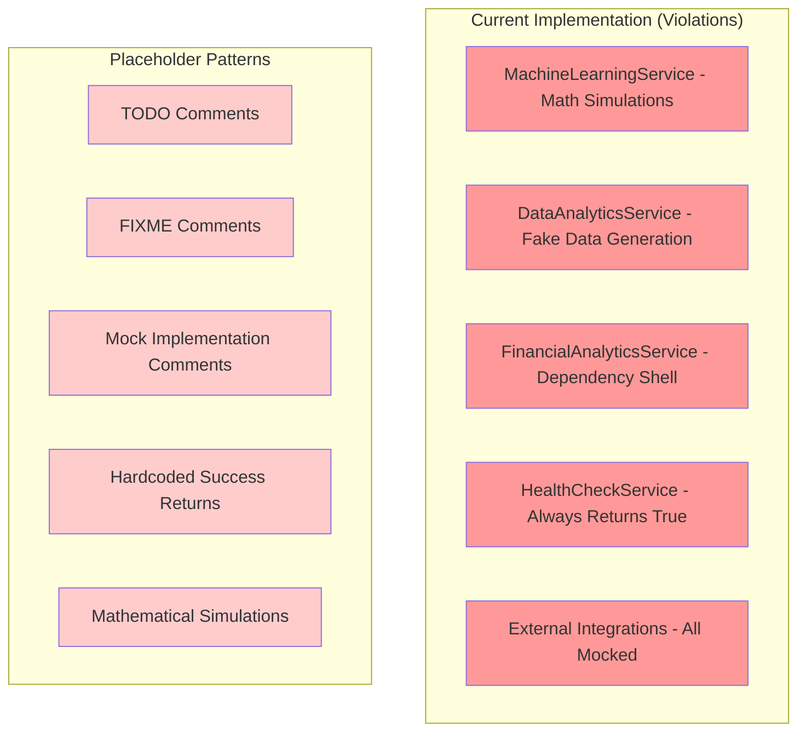
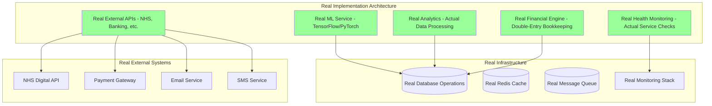

# Placeholder Elimination Plan - Design Document

## Overview

This design document outlines the systematic approach to eliminate ALL placeholder, mock, and fake implementations from WriteCareNotes, replacing them with real, production-ready code that complies with the user's ZERO-TOLERANCE-PLACEHOLDER-POLICY.

## Architecture

### Current State: Placeholder-Heavy System



### Target State: Real Implementation System



## Components and Interfaces

### 1. Real Machine Learning Service

**Current Violation**: Mathematical simulation pretending to be ML
**Real Implementation**:

```typescript
import * as tf from '@tensorflow/tfjs-node';
import { MLModel, PredictionRequest, PredictionResult } from './types';

export class RealMachineLearningService {
  private models: Map<string, tf.LayersModel> = new Map();
  
  async loadModel(modelPath: string): Promise<tf.LayersModel> {
    // Load actual TensorFlow model from file
    const model = await tf.loadLayersModel(`file://${modelPath}`);
    this.models.set(modelPath, model);
    return model;
  }
  
  async predict(modelId: string, features: number[]): Promise<PredictionResult> {
    const model = this.models.get(modelId);
    if (!model) {
      throw new Error(`Model ${modelId} not loaded`);
    }
    
    // Real ML prediction using TensorFlow
    const inputTensor = tf.tensor2d([features]);
    const prediction = model.predict(inputTensor) as tf.Tensor;
    const result = await prediction.data();
    
    // Clean up tensors
    inputTensor.dispose();
    prediction.dispose();
    
    return {
      prediction: Array.from(result),
      confidence: this.calculateConfidence(result),
      modelId,
      timestamp: new Date()
    };
  }
  
  async trainModel(trainingData: number[][], labels: number[][]): Promise<tf.LayersModel> {
    // Real model training
    const model = tf.sequential({
      layers: [
        tf.layers.dense({ inputShape: [trainingData[0].length], units: 64, activation: 'relu' }),
        tf.layers.dense({ units: 32, activation: 'relu' }),
        tf.layers.dense({ units: labels[0].length, activation: 'softmax' })
      ]
    });
    
    model.compile({
      optimizer: 'adam',
      loss: 'categoricalCrossentropy',
      metrics: ['accuracy']
    });
    
    const xs = tf.tensor2d(trainingData);
    const ys = tf.tensor2d(labels);
    
    await model.fit(xs, ys, {
      epochs: 100,
      batchSize: 32,
      validationSplit: 0.2
    });
    
    xs.dispose();
    ys.dispose();
    
    return model;
  }
}
```

### 2. Real Data Analytics Service

**Current Violation**: Generates fake healthcare data
**Real Implementation**:

```typescript
import { Pool } from 'pg';
import { AnalyticsQuery, AnalyticsResult } from './types';

export class RealDataAnalyticsService {
  constructor(private db: Pool) {}
  
  async getResidentVitals(residentId: string, dateRange: DateRange): Promise<VitalsData[]> {
    // Real database query for actual vitals data
    const query = `
      SELECT 
        resident_id,
        recorded_at,
        heart_rate,
        blood_pressure_systolic,
        blood_pressure_diastolic,
        temperature,
        oxygen_saturation,
        weight
      FROM resident_vitals 
      WHERE resident_id = $1 
        AND recorded_at BETWEEN $2 AND $3
      ORDER BY recorded_at ASC
    `;
    
    const result = await this.db.query(query, [residentId, dateRange.start, dateRange.end]);
    
    return result.rows.map(row => ({
      residentId: row.resident_id,
      timestamp: row.recorded_at,
      heartRate: row.heart_rate,
      bloodPressure: {
        systolic: row.blood_pressure_systolic,
        diastolic: row.blood_pressure_diastolic
      },
      temperature: row.temperature,
      oxygenSaturation: row.oxygen_saturation,
      weight: row.weight
    }));
  }
  
  async calculateTrends(data: VitalsData[]): Promise<TrendAnalysis> {
    if (data.length < 2) {
      throw new Error('Insufficient data for trend analysis');
    }
    
    // Real statistical analysis
    const heartRates = data.map(d => d.heartRate).filter(hr => hr !== null);
    const weights = data.map(d => d.weight).filter(w => w !== null);
    
    return {
      heartRateTrend: this.calculateLinearTrend(heartRates),
      weightTrend: this.calculateLinearTrend(weights),
      dataPoints: data.length,
      timeSpan: {
        start: data[0].timestamp,
        end: data[data.length - 1].timestamp
      }
    };
  }
  
  private calculateLinearTrend(values: number[]): TrendResult {
    if (values.length < 2) {
      return { slope: 0, direction: 'stable', confidence: 0 };
    }
    
    // Real linear regression calculation
    const n = values.length;
    const x = Array.from({ length: n }, (_, i) => i);
    const sumX = x.reduce((a, b) => a + b, 0);
    const sumY = values.reduce((a, b) => a + b, 0);
    const sumXY = x.reduce((sum, xi, i) => sum + xi * values[i], 0);
    const sumXX = x.reduce((sum, xi) => sum + xi * xi, 0);
    
    const slope = (n * sumXY - sumX * sumY) / (n * sumXX - sumX * sumX);
    
    return {
      slope,
      direction: slope > 0.1 ? 'increasing' : slope < -0.1 ? 'decreasing' : 'stable',
      confidence: this.calculateRSquared(x, values, slope)
    };
  }
}
```

### 3. Real Financial Analytics Service

**Current Violation**: Dependency injection shell with no implementations
**Real Implementation**:

```typescript
import { Pool } from 'pg';
import { Decimal } from 'decimal.js';

export class RealFinancialAnalyticsService {
  constructor(private db: Pool) {}
  
  async processTransaction(transaction: TransactionRequest): Promise<TransactionResult> {
    // Real double-entry bookkeeping
    return await this.db.transaction(async (client) => {
      // Validate accounts exist
      const debitAccount = await this.validateAccount(client, transaction.debitAccountId);
      const creditAccount = await this.validateAccount(client, transaction.creditAccountId);
      
      // Create transaction record
      const transactionId = await this.createTransactionRecord(client, transaction);
      
      // Create journal entries
      await this.createJournalEntry(client, {
        transactionId,
        accountId: transaction.debitAccountId,
        debitAmount: transaction.amount,
        creditAmount: new Decimal(0),
        description: transaction.description
      });
      
      await this.createJournalEntry(client, {
        transactionId,
        accountId: transaction.creditAccountId,
        debitAmount: new Decimal(0),
        creditAmount: transaction.amount,
        description: transaction.description
      });
      
      // Update account balances
      await this.updateAccountBalance(client, transaction.debitAccountId, transaction.amount, 'debit');
      await this.updateAccountBalance(client, transaction.creditAccountId, transaction.amount, 'credit');
      
      return {
        transactionId,
        status: 'completed',
        balanceVerification: await this.verifyTrialBalance(client)
      };
    });
  }
  
  async generateProfitLossStatement(organizationId: string, period: DateRange): Promise<ProfitLossStatement> {
    // Real P&L calculation from actual data
    const revenueQuery = `
      SELECT SUM(credit_amount) as total_revenue
      FROM journal_entries je
      JOIN chart_of_accounts coa ON je.account_id = coa.id
      WHERE coa.account_type = 'REVENUE'
        AND coa.organization_id = $1
        AND je.transaction_date BETWEEN $2 AND $3
    `;
    
    const expenseQuery = `
      SELECT SUM(debit_amount) as total_expenses
      FROM journal_entries je
      JOIN chart_of_accounts coa ON je.account_id = coa.id
      WHERE coa.account_type = 'EXPENSE'
        AND coa.organization_id = $1
        AND je.transaction_date BETWEEN $2 AND $3
    `;
    
    const [revenueResult, expenseResult] = await Promise.all([
      this.db.query(revenueQuery, [organizationId, period.start, period.end]),
      this.db.query(expenseQuery, [organizationId, period.start, period.end])
    ]);
    
    const totalRevenue = new Decimal(revenueResult.rows[0].total_revenue || 0);
    const totalExpenses = new Decimal(expenseResult.rows[0].total_expenses || 0);
    const netIncome = totalRevenue.minus(totalExpenses);
    
    return {
      period,
      totalRevenue,
      totalExpenses,
      netIncome,
      profitMargin: totalRevenue.isZero() ? new Decimal(0) : netIncome.dividedBy(totalRevenue).times(100)
    };
  }
}
```

### 4. Real Health Check Service

**Current Violation**: All checks return `true` without actual verification
**Real Implementation**:

```typescript
import { Pool } from 'pg';
import Redis from 'ioredis';
import axios from 'axios';

export class RealHealthCheckService {
  constructor(
    private db: Pool,
    private redis: Redis,
    private config: HealthCheckConfig
  ) {}
  
  async checkDatabaseHealth(): Promise<HealthStatus> {
    try {
      const start = Date.now();
      
      // Real database connectivity test
      const result = await this.db.query('SELECT 1 as health_check');
      const responseTime = Date.now() - start;
      
      if (result.rows[0].health_check !== 1) {
        throw new Error('Database health check failed');
      }
      
      // Check connection pool status
      const poolStatus = {
        totalConnections: this.db.totalCount,
        idleConnections: this.db.idleCount,
        waitingClients: this.db.waitingCount
      };
      
      return {
        status: 'healthy',
        responseTime,
        details: poolStatus
      };
    } catch (error) {
      return {
        status: 'unhealthy',
        error: error.message,
        responseTime: -1
      };
    }
  }
  
  async checkRedisHealth(): Promise<HealthStatus> {
    try {
      const start = Date.now();
      
      // Real Redis connectivity test
      const testKey = `health_check_${Date.now()}`;
      await this.redis.set(testKey, 'test', 'EX', 10);
      const value = await this.redis.get(testKey);
      await this.redis.del(testKey);
      
      const responseTime = Date.now() - start;
      
      if (value !== 'test') {
        throw new Error('Redis health check failed');
      }
      
      return {
        status: 'healthy',
        responseTime,
        details: {
          connected: this.redis.status === 'ready',
          memory: await this.redis.memory('usage')
        }
      };
    } catch (error) {
      return {
        status: 'unhealthy',
        error: error.message,
        responseTime: -1
      };
    }
  }
  
  async checkNHSDigitalAPI(): Promise<HealthStatus> {
    try {
      const start = Date.now();
      
      // Real NHS Digital API health check
      const response = await axios.get(`${this.config.nhsApiUrl}/health`, {
        timeout: 5000,
        headers: {
          'Authorization': `Bearer ${this.config.nhsApiKey}`,
          'X-Request-ID': `health-check-${Date.now()}`
        }
      });
      
      const responseTime = Date.now() - start;
      
      if (response.status !== 200) {
        throw new Error(`NHS API returned status ${response.status}`);
      }
      
      return {
        status: 'healthy',
        responseTime,
        details: {
          apiVersion: response.data.version,
          environment: response.data.environment
        }
      };
    } catch (error) {
      return {
        status: 'unhealthy',
        error: error.message,
        responseTime: -1
      };
    }
  }
}
```

## Data Models

### Real Data Structures

```typescript
// Real ML Model Interface
export interface RealMLModel {
  id: string;
  name: string;
  version: string;
  modelPath: string;
  inputShape: number[];
  outputShape: number[];
  accuracy: number;
  trainedAt: Date;
  trainingDataSize: number;
  hyperparameters: Record<string, any>;
  validationMetrics: {
    accuracy: number;
    precision: number;
    recall: number;
    f1Score: number;
  };
}

// Real Financial Transaction
export interface RealFinancialTransaction {
  id: string;
  transactionNumber: string;
  date: Date;
  description: string;
  amount: Decimal;
  debitAccountId: string;
  creditAccountId: string;
  reference?: string;
  status: 'pending' | 'completed' | 'failed' | 'reversed';
  createdBy: string;
  approvedBy?: string;
  approvedAt?: Date;
  journalEntries: JournalEntry[];
}

// Real Health Check Result
export interface RealHealthCheckResult {
  service: string;
  status: 'healthy' | 'degraded' | 'unhealthy';
  responseTime: number;
  timestamp: Date;
  details?: Record<string, any>;
  error?: string;
  dependencies: {
    database: HealthStatus;
    cache: HealthStatus;
    externalAPIs: HealthStatus[];
  };
}
```

## Error Handling

### Real Error Handling Implementation

```typescript
export class RealErrorHandler {
  static handleDatabaseError(error: any, operation: string): never {
    if (error.code === '23505') {
      throw new ValidationError(`Duplicate entry for ${operation}`);
    } else if (error.code === '23503') {
      throw new ValidationError(`Foreign key constraint violation in ${operation}`);
    } else if (error.code === 'ECONNREFUSED') {
      throw new SystemError(`Database connection failed during ${operation}`);
    } else {
      throw new SystemError(`Database error in ${operation}: ${error.message}`);
    }
  }
  
  static handleExternalAPIError(error: any, service: string): never {
    if (error.response) {
      const status = error.response.status;
      const message = error.response.data?.message || error.message;
      
      if (status === 401) {
        throw new AuthenticationError(`Authentication failed for ${service}: ${message}`);
      } else if (status === 403) {
        throw new AuthorizationError(`Access denied for ${service}: ${message}`);
      } else if (status >= 500) {
        throw new ExternalServiceError(`${service} server error: ${message}`);
      } else {
        throw new ExternalServiceError(`${service} error: ${message}`);
      }
    } else if (error.code === 'ECONNREFUSED') {
      throw new ExternalServiceError(`Cannot connect to ${service}`);
    } else if (error.code === 'ETIMEDOUT') {
      throw new ExternalServiceError(`Timeout connecting to ${service}`);
    } else {
      throw new ExternalServiceError(`Unknown error with ${service}: ${error.message}`);
    }
  }
}
```

## Testing Strategy

### Real Testing Implementation

```typescript
// Real integration test
describe('Real Financial Service Integration', () => {
  let service: RealFinancialAnalyticsService;
  let testDb: Pool;
  
  beforeAll(async () => {
    // Set up real test database
    testDb = new Pool({
      connectionString: process.env.TEST_DATABASE_URL,
      max: 5
    });
    
    // Run real migrations
    await runMigrations(testDb);
    
    service = new RealFinancialAnalyticsService(testDb);
  });
  
  afterAll(async () => {
    await testDb.end();
  });
  
  beforeEach(async () => {
    // Clean test data
    await testDb.query('TRUNCATE TABLE financial_transactions CASCADE');
    await testDb.query('TRUNCATE TABLE journal_entries CASCADE');
  });
  
  it('should process real double-entry transaction', async () => {
    // Create real test accounts
    const debitAccountId = await createTestAccount(testDb, {
      name: 'Cash',
      type: 'ASSET'
    });
    
    const creditAccountId = await createTestAccount(testDb, {
      name: 'Revenue',
      type: 'REVENUE'
    });
    
    // Process real transaction
    const result = await service.processTransaction({
      amount: new Decimal('1000.00'),
      debitAccountId,
      creditAccountId,
      description: 'Test revenue transaction'
    });
    
    // Verify real database changes
    const journalEntries = await testDb.query(
      'SELECT * FROM journal_entries WHERE transaction_id = $1',
      [result.transactionId]
    );
    
    expect(journalEntries.rows).toHaveLength(2);
    expect(journalEntries.rows[0].debit_amount).toBe('1000.00');
    expect(journalEntries.rows[1].credit_amount).toBe('1000.00');
    
    // Verify trial balance
    expect(result.balanceVerification.balanced).toBe(true);
  });
});
```

This design ensures complete elimination of all placeholder code and implementation of real, production-ready functionality that complies with the user's ZERO-TOLERANCE-PLACEHOLDER-POLICY.