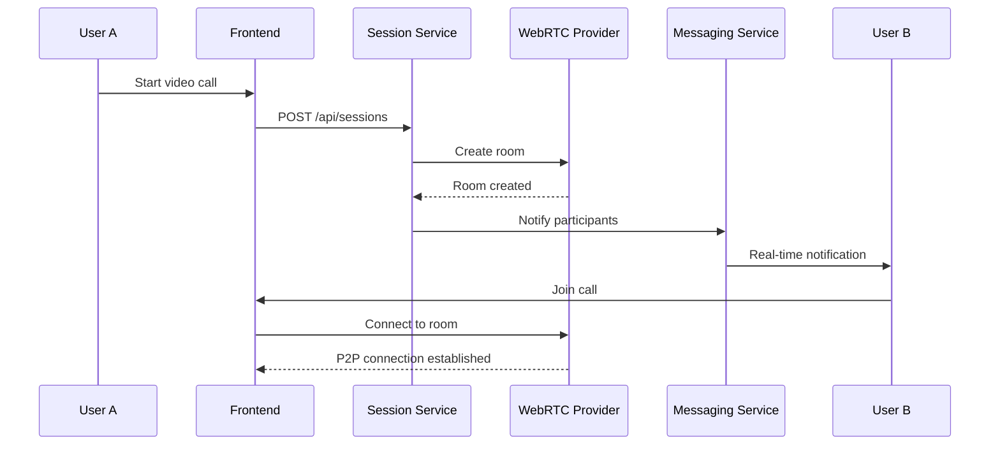
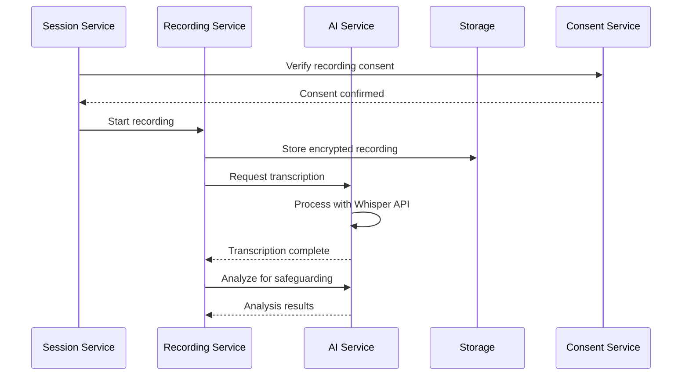

# WriteCareConnect - Technical Design Document

## 📐 **SYSTEM ARCHITECTURE OVERVIEW**

**Document Version**: 1.0  
**Date**: October 5, 2025  
**Status**: Technical Design Phase  

### **Architecture Style**: Microservices with Event-Driven Communication  
### **Integration Pattern**: Native integration with WriteCareNotes ecosystem  
### **Data Strategy**: Multi-tenant with row-level security  
### **Communication**: Real-time (WebRTC, WebSockets) + Asynchronous (Event Bus)

---

## 🏗️ **HIGH-LEVEL ARCHITECTURE**

```
┌─────────────────────────────────────────────────────────────────┐
│                    WRITECARE CONNECT SUITE                     │
├─────────────────────────────────────────────────────────────────┤
│  Frontend Layer (React/TypeScript)                             │
│  ┌─────────────────┐ ┌─────────────────┐ ┌─────────────────┐  │
│  │ Communication   │ │ Recording       │ │ Analytics       │  │
│  │ Interface       │ │ Management      │ │ Dashboard       │  │
│  └─────────────────┘ └─────────────────┘ └─────────────────┘  │
├─────────────────────────────────────────────────────────────────┤
│  API Gateway & Load Balancer                                   │
├─────────────────────────────────────────────────────────────────┤
│  Microservices Layer                                           │
│  ┌─────────────┐ ┌─────────────┐ ┌─────────────┐ ┌───────────┐ │
│  │ Session     │ │ Messaging   │ │ Recording   │ │ Analytics │ │
│  │ Service     │ │ Service     │ │ Service     │ │ Service   │ │
│  └─────────────┘ └─────────────┘ └─────────────┘ └───────────┘ │
│  ┌─────────────┐ ┌─────────────┐ ┌─────────────┐              │
│  │ Consent     │ │ Integration │ │ AI/ML       │              │
│  │ Service     │ │ Service     │ │ Service     │              │
│  └─────────────┘ └─────────────┘ └─────────────┘              │
├─────────────────────────────────────────────────────────────────┤
│  Event Bus & Message Queue (Redis/RabbitMQ)                    │
├─────────────────────────────────────────────────────────────────┤
│  Data Layer                                                     │
│  ┌─────────────┐ ┌─────────────┐ ┌─────────────┐ ┌───────────┐ │
│  │ PostgreSQL  │ │ Redis Cache │ │ File Storage│ │ Search    │ │
│  │ (Primary)   │ │ (Sessions)  │ │ (S3/Azure)  │ │ (Elastic) │ │
│  └─────────────┘ └─────────────┘ └─────────────┘ └───────────┘ │
├─────────────────────────────────────────────────────────────────┤
│  External Integrations                                          │
│  ┌─────────────┐ ┌─────────────┐ ┌─────────────┐ ┌───────────┐ │
│  │ WebRTC      │ │ Microsoft   │ │ AI Services │ │ Email/SMS │ │
│  │ (Daily.co)  │ │ Graph API   │ │ (OpenAI)    │ │ (SendGrid)│ │
│  └─────────────┘ └─────────────┘ └─────────────┘ └───────────┘ │
└─────────────────────────────────────────────────────────────────┘
```

---

## 🔧 **MICROSERVICES DETAILED DESIGN**

### **Service 1: Communication Session Service**

**Responsibility**: Manage video/audio sessions, participant coordination, session lifecycle

**Technology Stack**:
- **Runtime**: Node.js (TypeScript)
- **Framework**: Express.js with Socket.io
- **Database**: PostgreSQL (primary), Redis (session state)
- **External**: Daily.co WebRTC API

**API Design**:
```typescript
interface SessionService {
  // Session Management
  POST   /api/sessions                 // Create new session
  GET    /api/sessions/:id             // Get session details
  PUT    /api/sessions/:id             // Update session
  DELETE /api/sessions/:id             // End/cancel session
  
  // Participant Management
  POST   /api/sessions/:id/participants // Add participant
  DELETE /api/sessions/:id/participants/:userId // Remove participant
  PUT    /api/sessions/:id/participants/:userId // Update permissions
  
  // Real-time Events
  WebSocket /ws/sessions/:id           // Real-time session events
}
```

**Database Schema**:
```sql
-- Communication Sessions Table
CREATE TABLE communication_sessions (
    id UUID PRIMARY KEY DEFAULT gen_random_uuid(),
    tenant_id UUID NOT NULL REFERENCES tenants(id),
    session_type session_type_enum NOT NULL,
    title VARCHAR(255) NOT NULL,
    description TEXT,
    scheduled_start_time TIMESTAMPTZ,
    actual_start_time TIMESTAMPTZ,
    end_time TIMESTAMPTZ,
    status session_status_enum DEFAULT 'scheduled',
    daily_room_id VARCHAR(255), -- WebRTC provider room ID
    recording_enabled BOOLEAN DEFAULT false,
    care_context JSONB, -- Links to residents, incidents, etc.
    created_by UUID NOT NULL REFERENCES users(id),
    created_at TIMESTAMPTZ DEFAULT CURRENT_TIMESTAMP,
    updated_at TIMESTAMPTZ DEFAULT CURRENT_TIMESTAMP
);

-- Session Participants Table  
CREATE TABLE session_participants (
    id UUID PRIMARY KEY DEFAULT gen_random_uuid(),
    session_id UUID NOT NULL REFERENCES communication_sessions(id),
    user_id UUID REFERENCES users(id), -- NULL for external participants
    external_email VARCHAR(255), -- For external participants
    participant_type participant_type_enum NOT NULL,
    permissions JSONB DEFAULT '{}',
    joined_at TIMESTAMPTZ,
    left_at TIMESTAMPTZ,
    connection_quality_metrics JSONB,
    created_at TIMESTAMPTZ DEFAULT CURRENT_TIMESTAMP
);
```

**Event Publishing**:
```typescript
// Events published by Session Service
interface SessionEvents {
  'session.created': SessionCreatedEvent;
  'session.started': SessionStartedEvent;
  'session.participant.joined': ParticipantJoinedEvent;
  'session.participant.left': ParticipantLeftEvent;
  'session.ended': SessionEndedEvent;
  'session.recording.started': RecordingStartedEvent;
  'session.recording.stopped': RecordingStoppedEvent;
}
```

---

### **Service 2: Real-time Messaging Service**

**Responsibility**: Handle instant messaging, message persistence, real-time delivery

**Technology Stack**:
- **Runtime**: Node.js (TypeScript)
- **Framework**: Express.js with Socket.io
- **Database**: PostgreSQL (messages), Redis (real-time state)
- **Search**: Elasticsearch (message search)

**API Design**:
```typescript
interface MessagingService {
  // Message Operations
  POST   /api/messages                 // Send message
  GET    /api/messages/conversations/:id // Get conversation messages
  PUT    /api/messages/:id             // Edit message
  DELETE /api/messages/:id             // Delete message
  POST   /api/messages/:id/reactions   // Add reaction
  
  // Conversation Management
  POST   /api/conversations            // Create conversation
  GET    /api/conversations            // List user conversations
  PUT    /api/conversations/:id        // Update conversation settings
  
  // File Handling
  POST   /api/messages/attachments     // Upload attachment
  GET    /api/messages/attachments/:id // Download attachment
  
  // Search
  GET    /api/messages/search          // Search messages
  
  // Real-time
  WebSocket /ws/messaging              // Real-time message events
}
```

**Database Schema**:
```sql
-- Conversations Table
CREATE TABLE conversations (
    id UUID PRIMARY KEY DEFAULT gen_random_uuid(),
    tenant_id UUID NOT NULL REFERENCES tenants(id),
    conversation_type conversation_type_enum NOT NULL,
    title VARCHAR(255),
    care_context JSONB, -- Links to residents, incidents, etc.
    settings JSONB DEFAULT '{}',
    created_by UUID NOT NULL REFERENCES users(id),
    created_at TIMESTAMPTZ DEFAULT CURRENT_TIMESTAMP,
    updated_at TIMESTAMPTZ DEFAULT CURRENT_TIMESTAMP
);

-- Messages Table
CREATE TABLE messages (
    id UUID PRIMARY KEY DEFAULT gen_random_uuid(),
    conversation_id UUID NOT NULL REFERENCES conversations(id),
    sender_id UUID REFERENCES users(id), -- NULL for system messages
    sender_type sender_type_enum NOT NULL,
    content TEXT NOT NULL,
    message_type message_type_enum DEFAULT 'text',
    reply_to_message_id UUID REFERENCES messages(id),
    attachments JSONB DEFAULT '[]',
    metadata JSONB DEFAULT '{}',
    edited_at TIMESTAMPTZ,
    deleted_at TIMESTAMPTZ,
    created_at TIMESTAMPTZ DEFAULT CURRENT_TIMESTAMP
);

-- Message Reactions Table
CREATE TABLE message_reactions (
    id UUID PRIMARY KEY DEFAULT gen_random_uuid(),
    message_id UUID NOT NULL REFERENCES messages(id),
    user_id UUID NOT NULL REFERENCES users(id),
    reaction_type VARCHAR(50) NOT NULL,
    created_at TIMESTAMPTZ DEFAULT CURRENT_TIMESTAMP,
    UNIQUE(message_id, user_id, reaction_type)
);
```

**Real-time Architecture**:
```typescript
// Socket.io namespace organization
namespace MessagingNamespace {
  // Room structure: tenant_id:conversation_id
  interface RoomStructure {
    [tenantId_conversationId: string]: {
      participants: UserId[];
      typingUsers: UserId[];
      lastActivity: Date;
    }
  }
  
  // Message delivery confirmation
  interface MessageDelivery {
    messageId: string;
    deliveredTo: UserId[];
    readBy: UserId[];
    timestamp: Date;
  }
}
```

---

### **Service 3: Recording & Transcription Service**

**Responsibility**: Handle session recordings, AI transcription, storage management

**Technology Stack**:
- **Runtime**: Node.js (TypeScript)
- **Framework**: Express.js
- **Database**: PostgreSQL (metadata), Cloud Storage (recordings)
- **AI Services**: OpenAI Whisper API, AssemblyAI
- **Storage**: AWS S3 / Azure Blob Storage

**API Design**:
```typescript
interface RecordingService {
  // Recording Management
  POST   /api/recordings/start/:sessionId    // Start recording
  POST   /api/recordings/stop/:sessionId     // Stop recording
  GET    /api/recordings/:id                 // Get recording details
  GET    /api/recordings/:id/download        // Download recording
  DELETE /api/recordings/:id                 // Delete recording
  
  // Transcription
  POST   /api/recordings/:id/transcribe      // Request transcription
  GET    /api/recordings/:id/transcript      // Get transcript
  PUT    /api/recordings/:id/transcript      // Update transcript
  
  // Analysis
  GET    /api/recordings/:id/analysis        // Get AI analysis
  POST   /api/recordings/:id/action-items    // Extract action items
  
  // Consent Verification
  GET    /api/recordings/:id/consent-status  // Check consent
}
```

**Database Schema**:
```sql
-- Recordings Table
CREATE TABLE recordings (
    id UUID PRIMARY KEY DEFAULT gen_random_uuid(),
    session_id UUID NOT NULL REFERENCES communication_sessions(id),
    tenant_id UUID NOT NULL REFERENCES tenants(id),
    file_url TEXT NOT NULL,
    file_size_bytes BIGINT,
    duration_seconds INTEGER,
    format VARCHAR(50),
    quality VARCHAR(50),
    encryption_key_id VARCHAR(255),
    storage_provider VARCHAR(50),
    status recording_status_enum DEFAULT 'processing',
    started_at TIMESTAMPTZ NOT NULL,
    completed_at TIMESTAMPTZ,
    created_at TIMESTAMPTZ DEFAULT CURRENT_TIMESTAMP
);

-- Transcriptions Table
CREATE TABLE transcriptions (
    id UUID PRIMARY KEY DEFAULT gen_random_uuid(),
    recording_id UUID NOT NULL REFERENCES recordings(id),
    tenant_id UUID NOT NULL REFERENCES tenants(id),
    provider VARCHAR(50) NOT NULL, -- 'openai', 'assemblyai', etc.
    language VARCHAR(10) DEFAULT 'en',
    confidence_score DECIMAL(3,2),
    word_count INTEGER,
    speaker_identification BOOLEAN DEFAULT false,
    status transcription_status_enum DEFAULT 'pending',
    raw_transcript TEXT,
    formatted_transcript TEXT,
    speaker_segments JSONB,
    timestamps JSONB,
    processing_started_at TIMESTAMPTZ,
    completed_at TIMESTAMPTZ,
    created_at TIMESTAMPTZ DEFAULT CURRENT_TIMESTAMP
);
```

**AI Integration Design**:
```typescript
interface TranscriptionService {
  providers: {
    openai: OpenAIWhisperProvider;
    assemblyai: AssemblyAIProvider;
    azure: AzureSpeechProvider;
  };
  
  async transcribe(
    audioFile: Buffer,
    options: TranscriptionOptions
  ): Promise<TranscriptionResult>;
  
  async identifySpeakers(
    audioFile: Buffer,
    participantList: Participant[]
  ): Promise<SpeakerIdentification>;
  
  async extractActionItems(
    transcript: string
  ): Promise<ActionItem[]>;
  
  async analyzeSafeguardingConcerns(
    transcript: string
  ): Promise<SafeguardingAlert[]>;
}
```

---

### **Service 4: Consent Management Service**

**Responsibility**: GDPR compliance, consent capture, legal basis tracking

**Technology Stack**:
- **Runtime**: Node.js (TypeScript)
- **Framework**: Express.js
- **Database**: PostgreSQL (compliance-focused schema)
- **Legal**: Integration with legal document management

**API Design**:
```typescript
interface ConsentService {
  // Consent Operations
  POST   /api/consent/request            // Request consent
  POST   /api/consent/grant              // Grant consent
  POST   /api/consent/withdraw           // Withdraw consent
  GET    /api/consent/status/:userId     // Check consent status
  
  // Legal Basis
  POST   /api/legal-basis/assess         // Assess legal basis
  GET    /api/legal-basis/:dataProcessingId // Get legal basis
  
  // Compliance Reporting
  GET    /api/consent/audit-trail        // Get audit trail
  GET    /api/consent/compliance-report  // Generate compliance report
  POST   /api/consent/data-subject-request // Handle data subject requests
}
```

**Database Schema**:
```sql
-- Data Processing Activities Table
CREATE TABLE data_processing_activities (
    id UUID PRIMARY KEY DEFAULT gen_random_uuid(),
    tenant_id UUID NOT NULL REFERENCES tenants(id),
    activity_type VARCHAR(100) NOT NULL,
    purpose TEXT NOT NULL,
    legal_basis legal_basis_enum NOT NULL,
    data_categories TEXT[],
    retention_period_days INTEGER,
    description TEXT,
    created_at TIMESTAMPTZ DEFAULT CURRENT_TIMESTAMP
);

-- Consent Records Table
CREATE TABLE consent_records (
    id UUID PRIMARY KEY DEFAULT gen_random_uuid(),
    tenant_id UUID NOT NULL REFERENCES tenants(id),
    data_subject_id UUID, -- Could be user_id or external person
    data_subject_email VARCHAR(255),
    data_processing_activity_id UUID NOT NULL REFERENCES data_processing_activities(id),
    consent_status consent_status_enum NOT NULL,
    legal_basis legal_basis_enum NOT NULL,
    consent_method VARCHAR(100), -- 'web_form', 'email', 'verbal', etc.
    consent_evidence JSONB, -- Stores proof of consent
    granted_at TIMESTAMPTZ,
    withdrawn_at TIMESTAMPTZ,
    expiry_date TIMESTAMPTZ,
    ip_address INET,
    user_agent TEXT,
    created_at TIMESTAMPTZ DEFAULT CURRENT_TIMESTAMP
);

-- Consent Audit Trail Table
CREATE TABLE consent_audit_trail (
    id UUID PRIMARY KEY DEFAULT gen_random_uuid(),
    consent_record_id UUID NOT NULL REFERENCES consent_records(id),
    action VARCHAR(50) NOT NULL, -- 'granted', 'withdrawn', 'renewed', etc.
    previous_status consent_status_enum,
    new_status consent_status_enum,
    reason TEXT,
    performed_by UUID REFERENCES users(id),
    ip_address INET,
    user_agent TEXT,
    created_at TIMESTAMPTZ DEFAULT CURRENT_TIMESTAMP
);
```

---

### **Service 5: External Integration Service**

**Responsibility**: Microsoft Teams, Zoom, external platform bridging

**Technology Stack**:
- **Runtime**: Node.js (TypeScript)
- **Framework**: Express.js
- **External APIs**: Microsoft Graph, Zoom SDK, Slack API
- **Authentication**: OAuth 2.0, JWT handling

**API Design**:
```typescript
interface IntegrationService {
  // Platform Authentication
  POST   /api/integrations/teams/auth       // Teams OAuth flow
  POST   /api/integrations/zoom/auth        // Zoom OAuth flow
  DELETE /api/integrations/:platform/auth   // Disconnect platform
  
  // Cross-platform Operations
  POST   /api/integrations/bridge-session   // Bridge external session
  POST   /api/integrations/sync-messages    // Sync messages across platforms
  GET    /api/integrations/presence/:userId // Get cross-platform presence
  
  // External Invitations
  POST   /api/integrations/invite-external  // Invite external user
  POST   /api/integrations/calendar-sync    // Sync calendar events
}
```

**Integration Architecture**:
```typescript
interface PlatformConnector {
  platform: 'teams' | 'zoom' | 'slack';
  
  authenticate(credentials: OAuthCredentials): Promise<AccessToken>;
  createMeeting(sessionDetails: SessionDetails): Promise<ExternalMeeting>;
  inviteParticipant(meetingId: string, participant: Participant): Promise<void>;
  syncMessages(conversationId: string): Promise<Message[]>;
  getPresenceStatus(userId: string): Promise<PresenceStatus>;
}

class TeamsConnector implements PlatformConnector {
  private graphClient: GraphClient;
  
  async createMeeting(details: SessionDetails): Promise<TeamsMeeting> {
    // Microsoft Graph API integration
  }
  
  async bridgeToWriteCareConnect(teamsCallId: string): Promise<void> {
    // Bridge Teams call to WriteCareConnect session
  }
}
```

---

### **Service 6: AI/ML Analytics Service**

**Responsibility**: Safeguarding detection, sentiment analysis, action item extraction

**Technology Stack**:
- **Runtime**: Python (FastAPI) for ML, Node.js for API
- **ML Framework**: scikit-learn, transformers (HuggingFace)
- **AI Services**: OpenAI GPT-4, custom fine-tuned models
- **Database**: PostgreSQL + Vector database (pgvector)

**API Design**:
```typescript
interface AIAnalyticsService {
  // Content Analysis
  POST   /api/ai/analyze-transcript        // Analyze transcript
  POST   /api/ai/detect-safeguarding       // Detect safeguarding concerns
  POST   /api/ai/extract-action-items      // Extract action items
  POST   /api/ai/sentiment-analysis        // Sentiment analysis
  
  // Pattern Recognition
  GET    /api/ai/communication-patterns    // Analyze communication patterns
  GET    /api/ai/risk-indicators           // Identify risk indicators
  
  // Reporting
  POST   /api/ai/generate-summary          // Generate session summary
  POST   /api/ai/compliance-analysis       // Compliance analysis
}
```

**ML Pipeline Design**:
```python
class SafeguardingDetectionPipeline:
    def __init__(self):
        self.text_classifier = load_model('safeguarding_classifier_v2')
        self.sentiment_analyzer = load_model('care_sentiment_model')
        self.risk_scorer = RiskScoringModel()
    
    async def analyze_transcript(self, transcript: str) -> AnalysisResult:
        # Multi-stage analysis pipeline
        concerns = await self.detect_concerns(transcript)
        sentiment = await self.analyze_sentiment(transcript)
        risk_score = await self.calculate_risk_score(concerns, sentiment)
        
        return AnalysisResult(
            concerns=concerns,
            sentiment=sentiment,
            risk_score=risk_score,
            confidence_level=self.calculate_confidence()
        )
```

---

## 📊 **DATA FLOW ARCHITECTURE**

### **Real-time Communication Flow**:


### **Recording & Transcription Flow**:


---

## 🔐 **SECURITY ARCHITECTURE**

### **Authentication & Authorization**:
```typescript
interface SecurityFramework {
  authentication: {
    provider: 'WriteCareNotes_SSO';
    methods: ['password', 'mfa', 'sso'];
    tokenType: 'JWT';
    refreshStrategy: 'sliding_window';
  };
  
  authorization: {
    model: 'RBAC'; // Role-Based Access Control
    permissions: CommunicationPermission[];
    tenantIsolation: 'strict';
  };
  
  encryption: {
    inTransit: 'TLS_1.3';
    atRest: 'AES_256_GCM';
    endToEnd: 'WebRTC_DTLS_SRTP';
  };
}
```

### **Data Protection Strategy**:
```typescript
interface DataProtection {
  encryptionKeys: {
    storage: 'AWS_KMS' | 'Azure_KeyVault';
    rotation: 'quarterly';
    backup: 'multi_region';
  };
  
  accessControl: {
    principleOfLeastPrivilege: true;
    zeroTrust: true;
    auditLogging: 'comprehensive';
  };
  
  dataClassification: {
    levels: ['public', 'internal', 'confidential', 'restricted'];
    careSectorData: 'restricted';
    retention: 'automated';
  };
}
```

---

## 📈 **SCALABILITY & PERFORMANCE**

### **Horizontal Scaling Strategy**:
```yaml
# Kubernetes deployment configuration
apiVersion: apps/v1
kind: Deployment
metadata:
  name: communication-session-service
spec:
  replicas: 3  # Auto-scaled based on CPU/memory
  template:
    spec:
      containers:
      - name: session-service
        image: writecarenotes/session-service:latest
        resources:
          requests:
            memory: "256Mi"
            cpu: "250m"
          limits:
            memory: "512Mi"
            cpu: "500m"
        env:
        - name: DATABASE_URL
          valueFrom:
            secretKeyRef:
              name: db-credentials
              key: connection-string
```

### **Caching Strategy**:
```typescript
interface CachingLayers {
  level1: {
    type: 'Application_Cache';
    provider: 'Node_Memory';
    ttl: '5_minutes';
    use: 'frequently_accessed_data';
  };
  
  level2: {
    type: 'Distributed_Cache';
    provider: 'Redis_Cluster';
    ttl: '1_hour';
    use: 'session_state_user_preferences';
  };
  
  level3: {
    type: 'CDN';
    provider: 'CloudFlare';
    ttl: '24_hours';
    use: 'static_assets_recordings';
  };
}
```

### **Database Optimization**:
```sql
-- Optimized indexes for communication queries
CREATE INDEX CONCURRENTLY idx_sessions_tenant_status 
ON communication_sessions(tenant_id, status) 
WHERE status IN ('active', 'scheduled');

CREATE INDEX CONCURRENTLY idx_messages_conversation_created 
ON messages(conversation_id, created_at DESC) 
WHERE deleted_at IS NULL;

CREATE INDEX CONCURRENTLY idx_recordings_session_tenant 
ON recordings(session_id, tenant_id, created_at DESC);

-- Partitioning strategy for large tables
CREATE TABLE messages_2025_10 PARTITION OF messages 
FOR VALUES FROM ('2025-10-01') TO ('2025-11-01');
```

---

## 🔄 **EVENT-DRIVEN ARCHITECTURE**

### **Event Bus Design**:
```typescript
interface EventBusArchitecture {
  messageBroker: 'Redis_Streams' | 'RabbitMQ';
  eventSourcing: false; // Traditional CRUD for now
  sagaPattern: true; // For distributed transactions
  
  eventTypes: {
    domain: 'communication.writecarenotes.com';
    events: [
      'session.lifecycle.*',
      'message.sent',
      'recording.processed',
      'consent.changed',
      'safeguarding.alert',
      'integration.sync'
    ];
  };
}
```

### **Event Handling Patterns**:
```typescript
// Event handler example
class SessionEventHandler {
  @EventHandler('session.ended')
  async handleSessionEnded(event: SessionEndedEvent): Promise<void> {
    // Trigger multiple async operations
    await Promise.all([
      this.recordingService.finalizeRecording(event.sessionId),
      this.analyticsService.processSessionMetrics(event),
      this.aiService.analyzeSessionForInsights(event.sessionId),
      this.notificationService.sendSessionSummary(event.participants)
    ]);
  }
  
  @EventHandler('safeguarding.alert.high_priority')
  async handleSafeguardingAlert(event: SafeguardingAlertEvent): Promise<void> {
    // Immediate escalation for high-priority alerts
    await this.escalationService.createIncident(event);
    await this.notificationService.alertSafeguardingTeam(event);
  }
}
```

---

## 📱 **MOBILE-FIRST DESIGN**

### **Progressive Web App (PWA) Architecture**:
```typescript
interface PWAConfiguration {
  serviceWorker: {
    caching: 'network_first_with_fallback';
    offlineSupport: 'essential_features_only';
    syncStrategy: 'background_sync';
  };
  
  responsive: {
    breakpoints: ['320px', '768px', '1024px', '1440px'];
    approach: 'mobile_first';
    components: 'adaptive_based_on_screen_size';
  };
  
  performance: {
    bundleSize: '<500kb_initial';
    loadTime: '<3s_on_3G';
    interactivity: '<1s_time_to_interactive';
  };
}
```

### **Offline Capability Design**:
```typescript
interface OfflineStrategy {
  criticalFeatures: [
    'view_recent_messages',
    'access_session_recordings',
    'view_participant_lists',
    'basic_note_taking'
  ];
  
  syncMechanisms: {
    messages: 'incremental_sync_on_reconnection';
    recordings: 'download_on_demand';
    sessionData: 'full_sync_on_app_startup';
  };
  
  conflictResolution: {
    strategy: 'last_write_wins';
    userNotification: 'on_conflict_detection';
  };
}
```

---

## 🔍 **MONITORING & OBSERVABILITY**

### **Telemetry Strategy**:
```typescript
interface ObservabilityStack {
  metrics: {
    provider: 'Prometheus';
    visualization: 'Grafana';
    alerts: 'AlertManager';
    retention: '90_days';
  };
  
  logging: {
    provider: 'ELK_Stack'; // Elasticsearch, Logstash, Kibana
    structure: 'structured_json';
    retention: '1_year';
    levels: ['error', 'warn', 'info', 'debug'];
  };
  
  tracing: {
    provider: 'Jaeger';
    sampling: '10_percent';
    retention: '7_days';
  };
  
  businessMetrics: {
    sessionSuccess: 'percentage_successful_connections';
    userEngagement: 'daily_active_users_communication';
    qualityMetrics: 'call_quality_scores';
    complianceMetrics: 'consent_completion_rates';
  };
}
```

### **Health Check Design**:
```typescript
interface HealthCheckStrategy {
  endpoints: {
    '/health': 'basic_service_availability';
    '/health/detailed': 'full_dependency_check';
    '/metrics': 'prometheus_metrics_endpoint';
  };
  
  dependencies: [
    'database_connectivity',
    'redis_connectivity',
    'external_api_availability',
    'file_storage_accessibility'
  ];
  
  alerts: {
    responseTime: '>5s_average_response_time';
    errorRate: '>1_percent_error_rate';
    availability: '<99.5_percent_uptime';
  };
}
```

---

## 🚀 **DEPLOYMENT STRATEGY**

### **CI/CD Pipeline**:
```yaml
# Azure DevOps Pipeline / GitHub Actions
stages:
  - name: "Build"
    jobs:
      - job: "TypeScript_Build"
      - job: "Docker_Build"
      - job: "Security_Scan"
  
  - name: "Test"
    jobs:
      - job: "Unit_Tests"
      - job: "Integration_Tests"
      - job: "E2E_Tests"
      - job: "Performance_Tests"
  
  - name: "Deploy_Staging"
    jobs:
      - job: "Database_Migration"
      - job: "Service_Deployment"
      - job: "Smoke_Tests"
  
  - name: "Deploy_Production"
    condition: "manual_approval"
    jobs:
      - job: "Blue_Green_Deployment"
      - job: "Health_Verification"
      - job: "Rollback_Preparation"
```

### **Infrastructure as Code (IaC)**:
```terraform
# Terraform configuration for WriteCareConnect
resource "aws_ecs_cluster" "writecare_connect" {
  name = "writecare-connect-${var.environment}"
  
  setting {
    name  = "containerInsights"
    value = "enabled"
  }
}

resource "aws_ecs_service" "session_service" {
  name            = "session-service"
  cluster         = aws_ecs_cluster.writecare_connect.id
  task_definition = aws_ecs_task_definition.session_service.arn
  desired_count   = var.environment == "production" ? 3 : 1
  
  load_balancer {
    target_group_arn = aws_lb_target_group.session_service.arn
    container_name   = "session-service"
    container_port   = 3000
  }
}
```

---

## 🧪 **TESTING STRATEGY**

### **Test Pyramid Implementation**:
```typescript
interface TestingStrategy {
  unitTests: {
    coverage: '90_percent_minimum';
    framework: 'Jest';
    focus: 'business_logic_validation';
  };
  
  integrationTests: {
    coverage: '80_percent_api_endpoints';
    framework: 'Supertest';
    focus: 'service_interaction_validation';
  };
  
  e2eTests: {
    coverage: 'critical_user_journeys';
    framework: 'Playwright';
    focus: 'full_workflow_validation';
  };
  
  performanceTests: {
    tool: 'Artillery_K6';
    targets: {
      sessionCreation: '100_concurrent_users';
      messageDelivery: '<500ms_latency';
      recordingProcessing: '<5min_completion';
    };
  };
}
```

---

**Document Status**: Technical Design Complete  
**Next Phase**: Implementation Planning  
**Review Schedule**: Weekly during development  
**Approval Required**: Tech Lead, System Architect, Security Officer